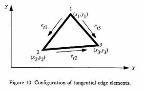

## 2.2. Guias de Onda Não Homogêneos — Formulação Vetorial

Para problemas de guias de onda não homogêneos, a abordagem do potencial escalar não é aplicável quando se está interessado nas características de dispersão do guia de onda. Para isso, deve-se seguir uma abordagem vetorial de elementos finitos. Infelizmente, o método de elementos finitos baseado em nós, quando aplicado à equação vetorial de onda, resulta em soluções não físicas ou espúrias, que são geralmente atribuídas à falta de imposição das condições de divergência (ver refs. 2 e 11). Muitas tentativas foram feitas para evitar esses modos espúrios por meio de diferentes variações do método de elementos finitos nodais. Felizmente, uma abordagem revolucionária foi descoberta recentemente. Essa abordagem utiliza as chamadas “bases vetoriais” ou “elementos vetoriais”, que atribuem graus de liberdade às arestas em vez de aos nós dos elementos. Por essa razão, são popularmente conhecidos como “elementos de aresta”.

Embora os elementos de aresta tenham sido descritos pela primeira vez por Whitney (ref. 12) há 35 anos, sua importância no eletromagnetismo não foi reconhecida até o final da década de 1980 (ref. 3). Na seção 2.2, descrevemos a formulação do método de elementos finitos para a equação vetorial de onda usando elementos de aresta. Essa formulação, em geral, permite que o problema de autovalor, $\mathrm{St}$ e $C$, seja resolvido diretamente, sem necessidade de eliminar o problema de dispersão. Para isso, seguimos os seguintes passos:

1. Resolver o problema de guia de onda homogêneo usando campos vetoriais transversais de duas componentes

2. Resolver o problema generalizado de guia de onda usando campos vetoriais de três componentes

3. Resolver o número de onda $k_0$ quando a constante de propagação $\beta$ é especificada

4. Resolver a constante de propagação $\beta$ de qualquer guia de onda generalizado para uma dada frequência de operação

---

### 2.2.1. Solução do Problema de Guia de Onda Homogêneo com Campos Vetoriais Transversais de Duas Componentes

Para um guia de onda homogêneo, os modos propagantes podem ser divididos em modos elétricos transversais (TE) ou magnéticos transversais (TM), que podem ser resolvidos separadamente.

Para o modo TE, $E_z = 0$, o campo elétrico transversal $\mathbf{E}_t$ satisfaz a equação vetorial de onda:

$$
\nabla_t \times \left( \frac{1}{\mu_r} \nabla_t \times \mathbf{E}_t \right) - k_c^2 \varepsilon_r \mathbf{E}_t = 0
$$

e para o modo TM, $H_z = 0$, o campo magnético transversal $\mathbf{H}_t$ satisfaz:

$$
\nabla_t \times \left( \frac{1}{\varepsilon_r} \nabla_t \times \mathbf{H}_t \right) - k_c^2 \mu_r \mathbf{H}_t = 0
$$

onde $\mu_r$ e $\varepsilon_r$ são a permeabilidade e permissividade do material no guia de onda, respectivamente.

Nesta seção, ilustramos o procedimento para o modo TE, e o mesmo procedimento pode ser aplicado ao modo TM, exceto que condições de contorno de Neumann são aplicadas em contornos PEC em vez de condições de Dirichlet.

---

### 2.2.1.1. Formulação

Para o modo TE, considere a equação de onda:

$$
\nabla_t \times \left( \frac{1}{\mu_r} \nabla_t \times \mathbf{E}_t \right) - k_c^2 \varepsilon_r \mathbf{E}_t = 0
$$

Multiplicando escalarmente pela função de teste vetorial $\mathbf{T}_t$ e integrando sobre a seção transversal:

$$
\iint_\Gamma \left( \mathbf{T}_t \cdot \nabla_t \times \left( \frac{1}{\mu_r} \nabla_t \times \mathbf{E}_t \right) - k_c^2 \varepsilon_r \mathbf{T}_t \cdot \mathbf{E}_t \right) ds = 0
$$

Das identidades vetoriais:

$$
\mathbf{T}_t \cdot (\nabla_t \times \mathbf{A}) = (\nabla_t \times \mathbf{T}_t) \cdot \mathbf{A} - \nabla_t \cdot (\mathbf{T}_t \times \mathbf{A})
$$

$$
(\mathbf{T}_t \times \mathbf{A}) \cdot \hat{n} = - \mathbf{T}_t \cdot (\hat{n} \times \mathbf{A})
$$

e do teorema da divergência:

$$
\iint_\Gamma \nabla_t \cdot (\mathbf{T}_t \times \mathbf{A}) ds = \oint_{\partial \Gamma} (\mathbf{T}_t \times \mathbf{A}) \cdot \hat{n} \, dl
$$

A equação pode ser escrita na forma fraca:

$$
\iint_\Gamma \frac{1}{\mu_r} (\nabla_t \times \mathbf{T}_t) \cdot (\nabla_t \times \mathbf{E}_t) ds = k_c^2 \varepsilon_r \iint_\Gamma \mathbf{T}_t \cdot \mathbf{E}_t ds - \oint_{\partial \Gamma} \mathbf{T}_t \cdot \left( \hat{n} \times \frac{1}{\mu_r} \nabla_t \times \mathbf{E}_t \right) dl
$$

Em um contorno condutor elétrico perfeito (PEC), a integral de contorno se anula, pois $\mathbf{T}_t$ é tomada como zero para satisfazer as condições de contorno de Dirichlet. Portanto, para todos os problemas delimitados por paredes PEC, o último termo do lado direito da equação (48) é igual a zero. Assim, a equação final pode ser escrita como

$$
\iint_\Gamma \frac{1}{\mu_r} (\nabla_t \times \mathbf{T}_t) \cdot (\nabla_t \times \mathbf{E}_t) ds = k_c^2 \varepsilon_r \iint_\Gamma \mathbf{T}_t \cdot \mathbf{E}_t ds
$$

---

### 2.2.1.2. Discretização

Os elementos finitos utilizados na seção 2.1 são escalares e possuem parâmetros desconhecidos, sendo os valores do campo escalar nos nós do elemento. Elementos finitos baseados em nós não são adequados para representar campos vetoriais em eletromagnetismo, pois as condições de contorno frequentemente assumem a forma de uma especificação apenas da parte do campo vetorial que é tangente ao contorno.

Com elementos baseados em nós, a restrição física deve ser transformada em relações lineares entre as componentes cartesianas, e nos nós onde o contorno muda de direção, uma direção tangencial média deve ser determinada primeiro. Estes são muito difíceis (se não impossíveis) de implementar em elementos finitos baseados em nós. A falha em implementar condições de contorno adequadas resulta em modos espúrios que são não físicos.

A abordagem mais elegante e simples para eliminar as desvantagens dos elementos baseados em nós é utilizar elementos de aresta. Elementos de aresta são bases de elementos finitos recentemente desenvolvidas para campos vetoriais. Com elementos de aresta, apenas a continuidade tangencial dos campos vetoriais é imposta ao longo das fronteiras dos elementos. As vantagens dos elementos de aresta são as seguintes:

1. Os elementos de aresta impõem a continuidade apenas das componentes tangenciais dos campos elétrico e magnético, o que é consistente com as restrições físicas desses campos.

2. As condições de contorno entre elementos são automaticamente obtidas através das condições de contorno naturais.

3. A condição de contorno de Dirichlet pode ser facilmente imposta ao longo das arestas dos elementos.

4. Como os elementos de aresta são escolhidos de modo a serem livres de divergência, as soluções espúrias não físicas são completamente eliminadas.

Para um único elemento triangular mostrado na figura 10, o campo elétrico transversal pode ser expresso como uma superposição de elementos de aresta. Os elementos de aresta permitem uma componente tangencial constante da função base ao longo da aresta triangular, ao mesmo tempo permitindo uma componente tangencial nula ao longo das outras arestas. Essas funções base, sobrepondo-se em cada célula triangular, fornecem a expansão completa (ref. 11):

**Figura 10.** .

Para um elemento triangular:

$$
\mathbf{E}_t = \sum_{m=1}^{3} e_{tm} \mathbf{W}_{tm}
$$

onde

$$
\mathbf{W}_{tm} = L_{tm} (\alpha_i \nabla_t \alpha_j - \alpha_j \nabla_t \alpha_i)
$$

$\alpha_i$ é a função de forma de primeira ordem associada aos nós 1, 2 e 3, definida pela equação (15); e $L_{tm}$ é o comprimento da aresta $m$ conectando os nós $i$ e $j$, isto é, explicitamente, as funções base que representam as arestas 1, 2 e 3 com coeficientes $e_{t1}$, $e_{t2}$ e $e_{t3}$ são escritas como

$$
\mathbf{W}_{t1} = L_{t1} (\alpha_1 \nabla_t \alpha_2 - \alpha_2 \nabla_t \alpha_1)
$$

$$
\mathbf{W}_{t2} = L_{t2} (\alpha_2 \nabla_t \alpha_3 - \alpha_3 \nabla_t \alpha_2)
$$

$$
\mathbf{W}_{t3} = L_{t3} (\alpha_3 \nabla_t \alpha_1 - \alpha_1 \nabla_t \alpha_3)
$$

Os três parâmetros desconhecidos são $e_{tm}$. Pode-se mostrar que

$$
\hat{t}_{tm} \cdot \mathbf{E}_t = e_{tm} \quad \text{(na aresta } m\text{)}
$$

onde $\hat{t}_{tm}$ é um vetor unitário ao longo da aresta $m$ na direção da aresta; por exemplo,

$$
\hat{t}_{t1} = \frac{(x_2 - x_1)\hat{x} + (y_2 - y_1)\hat{y}}{L_{t1}}
$$

para a aresta 1 conectando os nós 1 e 2. Em outras palavras, $e_{tm}$ controla o campo tangencial ao longo da aresta $m$. Posteriormente, $\nabla_t \cdot \mathbf{W}_{tm} = 0$ é verificado e, portanto, o campo elétrico obtido através da equação (50) satisfaz $\nabla_t \cdot \mathbf{E}_t = 0$, a equação da divergência, dentro do elemento. Assim, a solução por elementos finitos é livre de soluções espúrias.

Com o uso das coordenadas simplex, como definidas pela equação (15), a função base dada pela equação (51) pode ser escrita como

$$
\mathbf{W}_{tm} = \frac{L_{tm}}{4A^2} \left[ (A_m + B_m y)\hat{x} + (C_m + D_m x)\hat{y} \right]
$$

onde

$$
A_m = a_i b_j - a_j b_i
$$

$$
B_m = c_i b_j - c_j b_i
$$

$$
C_m = a_i c_j - a_j c_i
$$

$$
D_m = b_i c_j - b_j c_i = -B_m
$$

A partir da equação (56), $\nabla_t \cdot \mathbf{W}_{tm} = 0$, o que resulta em um campo elétrico sem divergência, isto é, $\nabla_t \cdot \mathbf{E}_t = 0$.

---

### 2.2.1.3. Formulação por elementos finitos

Substituindo a equação (50) na equação (49) para um único elemento triangular, obtém-se a seguinte equação:

$$
\frac{1}{\mu_r} \iint_\Delta \sum_{m=1}^{3} (\nabla_t \times \mathbf{W}_{tm}) \cdot (\Delta_t \times \mathbf{W}_{tn}) e_{tm} ds = k_c^2 \varepsilon_r \iint_\Delta \sum_{m=1}^{3} (\mathbf{W}_{tm} \cdot \mathbf{W}_{tn}) e_{tm} ds \quad (n = 1, 2, 3) 
$$

onde $\Delta$ indica a integração sobre o elemento triangular.

Trocando a ordem da integração e das somas, a equação (61) pode ser escrita na forma matricial como

$$
[S_e]\{e\} = k_c^2 [T_e]\{e\}
$$

Assim, as matrizes de elementos finitos para um único elemento são dadas por

$$
[S_e] =
\frac{1}{\mu_r}
\iint_\Delta
(\nabla_t \times \mathbf{W}_{tm}) \cdot (\nabla_t \times \mathbf{W}_{tn}) \, ds
$$

e

$$
[T_e] =
\varepsilon_r
\iint_\Delta
(\mathbf{W}_{tm} \cdot \mathbf{W}_{tn}) \, ds
$$

---

Essas matrizes de elemento podem ser montadas sobre todos os triângulos na seção transversal do guia de onda para obter uma equação matricial global de autovalores:

$$
[S]\{e_t\} = k_c^2 [T]\{e_t\}
$$

Funções de base:

Os coeficientes satisfazem:

$$
\hat{t}_m \cdot \mathbf{E}_t = e_{tm}
$$

---

### Formulação FEM

$$
\frac{1}{\mu_r} \iint_\Delta \sum_{m=1}^{3} (\nabla_t \times \mathbf{W}_{tm}) \cdot (\nabla_t \times \mathbf{W}_{tn}) e_{tm} ds
=
k_c^2 \varepsilon_r \iint_\Delta \sum_{m=1}^{3} (\mathbf{W}_{tm} \cdot \mathbf{W}_{tn}) e_{tm} ds
$$

Forma matricial:

$$
[S_el]\{e_t\} = k_c^2 [T_el]\{e_t\}
$$

---

### Matrizes

$$
[S_el] = \frac{1}{\mu_r} \iint_\Delta (\nabla_t \times \mathbf{W}_{tm}) \cdot (\nabla_t \times \mathbf{W}_{tn}) ds
$$

$$
[T_el] = \varepsilon_r \iint_\Delta (\mathbf{W}_{tm} \cdot \mathbf{W}_{tn}) ds
$$

---

### Sistema Global

$$
[S]\{e_t\} = k_c^2 [T]\{e_t\}
$$
