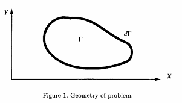
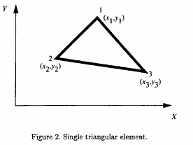

## 2. Problemas Bidimensionais

### 2.1. Guias de Onda Homogêneos — Formulação Escalar

Esta seção trata da solução de problemas bidimensionais de guias de onda com contornos fechados, utilizando o método dos elementos finitos de Galerkin. A equação de onda é resolvida para um problema generalizado de autovalor/não autovalor para elementos triangulares arbitrários (ref. 1). É apresentada uma matriz de elementos finitos derivada e um programa computacional para calcular os autovalores e as distribuições do campo elétrico.

#### 2.1.1. Formulação

A função potencial escalar $\psi$ satisfaz a equação de Helmholtz com número de onda $k_c$

$$
\nabla_t^2 \psi + k_c^2 \psi = 0
$$

no interior e sobre o contorno $\Gamma$ indicado na figura 1. 

**Figura 1.** Geometria do problema.

Esta é a forma “forte” da equação escalar de Helmholtz. Na forma forte, a incógnita aparece dentro de um operador diferencial de segunda ordem. Para tornar a equação adequada à solução numérica, ela pode ser convertida para a forma “fraca” multiplicando ambos os lados por uma função de teste $T_s$ e integrando sobre a superfície $\Gamma$; isto é,

$$
\iint_{\Gamma} \left[T_s\left(\nabla_t^2 \psi\right) + k_c^2 T_s \psi\right] ds = 0
$$

O primeiro termo na equação (2) pode ser escrito como

$$
\iint_{\Gamma} T_s\left(\nabla_t^2 \psi\right) ds = \iint_{\Gamma} T_s\left(\nabla_t \cdot \nabla_t \psi\right) ds
$$

As seguintes identidades vetoriais podem ser usadas para modificar a equação (3):

$$
\nabla_t \cdot [T_s(\nabla_t \psi)] = \nabla T_s \cdot \nabla_t \psi + T_s(\nabla_t \cdot \nabla_s \psi)
$$

e

$$
\iint_{\Gamma} \nabla_t \cdot \nabla_t \psi ds = \oint_{d\Gamma} \nabla_t \psi \cdot \hat{n} dl
$$

onde $\hat{n}$ é a normal unitária ao longo do contorno $d\Gamma$. A equação (2) pode agora ser escrita como

$$
\iint_{\Gamma} (\nabla_t T_s \cdot \nabla_t \psi) ds - k_c^2 \iint_{\Gamma} T_s \psi ds = \int_{d\Gamma} T_s \frac{\partial \psi}{\partial n} dl
$$

onde $\partial \psi/\partial n$ é a derivada normal de $\psi$ ao longo do contorno $d\Gamma$. O termo no lado direito se anula quando $T_s$ se anula sobre o contorno PEC para o caso TM e $\partial \psi/\partial n$ se anula no contorno para o caso TE. Portanto, a equação (6) pode ser escrita como

$$
\iint_{\Gamma} (\nabla_t T_s \cdot \nabla_t \psi) ds = k_c^2 \iint_{\Gamma} T_s \psi ds
$$

#### 2.1.2. Discretização

A região do problema é discretizada com elementos triangulares de primeira ordem. Dentro do elemento triangular dado na figura 2, $\psi$ é adequadamente aproximado pela expressão (ref. 1)

$$
\psi = a + bx + cy
$$

**Figura 2.** Elemento triangular simples.

A solução é planar por partes, mas contínua em toda parte. Nos vértices 1, 2 e 3, o potencial pode ser expresso como

$$
\psi_1 = a + bx_1 + cy_1
$$

$$
\psi_2 = a + bx_2 + cy_2
$$

$$
\psi_3 = a + bx_3 + cy_3
$$

Das equações (9), (10) e (11), os coeficientes $a$, $b$ e $c$ são avaliados como

$$
\begin{bmatrix}
a \\
b \\
c
\end{bmatrix}
=
\left[
\begin{matrix}
1 & x_1 & y_1 \\
1 & x_2 & y_2 \\
1 & x_3 & y_3
\end{matrix}
\right]^{-1}
\begin{bmatrix}
\psi_1 \\
\psi_2 \\
\psi_3
\end{bmatrix}
$$

Portanto, a equação (8) pode ser reescrita substituindo-se $a$, $b$ e $c$ por

$$
\psi =
\begin{bmatrix}
1 & x & y
\end{bmatrix}
\begin{bmatrix}
a \\
b \\
c
\end{bmatrix}
=
\begin{bmatrix}
1 & x & y
\end{bmatrix}
\left[
\begin{matrix}
1 & x_1 & y_1 \\
1 & x_2 & y_2 \\
1 & x_3 & y_3
\end{matrix}
\right]^{-1}
\begin{bmatrix}
\psi_1 \\
\psi_2 \\
\psi_3
\end{bmatrix}
$$

A equação (13) pode ser escrita como

$$
\psi = \sum_{i=1}^{3} \psi_i \alpha_i(x,y)
$$

onde $\alpha_i(x,y)$ é dada por

$$
\alpha_i(x,y) = \frac{1}{2A}(a_i + b_i x + c_i y)
\qquad (i = 1,2,3)
$$

e $a_i$, $b_i$ e $c_i$ são dados por

$$
a_i = x_j y_k - x_k y_j
$$

$$
b_i = y_j - y_k
$$

$$
c_i = x_k - x_j
$$

onde $i$, $j$ e $k$ são cíclicos; isto é, $(i = 1; j = 2; k = 3)$, $(i = 2; j = 3; k = 1)$ e $(i = 3; j = 1; k = 2)$, e $A$ é dada por

$$
A = \frac{1}{2}
\begin{vmatrix}
1 & x_1 & y_1 \\
1 & x_2 & y_2 \\
1 & x_3 & y_3
\end{vmatrix}
$$

Usando a função de teste (como na técnica de Galerkin (ref. 1)),

$$
T_s = \alpha_j(x,y)
\qquad (j = 1, 2, 3)
$$

e a representação do elemento na equação (14), o lado esquerdo da equação (7) pode ser avaliado sobre um único elemento como

$$
\iint_{\Delta} (\nabla_t T_s \cdot \nabla_t \psi) dx dy
= \sum_{i=1}^{3} \psi_i \iint_{\Delta} (\nabla \alpha_i \cdot \nabla \alpha_j) dx dy
\qquad (j = 1, 2, 3)
$$

e o lado direito como

$$
\iint_{\Delta} T_s \psi dx dy = \sum_{i=1}^{3} \psi_i \iint_{\Delta} \alpha_i \alpha_j dx dy
\qquad (j = 1, 2, 3)
$$

Portanto, para cada elemento, a equação (7) torna-se

$$
\sum_{i=1}^{3} \psi_i \iint_{\Delta} (\nabla \alpha_i \cdot \nabla \alpha_j) dx dy
= k_c^2 \sum_{i=1}^{3} \psi_i \iint_{\Delta} \alpha_i \alpha_j dx dy
\qquad (j = 1, 2, 3)
$$

E isto pode ser escrito em forma matricial como

$$
[S_{el}]\{\psi\} = k_c^2 [T_{el}]\{\psi\}
$$

onde

$$
[S_{el}] = \iint_{\Delta} (\nabla \alpha_i \cdot \nabla \alpha_j) dx dy
$$

$$
[T_{el}] = \iint_{\Delta} (\alpha_i \alpha_j) dx dy
$$

$$
\nabla \alpha_i = \frac{\partial \alpha_i}{\partial x} \hat{x} + \frac{\partial \alpha_i}{\partial y} \hat{y}
$$

Da equação (15), $\nabla \alpha_i$ pode ser escrita como

$$
\nabla \alpha_i = \frac{1}{2A}(b_i \hat{x} + c_i \hat{y})
$$

e, portanto,

$$
[\nabla \alpha_i \cdot \nabla \alpha_j] =
\begin{bmatrix}
\nabla \alpha_1 \cdot \nabla \alpha_1 & \nabla \alpha_1 \cdot \nabla \alpha_2 & \nabla \alpha_1 \cdot \nabla \alpha_3 \\
\nabla \alpha_2 \cdot \nabla \alpha_1 & \nabla \alpha_2 \cdot \nabla \alpha_2 & \nabla \alpha_2 \cdot \nabla \alpha_3 \\
\nabla \alpha_3 \cdot \nabla \alpha_1 & \nabla \alpha_3 \cdot \nabla \alpha_2 & \nabla \alpha_3 \cdot \nabla \alpha_3
\end{bmatrix}
$$

Substituindo-se a equação (28) na equação (29), obtém-se

$$
[\nabla \alpha_i \cdot \nabla \alpha_j] = \frac{1}{4A^2}
\begin{bmatrix}
b_1^2 + c_1^2 & b_1 b_2 + c_1 c_2 & b_1 b_3 + c_1 c_3 \\
b_2 b_1 + c_2 c_1 & b_2^2 + c_2^2 & b_2 b_3 + c_2 c_3 \\
b_3 b_1 + c_3 c_1 & b_3 b_2 + c_3 c_2 & b_3^2 + c_3^2
\end{bmatrix}
$$

A matriz $[S_{el}]$ pode ser avaliada usando a equação (30) para obter

$$
[S_{el}] = \left[ \iint_{\Delta} (\nabla \alpha_i \cdot \nabla \alpha_j) dx dy \right] = A [\nabla \alpha_i \cdot \nabla \alpha_j]
$$

$$
[T_{el}] = \left[ \iint_{\Delta} \alpha_i \alpha_j dx dy \right]
$$

A matriz $[T_{el}]$ foi avaliada por Silvester (ref. 6) e é dada de forma simples como

$$
[T_{el}] = \frac{A}{12}
\begin{bmatrix}
2 & 1 & 1 \\
1 & 2 & 1 \\
1 & 1 & 2
\end{bmatrix}
$$

As matrizes $[S_{el}]$ e $[T_{el}]$ são avaliadas para cada elemento e montadas sobre toda a região de acordo com a numeração dos nós globais para obter uma equação matricial global (ref. 1), da seguinte forma:

$$
[S]\{\psi\} = k_c^2 [T]\{\psi\}
$$

Isto resulta em matrizes de ordem $n \times n$, onde $n$ é o número total de nós. Com as equações (30), (31) e (33), a equação de autovalor (eq. (34)) é resolvida para $k_c^2$ pelos solucionadores de autovalores generalizados padrão da biblioteca EISPACK (refs. 7 e 8). Os números de corte são então dados por $\sqrt{k_c^2}$.

### 2.1.3. Cálculo de Campo a partir do Potencial Escalar

Uma vez que o potencial escalar é calculado em cada nó, o campo elétrico pode ser obtido para ambos os modos TE e TM pelas seguintes formulações. O potencial escalar em qualquer ponto $(x,y)$ dentro de um elemento triangular é dado por

$$
\psi = \sum_{i=1}^{3} \psi_i \alpha_i(x,y)
$$

Esses potenciais escalares podem ser diferenciados em relação a $x$ e $y$ para obter as seguintes expressões:

$$
\frac{\partial \psi}{\partial x} = \frac{1}{2A} \sum_{i=1}^{3} \psi_i b_i
$$

$$
\frac{\partial \psi}{\partial y} = \frac{1}{2A} \sum_{i=1}^{3} \psi_i c_i
$$

Para os modos TE, os componentes do campo elétrico transversal $E_x$ e $E_y$ dentro de um elemento são dados por

$$
E_x = -\frac{\partial \psi}{\partial y}
$$

$$
E_y = \frac{\partial \psi}{\partial x}
$$

Ao obter o potencial escalar para os modos TM, o potencial escalar é definido como zero nas paredes PEC do guia de onda para satisfazer as condições de contorno de Dirichlet para o componente longitudinal do campo elétrico. Uma maneira muito simples de implementar isso é ignorar os nós na parede PEC ao formar as matrizes dos elementos. Isso resultará em matrizes de ordem inferior para o caso TM do que para o caso TE.

Uma vez que o potencial escalar é obtido, os campos elétricos transversais para os modos TM são dados por

$$
E_x = -Z_0^{TM} \frac{\partial \psi}{\partial x}
$$

$$
E_y = -Z_0^{TM} \frac{\partial \psi}{\partial y}
$$

onde $Z_0^{TM}$ é a impedância característica de onda para o modo TM.

---

### 2.1.4. Exemplos Numéricos

Um código computacional HELM10 foi desenvolvido para implementar a formulação apresentada na seção 2.1. O fluxograma para a implementação da solução FEM é mostrado na figura 3. Exemplos numéricos para o guia de onda retangular, o guia de onda circular e a linha coaxial são apresentados a seguir:

**Guia de onda retangular:** Os números de onda de corte $k_c$ de um guia de onda retangular foram calculados usando o HELM10 e são apresentados na tabela 1 juntamente com resultados analíticos para referência. A geometria do guia de onda retangular $(a_r/b_r = 2)$ é mostrada na figura 4. Os resultados numéricos apresentados são obtidos utilizando 400 elementos triangulares sobre a seção transversal do guia de onda. Os autovetores para alguns dos modos foram calculados e os campos elétricos dos modos correspondentes são plotados na figura 5.

[Inserir Figura 3 aqui]

[Inserir Figura 4 aqui]

**Guia de onda circular:** Os números de onda de corte para um guia de onda circular de raio unitário foram calculados com o HELM10 e comparados com dados analíticos disponíveis da referência 9 (ver tabela 2). Uma seção transversal do guia de onda circular é mostrada na figura 6. Duzentos elementos triangulares foram utilizados para modelar a geometria. Os autovetores dos modos selecionados foram calculados e os campos elétricos desses modos são plotados na figura 7.

[Inserir Figura 6 aqui]

**Linha coaxial:** A seção transversal da linha coaxial é mostrada na figura 8. O programa HELM10 é utilizado para calcular os números de onda de corte e a intensidade correspondente do campo elétrico dos modos TE e TM de ordem superior. Uma malha triangular com 340 elementos foi utilizada para modelar a geometria. A tabela 3 apresenta os números de onda de corte calculados para $r_2/r_1 = 4$ pelo HELM10 e os valores analíticos disponíveis na literatura (ref. 10). Para os modos TM, o potencial nos condutores interno e externo é definido como zero. Os componentes do campo elétrico transversal são calculados e plotados na figura 9.

[Inserir Figura 8 aqui]

---

### 2.1.5. Resumo

Na seção 2, foi descrito um método de elementos finitos bidimensional baseado em nós para guias de onda homogêneos utilizando a técnica de Galerkin. O procedimento apresentado aqui é válido para qualquer seção transversal arbitrária do guia de onda preenchido com materiais homogêneos. O programa computacional HELM10 fornece os números de onda de corte e os componentes do campo elétrico transversal para qualquer modo de propagação em tal guia de onda. Exemplos de um guia de onda retangular, um guia de onda circular e uma linha coaxial foram apresentados para validar os resultados numéricos obtidos. A precisão dos resultados numéricos depende do número de elementos utilizados para representar a geometria.
