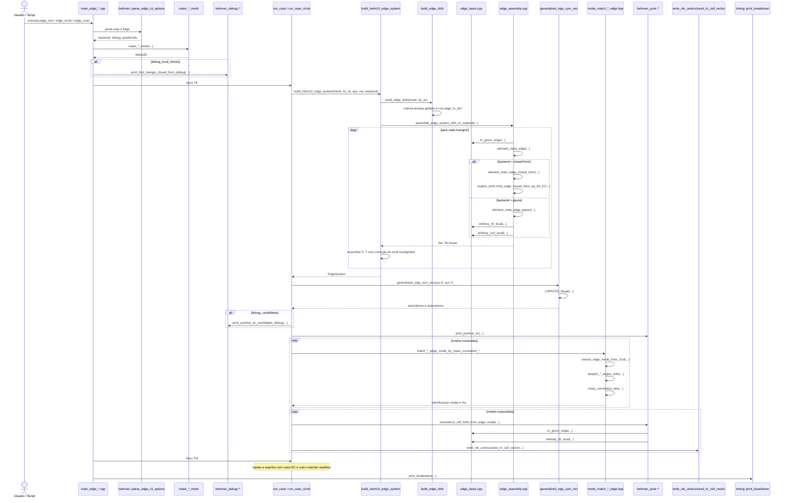

# R2 - HELMVEC: Diagrama de Sequência e Árvore de Chamada

Este arquivo cobre a segunda família de execução do projeto, correspondente ao programa histórico `HELMVEC` do artigo.

Casos do artigo cobertos diretamente por esta raiz:

- Caso 4: guia de onda retangular vetorial, Figura 4 / Tabela 4
- Caso 5: guia de onda circular vetorial, Tabela 5

Extensão adicional do repositório nesta mesma família:

- `edge_coax`, usado como ampliação de cobertura numérica, mas não contado como caso original da Seção `2.2.1` na nossa lista do artigo.

Executáveis atuais correspondentes:

- `edge_rect`
- `edge_circle`
- `edge_coax`

## 1) Visão geral da família

Esta família reutiliza a lógica geral de `main -> montagem -> solve -> matching -> exportação`, mas troca completamente o espaço discreto:

- o grau de liberdade deixa de estar no nó;
- passa a ser a circulação tangencial associada à aresta;
- a malha precisa carregar orientação local/global das arestas;
- o pós-processamento reconstrói campo por célula, não mais por nó.

Em termos conceituais, esta é a primeira raiz em que o projeto realmente entra na linguagem dos elementos de aresta.

## 2) Diagrama de sequência da família `HELMVEC`



## 3) Árvore de chamada completa da família

```text
edge_rect / edge_circle / edge_coax
└── main_edge_*.cpp
    ├── helmvec::parse_edge_cli_options(argc, argv)
    ├── make_*_mesh(...)
    │   ├── make_rect_mesh(...)
    │   ├── make_circle_mesh(...)
    │   └── make_coax_mesh(...)
    ├── [opcional] helmvec_debug::print_first_triangle_closed_form_debug(...)
    ├── run_case(...) ou run_case_circle(...)
    │   ├── build_helm10_edge_system(mesh, bc, eps, mu, backend)
    │   │   ├── build_edge_dofs(mesh, bc)
    │   │   │   ├── key_undirected(...)
    │   │   │   ├── cria Edge global sem orientação duplicada
    │   │   │   ├── grava tri_edges[tid].e
    │   │   │   ├── grava tri_edges[tid].sgn
    │   │   │   └── cria edge_to_dof conforme EdgeBC
    │   │   └── assemble_edge_system_with_tri_material(...)
    │   │       ├── loop em mesh.tris
    │   │       │   ├── tri_geom_edge(mesh, tri)
    │   │       │   ├── element_mats_edge(tg, eps_r, mu_r, backend, Sel, Tel)
    │   │       │   │   ├── backend closed-form
    │   │       │   │   │   ├── element_mats_edge_closed_form(...)
    │   │       │   │   │   └── explicit_tri2d::tri2d_edge_closed_form_eq_66_67(...)
    │   │       │   │   └── backend gauss
    │   │       │   │       ├── element_mats_edge_gauss(...)
    │   │       │   │       ├── whitney_curl_local(...)
    │   │       │   │       └── whitney_W_local(...)
    │   │       │   └── assemble S(I,J), T(I,J) com sgn local/global
    │   │       └── return EdgeSystem{S, T, ed}
    │   ├── generalized_eigs_sym_vec(sys.S, sys.T)
    │   │   └── LAPACKE_dsygv(...)
    │   ├── [opcional] helmvec_debug::print_positive_kc_candidates_debug(...)
    │   ├── helmvec_post::print_positive_kc(...)
    │   ├── loop de matching modal
    │   │   └── match_*_edge_mode_by_mass_correlation_*
    │   │       ├── extract_edge_mode_from_Zcol(...)
    │   │       ├── analytic_*_edges_dofs(...)
    │   │       └── mass_correlation_abs(...)
    │   │           ├── mass_inner(...)
    │   │           └── mass_norm(...)
    │   ├── loop de exportação VTK
    │   │   ├── helmvec_post::reconstruct_cell_field_from_edge_mode(...)
    │   │   │   ├── tri_geom_edge(...)
    │   │   │   ├── recupera e_loc com correção de sinal
    │   │   │   ├── whitney_W_local(...)
    │   │   │   └── normalização opcional
    │   │   └── write_vtk_unstructured_tri_cell_vector(...)
    │   └── return Breakdown do caso
    ├── repete run_case para TE
    ├── repete run_case para TM
    └── timing::print_breakdown(...)
```

## 4) Núcleo que diferencia esta família

O coração do `R2` está em três peças que não existiam no `R1`:

### 4.1) Construção dos DOFs de aresta

```text
build_edge_dofs(mesh, bc)
├── key_undirected(a, b)
├── cria catálogo global de arestas
├── registra tri_edges[tid].e
├── registra tri_edges[tid].sgn
└── cria edge_to_dof(...)
```

Ponto conceitual importante:

- a aresta global é identificada sem orientação (`min,max`);
- a orientação local do triângulo é preservada por `sgn = ±1`;
- na montagem, esse sinal corrige a contribuição local antes do espalhamento global.

### 4.2) Base de Whitney local

```text
tri_geom_edge(mesh, tri)
├── tri_geom(...)
├── grad_lambda(i, g)
├── comprimentos L[m]
├── whitney_W_local(m, tg, lam)
└── whitney_curl_local(m, tg)
```

Ponto conceitual importante:

- `whitney_W_local(...)` produz a base vetorial tangencial da aresta;
- `whitney_curl_local(...)` entra no termo `curl-curl`;
- a formulação local já nasce geometricamente adaptada à continuidade tangencial.

### 4.3) Montagem vetorial global

```text
assemble_edge_system_with_tri_material(...)
├── tri_geom_edge(...)
├── element_mats_edge(...)
│   ├── element_mats_edge_closed_form(...)
│   └── element_mats_edge_gauss(...)
└── assemble S,T com si * sj
```

Ponto conceitual importante:

- o fator `si * sj` é o elo entre a orientação da aresta no triângulo local e a orientação escolhida no sistema global;
- sem isso, a montagem edge perde coerência entre elementos adjacentes.

## 5) Substituições específicas por executável

| Executável | Caso no artigo | Geração de malha | Matcher modal | VTK típico | Observação |
| --- | --- | --- | --- | --- | --- |
| `edge_rect` | Caso 4 | `make_rect_mesh(...)` | `match_rect_edge_mode_by_mass_correlation_te/tm(...)` | `edge_rect_Et.vtk`, `edge_rect_Ht.vtk` | caso diretamente ligado à Tabela 4 |
| `edge_circle` | Caso 5 | `make_circle_mesh(...)` | `match_circle_edge_mode_by_mass_correlation_TE/TM(...)` | `edge_circle_Et.vtk`, `edge_circle_Ht.vtk` | caso diretamente ligado à Tabela 5 |
| `edge_coax` | extensão do repositório | `make_coax_mesh(...)` | `match_coax_edge_mode_by_mass_correlation_TE/TM(...)` | `edge_coax_Et.vtk`, `edge_coax_Ht.vtk` | útil para ampliar a cobertura, mas fora do conjunto original da `2.2.1` no artigo |

## 6) Subárvore do matching modal

### `edge_rect`

```text
match_rect_edge_mode_by_mass_correlation_te/tm(...)
├── extract_edge_mode_from_Zcol(...)
├── analytic_edges_rect(...)
│   ├── te_field_rect(...) ou tm_field_rect(...)
│   └── edge_gauss2_avg_tangential(...)
└── mass_correlation_abs(...)
    ├── mass_inner(...)
    └── mass_norm(...)
```

### `edge_circle`

```text
match_circle_edge_mode_by_mass_correlation_TE/TM(...)
├── extract_edge_mode_from_Zcol(...)
├── bessel_roots(...)
│   └── find_root_bisection(...)
├── analytic_circle_edges_dofs(...)
│   ├── polar_derivatives_U(...)
│   ├── gradU_cart(...)
│   ├── field_Ft_from_U(...)
│   └── edge_dof_from_field_gauss2(...)
└── mass_correlation_abs(...)
    ├── mass_inner(...)
    └── mass_norm(...)
```

### `edge_coax`

```text
match_coax_edge_mode_by_mass_correlation_TE/TM(...)
├── extract_edge_mode_from_Zcol(...)
├── coax_roots(...)
│   ├── det_TE(...)
│   ├── det_TM(...)
│   └── find_root_bisection(...)
├── analytic_coax_edges_dofs(...)
│   ├── coax_polar_derivatives_U(...)
│   ├── gradU_cart(...)
│   ├── Ft_from_gradU(...)
│   └── edge_dof_from_field_gauss2(...)
└── mass_correlation_abs(...)
    ├── mass_inner(...)
    └── mass_norm(...)
```

## 7) Leituras importantes para o próximo diagrama

- Em relação ao `R1`, o `R2` troca completamente a ontologia do grau de liberdade: sai o nó, entra a aresta.
- O `main` continua curto, mas o miolo matemático migra para `build_edge_dofs(...)`, `tri_geom_edge(...)` e `element_mats_edge(...)`.
- O matching modal já não compara potenciais nodais; ele compara vetores de DOFs tangenciais de aresta.
- O pós-processamento também muda de natureza: o campo é reconstruído em `CELL_DATA`, porque o modo edge é mais natural no interior do elemento do que sobre os nós.
- O ramo TE e o ramo TM compartilham a mesma infraestrutura, mas divergem na BC:
  - `EdgeBC::TE_PEC_TangentialZero`
  - `EdgeBC::TM_PEC_NormalZero`

## 8) Arquivos-chave desta raiz

- [main_edge_rect.cpp](/home/sperotto/tp3485-fem-eigen-em/src/helmvec/main_edge_rect.cpp)
- [main_edge_circle.cpp](/home/sperotto/tp3485-fem-eigen-em/src/helmvec/main_edge_circle.cpp)
- [main_edge_coax.cpp](/home/sperotto/tp3485-fem-eigen-em/src/helmvec/main_edge_coax.cpp)
- [edge_assembly.cpp](/home/sperotto/tp3485-fem-eigen-em/src/edge/edge_assembly.cpp)
- [edge_basis.cpp](/home/sperotto/tp3485-fem-eigen-em/src/edge/edge_basis.cpp)
- [edge_dofs.cpp](/home/sperotto/tp3485-fem-eigen-em/src/edge/edge_dofs.cpp)
- [edge_mode_post.hpp](/home/sperotto/tp3485-fem-eigen-em/src/helmvec/edge_mode_post.hpp)
- [mode_match_rect_edge.hpp](/home/sperotto/tp3485-fem-eigen-em/src/edge/mode_match_rect_edge.hpp)
- [mode_match_circle_edge.hpp](/home/sperotto/tp3485-fem-eigen-em/src/edge/mode_match_circle_edge.hpp)
- [mode_match_coax_edge.hpp](/home/sperotto/tp3485-fem-eigen-em/src/edge/mode_match_coax_edge.hpp)

## 9) Papel deste documento na sequência maior

Este é o segundo diagrama-base da coleção. Ele fecha a primeira grande transição do projeto:

- `R1`: formulação escalar nodal
- `R2`: formulação vetorial com elementos de aresta

Os próximos diagramas vão reaproveitar muito da infraestrutura do `R2`, especialmente:

- a montagem edge;
- a noção de bloco vetorial transversal;
- a leitura física dos DOFs associados a arestas.
