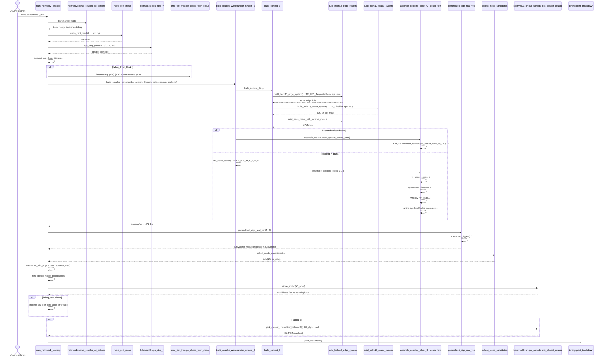

# R4 - HELMVEC2: Diagrama de Sequência e Árvore de Chamada

Este arquivo cobre a quarta família de execução do projeto, correspondente ao programa histórico `HELMVEC2` do artigo.

Caso do artigo coberto por esta raiz:

- Caso 8: guia quadrado parcialmente preenchido, Figura 11 / Tabela 8

Executável atual correspondente:

- `helmvec2_rect`

## 1) Visão geral da família

Esta raiz é o primeiro ponto em que o projeto entra de fato no problema acoplado da Seção `2.2.3`:

- a incógnita espectral deixa de ser `kc`;
- `beta` passa a entrar como dado;
- `k0` passa a sair do autoproblema;
- os blocos `Et` e `Ez` deixam de ficar apenas justapostos e passam a se acoplar.

Em linguagem estrutural, a mudança central é esta:

- em `R3`, o sistema era essencialmente block-diagonal;
- em `R4`, o sistema global passa a ser `A x = k0^2 B x`;
- os termos `tz` e `zt` agora entram na montagem global como acoplamento real entre arestas e nós.

Além disso, esta família acrescenta uma etapa de validação que não aparecia nos diagramas anteriores:

- filtrar raízes fisicamente propagantes;
- deduplicar candidatos espectrais;
- casar cada raiz calculada com a referência da Tabela 8.

## 2) Diagrama de sequência da família `HELMVEC2`



## 3) Árvore de chamada completa da família

```text
helmvec2_rect
└── main_helmvec2_rect.cpp
    ├── helmvec2::parse_coupled_cli_options(argc, argv)
    ├── make_rect_mesh(L, L, nx, ny)
    ├── helmvec23::eps_step_y(mesh, 0.5*L, 1.5, 1.0)
    ├── constroi mu[] uniforme
    ├── [opcional] print_first_triangle_closed_form_debug(...)
    │   ├── tri_geom_edge(...)
    │   ├── explicit_tri2d::tri2d_wavenumber_closed_form_eq_120_125(...)
    │   ├── explicit_tri2d::tri2d_wavenumber_rearranged_closed_form_eq_119(...)
    │   └── print_block_3x3(...)
    ├── build_coupled_wavenumber_system_E(mesh, beta, eps, mu, backend)
    │   ├── build_context_E(mesh, eps, mu, backend)
    │   │   ├── validate_tri_data(...)
    │   │   ├── build_helm10_edge_system(mesh, TE_PEC_TangentialZero, eps, mu, backend)
    │   │   ├── build_helm10_scalar_system(mesh, TM_Dirichlet, eps, mu, backend)
    │   │   └── build_edge_mass_with_inverse_mu(...)
    │   │       ├── inverse_per_triangle_checked(mu_r_tri)
    │   │       └── build_helm10_edge_system(mesh, TE_PEC_TangentialZero, inv_mu, one, backend)
    │   ├── aloca A e B
    │   ├── backend closed-form
    │   │   └── assemble_wavenumber_system_closed_form(...)
    │   │       ├── loop em triangulos
    │   │       ├── tri_geom_edge(...)
    │   │       ├── tri2d_wavenumber_rearranged_closed_form_eq_119(...)
    │   │       ├── espalha A_tt e B_tt com sgn_m * sgn_n
    │   │       ├── espalha A_zz e B_zz em dofs escalares
    │   │       ├── espalha A_tz com sgn_m
    │   │       └── espalha A_zt com sgn_n
    │   └── backend gauss
    │       ├── add_block_scaled(A, 0, 0, edge.S, +1)
    │       ├── add_block_scaled(A, 0, 0, Mt^(1/mu), +beta^2)
    │       ├── add_block_scaled(B, 0, 0, edge.T, +1)
    │       ├── add_block_scaled(A, nt, nt, scal.S, +beta^2)
    │       ├── add_block_scaled(B, nt, nt, scal.T, +beta^2)
    │       └── assemble_coupling_block_C(...)
    │           ├── loop em triangulos
    │           ├── tri_geom_edge(...)
    │           ├── gradN constante por triangulo
    │           ├── kTriQuadP2
    │           ├── whitney_W_local(...)
    │           └── espalha bloco C com sinal de orientacao
    ├── generalized_eigs_real_vec(sys.A, sys.B)
    │   └── LAPACKE_dggev(...)
    ├── collect_mode_candidates(eig, nt, nz)
    │   ├── descarta lambda nao finito
    │   ├── descarta parte imaginaria relevante
    │   ├── descarta lambda <= 0
    │   ├── converte k0 = sqrt(lambda_re)
    │   └── calcula ez_ratio por energia de bloco
    ├── calcula eps_max e k0_min_phys = beta / sqrt(eps_max)
    ├── filtra candidatos propagantes
    ├── helmvec23::unique_sorted(...)
    ├── [opcional] imprime debug de candidatos
    ├── loop de matching com a Tabela 8
    │   └── helmvec23::pick_closest_unused(...)
    └── timing::print_breakdown(...)
```

## 4) Núcleo que diferencia esta família

O coração do `R4` está em quatro peças que marcam a virada para o problema acoplado.

### 4.1) Contexto comum `Et/Ez`

```text
build_context_E(...)
├── build_helm10_edge_system(...)
├── build_helm10_scalar_system(...)
└── build_edge_mass_with_inverse_mu(...)
```

Ponto conceitual importante:

- o repositório não desperdiça a infraestrutura das famílias anteriores;
- ele monta primeiro os blocos-base já conhecidos;
- depois acrescenta a massa vetorial com peso `1/mu_r`, necessária para os termos com `beta^2`.

### 4.2) Acoplamento verdadeiro entre arestas e nós

```text
assemble_coupling_block_C(...)
├── gradN[j] = [b_j, c_j] / (2A)
├── C(m,j) = int_T (1/mu_r) W_m . grad(N_j) dA
├── bloco sup-dir  += coeff_top_right  * C
└── bloco inf-esq  += coeff_bottom_left* C^T
```

Ponto conceitual importante:

- é aqui que a família deixa de ser apenas “mista” e se torna realmente “acoplada”;
- o bloco `C` leva a informação entre o campo transversal discreto em arestas e a componente longitudinal discreta em nós;
- os sinais de orientação das arestas continuam indispensáveis na passagem do local para o global.

### 4.3) Duas rotas de montagem para a mesma física

```text
backend = closed-form
└── assemble_wavenumber_system_closed_form(...)

backend = gauss
├── add_block_scaled(...)
└── assemble_coupling_block_C(...)
```

Ponto conceitual importante:

- o caminho `closed-form` entra pelas expressões locais rearranjadas da Eq. `(119)`;
- o caminho `gauss` recompõe o mesmo sistema a partir dos blocos base e do bloco de acoplamento;
- as duas rotas convergem para o mesmo solve generalizado real `A x = k0^2 B x`.

### 4.4) Filtro físico e matching com a Tabela 8

```text
collect_mode_candidates(...)
├── k0 = sqrt(lambda_re)
└── ez_ratio = ||Ez||² / (||Et||² + ||Ez||²)

k0_min_phys = beta / sqrt(eps_max)
```

Ponto conceitual importante:

- o solver devolve um espectro mais amplo do que o conjunto de modos propagantes desejados;
- o filtro `k0 > beta / sqrt(eps_max)` remove raízes não propagantes para o meio estratificado da Figura 11;
- depois disso, o repositório ainda precisa deduplicar e casar cada raiz com a sequência publicada pelo `HELMVEC2`.

## 5) Substituições específicas do caso

| Item | Implementação atual |
| --- | --- |
| Geometria | `make_rect_mesh(L, L, nx, ny)` |
| Perfil material | `helmvec23::eps_step_y(mesh, 0.5*L, 1.5, 1.0)` |
| Formulação global | `A x = k0^2 B x` |
| Solver | `generalized_eigs_real_vec(...)` |
| Filtro físico | `k0 > beta / sqrt(eps_max)` |
| Casamento final | `helmvec23::pick_closest_unused(...)` |

## 6) Subárvore da filtragem e do matching

Depois do solve, esta família entra em um trecho novo que não aparecia em `R1`, `R2` ou `R3`.

```text
generalized_eigs_real_vec(...)
└── collect_mode_candidates(...)
    ├── filtra espectro real positivo
    ├── calcula k0
    └── calcula ez_ratio

all_modes
├── filtro fisico k0 > beta / sqrt(eps_max)
├── helmvec23::unique_sorted(...)
└── loop de matching
    └── helmvec23::pick_closest_unused(...)
```

Esse trecho é importante porque separa três ideias diferentes:

- resolver o autoproblema;
- decidir quais raízes fazem sentido físico para o caso estratificado;
- alinhar as raízes calculadas com a ordenação de validação publicada na Tabela 8.

## 7) Leituras importantes para o próximo diagrama

Esta raiz prepara o terreno de `R5` de forma quase direta:

- `R4` resolve `k0` com `beta` dado;
- `R5` vai inverter a pergunta e resolver `beta` com `k0` dado;
- o tronco geométrico e boa parte dos utilitários continuam os mesmos;
- o que muda é o rearranjo algébrico do problema espectral e o pós-processamento final.

Em termos pedagógicos, `HELMVEC2` é o momento em que a teoria mista da Seção `2.2.2` amadurece e se transforma num problema espectral realmente operacional para meio inhomogêneo.

## 8) Arquivos-chave desta raiz

- [main_helmvec2_rect.cpp](/home/sperotto/tp3485-fem-eigen-em/src/helmvec2/main_helmvec2_rect.cpp)
- [helmvec2_coupled_system.cpp](/home/sperotto/tp3485-fem-eigen-em/src/helmvec2/helmvec2_coupled_system.cpp)
- [helmvec2_coupled_system.hpp](/home/sperotto/tp3485-fem-eigen-em/src/helmvec2/helmvec2_coupled_system.hpp)
- [helmvec23_shared.hpp](/home/sperotto/tp3485-fem-eigen-em/src/helmvec2/helmvec23_shared.hpp)
- [coupled_cli_options.hpp](/home/sperotto/tp3485-fem-eigen-em/src/helmvec2/coupled_cli_options.hpp)
- [lapack_eig.hpp](/home/sperotto/tp3485-fem-eigen-em/src/core/lapack_eig.hpp)
- [edge_assembly.cpp](/home/sperotto/tp3485-fem-eigen-em/src/edge/edge_assembly.cpp)
- [helm10_scalar_system.cpp](/home/sperotto/tp3485-fem-eigen-em/src/core/helm10_scalar_system.cpp)

## 9) Papel deste documento na sequência maior

Este é o quarto diagrama-base da coleção. Ele marca a entrada do projeto no domínio dos problemas acoplados inhomogêneos em que a separação modal já não pode ser feita apenas pela estrutura do sistema. Por isso, `R4` é a raiz em que montagem, filtragem física e validação tabulada passam a ser igualmente importantes.
