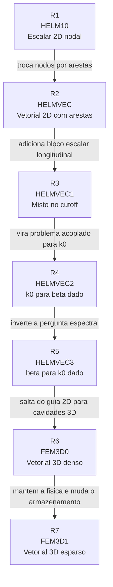

# Diagrama Mestre R1 a R7

Este arquivo resume a colecao inteira de diagramas de execucao do projeto em uma unica visao. A ideia aqui nao e substituir os diagramas detalhados, mas fornecer um mapa de alto nivel para localizar cada familia dentro da historia completa do codigo.

## 1) Visao global da sequencia



## 2) O que muda de uma raiz para a seguinte

| Transicao | Mudanca central | O que permanece |
| --- | --- | --- |
| `R1 -> R2` | base nodal escalar vira base vetorial de aresta | malha 2D, solve simetrico, matching com referencia |
| `R2 -> R3` | campo transversal puro vira sistema misto `aresta + escalar` | reutilizacao da infraestrutura 2D e solve simetrico |
| `R3 -> R4` | blocos deixam de ser so justapostos e passam a se acoplar | base mista `Et/Ez`, malha 2D retangular |
| `R4 -> R5` | a incognita espectral muda de `k0` para `beta` | mesmo nucleo acoplado, mesma geometria base e utilitarios compartilhados |
| `R5 -> R6` | guia 2D vira cavidade 3D tetraedrica | filosofia de elementos de aresta e comparacao com o artigo |
| `R6 -> R7` | montagem densa vira montagem esparsa simetrica | mesma fisica 3D, mesmos casos, mesmo matching modal |

## 3) Troncos estruturais que reaparecem

Ao longo da colecao, alguns troncos reaparecem com formas diferentes:

| Tronco | Onde nasce | Onde reaparece |
| --- | --- | --- |
| `montagem -> solve -> matching` | `R1` | em todas as demais raizes |
| orientacao de arestas e bases de Whitney | `R2` | `R3`, `R4`, `R5`, `R6`, `R7` |
| combinacao de blocos vetorial + escalar | `R3` | `R4` e `R5` |
| filtragem / organizacao modal apos solve | `R3` | `R4`, `R5`, `R6`, `R7` |
| camada de casos + referencias | `R1` em escala simples | `R6` e `R7` com estrutura muito mais elaborada |

## 4) Mapa por dimensao e tipo de problema

```text
2D escalar:
  R1

2D vetorial com arestas:
  R2

2D misto / acoplado:
  R3
  R4
  R5

3D vetorial:
  R6
  R7
```

## 5) Mapa por pergunta espectral

| Pergunta | Raiz | Forma global |
| --- | --- | --- |
| quais sao os cutoffs escalares TE/TM em 2D? | `R1` | `S x = kc^2 T x` |
| quais sao os cutoffs vetoriais em 2D com arestas? | `R2` | `S x = kc^2 T x` |
| como separar familias mistas no cutoff? | `R3` | sistema em blocos da Eq. `(92)` |
| como encontrar `k0` com `beta` dado? | `R4` | `A x = k0^2 B x` |
| como encontrar `beta` com `k0` dado? | `R5` | `P x = beta^2 Q x` |
| quais sao os autovalores de cavidades 3D? | `R6`, `R7` | `S e = k0^2 T e` |

## 6) Links para os diagramas detalhados

- [Diagrama_R1_HELM10_Sequencia_e_Arvore.md](Diagrama_R1_HELM10_Sequencia_e_Arvore.md)
- [Diagrama_R2_HELMVEC_Sequencia_e_Arvore.md](Diagrama_R2_HELMVEC_Sequencia_e_Arvore.md)
- [Diagrama_R3_HELMVEC1_Sequencia_e_Arvore.md](Diagrama_R3_HELMVEC1_Sequencia_e_Arvore.md)
- [Diagrama_R4_HELMVEC2_Sequencia_e_Arvore.md](Diagrama_R4_HELMVEC2_Sequencia_e_Arvore.md)
- [Diagrama_R5_HELMVEC3_Sequencia_e_Arvore.md](Diagrama_R5_HELMVEC3_Sequencia_e_Arvore.md)
- [Diagrama_R6_FEM3D0_Sequencia_e_Arvore.md](Diagrama_R6_FEM3D0_Sequencia_e_Arvore.md)
- [Diagrama_R7_FEM3D1_Sequencia_e_Arvore.md](Diagrama_R7_FEM3D1_Sequencia_e_Arvore.md)

## 7) Papel deste arquivo

Este diagrama-mestre existe para responder rapidamente duas perguntas:

- em que ponto da historia do projeto eu estou?
- qual raiz preciso abrir para entender a proxima camada de complexidade?

Ele e, por assim dizer, o sumario visual da colecao.
