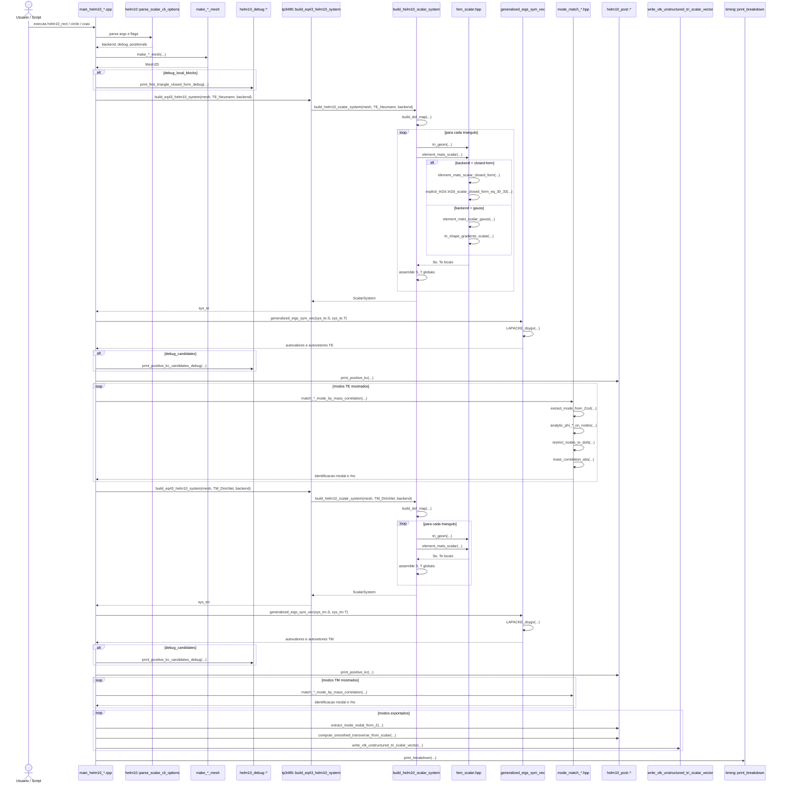

# R1 - HELM10: Diagrama de Sequência e Árvore de Chamada

Este arquivo cobre a primeira família de execução do projeto, correspondente ao programa histórico `HELM10` do artigo.

Casos do artigo cobertos por esta raiz:

- Caso 1: guia de onda retangular homogêneo, Figura 4 / Tabela 1 / Figura 5
- Caso 2: guia de onda circular homogêneo, Figura 6 / Tabela 2 / Figura 7
- Caso 3: linha coaxial homogênea, Figura 8 / Tabela 3 / Figura 9

Executáveis atuais correspondentes:

- `helm10_rect`
- `helm10_circle`
- `helm10_coax`

Entrada didática por equação:

- `tp3485::build_eq43_helm10_system(...)`

## 1) Visão geral da família

Os três executáveis têm a mesma espinha dorsal:

1. interpretar CLI;
2. construir a malha 2D;
3. montar o sistema escalar TE;
4. resolver o autoproblema generalizado;
5. fazer matching modal com a referência analítica;
6. repetir o processo para TM;
7. reconstruir campos e exportar VTK;
8. imprimir tabela e tempos.

O que muda entre os três é:

- a rotina de geração de malha;
- a rotina de matching analítico;
- os nomes dos arquivos de saída.

## 2) Diagrama de sequência da família `HELM10`



## 3) Árvore de chamada completa da família

```text
helm10_rect / helm10_circle / helm10_coax
└── main_helm10_*.cpp
    ├── helm10::parse_scalar_cli_options(argc, argv)
    ├── make_*_mesh(...)
    │   ├── make_rect_mesh(...)
    │   ├── make_circle_mesh(...)
    │   └── make_coax_mesh(...)
    ├── [opcional] helm10_debug::print_first_triangle_closed_form_debug(...)
    ├── tp3485::build_eq43_helm10_system(mesh, ScalarBC::TE_Neumann, backend)
    │   └── build_helm10_scalar_system(mesh, ScalarBC::TE_Neumann, backend)
    │       ├── build_dof_map(mesh, bc)
    │       ├── loop em mesh.tris
    │       │   ├── tri_geom(mesh, tri)
    │       │   ├── element_mats_scalar(g, backend, Se, Te)
    │       │   │   ├── backend closed-form
    │       │   │   │   ├── element_mats_scalar_closed_form(g, Se, Te)
    │       │   │   │   └── explicit_tri2d::tri2d_scalar_closed_form_eq_30_33(...)
    │       │   │   └── backend gauss
    │       │   │       ├── element_mats_scalar_gauss(g, Se, Te)
    │       │   │       └── tri_shape_gradients_scalar(g, dndx, dndy)
    │       │   └── assemble S(ia, ib) e T(ia, ib)
    │       └── return ScalarSystem{S, T, ndof, dof_map}
    ├── generalized_eigs_sym_vec(sys_te.S, sys_te.T)
    │   └── LAPACKE_dsygv(...)
    ├── [opcional] helm10_debug::print_positive_kc_candidates_debug(...)
    ├── helm10_post::print_positive_kc(...)
    ├── loop de matching TE
    │   └── match_*_mode_by_mass_correlation(...)
    │       ├── extract_mode_from_Zcol(...)
    │       ├── analytic_phi_*_on_nodes(...)
    │       ├── restrict_nodes_to_dofs(...)
    │       └── mass_correlation_abs(...)
    │           ├── mass_inner(...)
    │           └── mass_norm(...)
    ├── tp3485::build_eq43_helm10_system(mesh, ScalarBC::TM_Dirichlet, backend)
    │   └── build_helm10_scalar_system(mesh, ScalarBC::TM_Dirichlet, backend)
    │       └── mesmo tronco de montagem TE, mudando apenas a BC
    ├── generalized_eigs_sym_vec(sys_tm.S, sys_tm.T)
    │   └── LAPACKE_dsygv(...)
    ├── [opcional] helm10_debug::print_positive_kc_candidates_debug(...)
    ├── helm10_post::print_positive_kc(...)
    ├── loop de matching TM
    │   └── match_*_mode_by_mass_correlation(...)
    ├── loop de exportação VTK
    │   ├── helm10_post::extract_mode_nodal_from_Z(...)
    │   ├── helm10_post::compute_smoothed_transverse_from_scalar(...)
    │   │   ├── tri_geom(mesh, tri)
    │   │   ├── gradiente local do potencial
    │   │   └── suavização nodal ponderada por área
    │   └── write_vtk_unstructured_tri_scalar_vector(...)
    └── timing::print_breakdown(...)
```

## 4) Núcleo que diferencia esta família

O coração do `R1` está em três peças que sustentam toda a trilha posterior do projeto.

### 4.1) Montagem escalar nodal

```text
tp3485::build_eq43_helm10_system(...)
└── build_helm10_scalar_system(...)
    ├── build_dof_map(...)
    ├── tri_geom(...)
    ├── element_mats_scalar(...)
    └── assemble S, T globais
```

Ponto conceitual importante:

- a base discreta ainda é nodal `P1`;
- o sistema global nasce diretamente da formulação escalar da Seção `2.1`;
- este é o primeiro lugar em que a teoria do artigo realmente se transforma em matriz FEM no repositório.

### 4.2) Reuso da mesma espinha para TE e TM

```text
fluxo TE
└── tp3485::build_eq43_helm10_system(..., TE_Neumann, ...)
    └── build_helm10_scalar_system(..., TE_Neumann, ...)

fluxo TM
└── tp3485::build_eq43_helm10_system(..., TM_Dirichlet, ...)
    └── build_helm10_scalar_system(..., TM_Dirichlet, ...)
```

Ponto conceitual importante:

- a infraestrutura numérica é quase a mesma para as duas famílias;
- o que muda é a condição de contorno e, com ela, o espaço discreto efetivo;
- essa simetria estrutural é uma das ideias de projeto que mais se repetirão nas raízes seguintes.

### 4.3) Matching modal e reconstrução de campo

```text
match_*_mode_by_mass_correlation(...)
├── extrai modo FEM
├── monta referencia analitica
└── compara por correlacao de massa

helm10_post::compute_smoothed_transverse_from_scalar(...)
└── reconstrói campo transversal suave
```

Ponto conceitual importante:

- o solve sozinho não entrega a linguagem física do artigo;
- o matching modal é o elo entre autovalores brutos e tabelas publicadas;
- a reconstrução do campo mostra que esta raiz já não é só validação espectral, mas também leitura física do modo.

## 5) Substituições específicas por executável

| Executável | Geração de malha | Matching analítico | VTK típico |
| --- | --- | --- | --- |
| `helm10_rect` | `make_rect_mesh(...)` | `match_rect_mode_by_mass_correlation(...)` | `te_rect_*_sv.vtk`, `tm_rect_*_sv.vtk` |
| `helm10_circle` | `make_circle_mesh(...)` | `match_circle_mode_by_mass_correlation(...)` | `te_circle_sv.vtk`, `tm_circle_sv.vtk` |
| `helm10_coax` | `make_coax_mesh(...)` | `match_coax_mode_by_mass_correlation(...)` | `te_coax_sv.vtk`, `tm_coax_sv.vtk` |

## 6) Subárvore analítica do matching modal

O tronco principal é o mesmo nas três geometrias, mas a camada analítica muda.

### `helm10_rect`

```text
match_rect_mode_by_mass_correlation(...)
├── extract_mode_from_Zcol(...)
├── candidates_rect(...)
├── analytic_phi_rect_on_nodes(...)
├── restrict_nodes_to_dofs(...)
└── mass_correlation_abs(...)
    ├── mass_inner(...)
    └── mass_norm(...)
```

### `helm10_circle`

```text
match_circle_mode_by_mass_correlation(...)
├── extract_mode_from_Zcol(...)
├── bessel_roots(...)
│   └── find_root_bisection(...)
├── analytic_phi_circle_on_nodes(...)
├── restrict_nodes_to_dofs(...)
└── mass_correlation_abs(...)
    ├── mass_inner(...)
    └── mass_norm(...)
```

### `helm10_coax`

```text
match_coax_mode_by_mass_correlation(...)
├── extract_mode_from_Zcol(...)
├── coax_roots(...)
│   ├── det_TM(...)
│   ├── det_TE(...)
│   └── find_root_bisection(...)
├── analytic_phi_coax_on_nodes(...)
├── restrict_nodes_to_dofs(...)
└── mass_correlation_abs(...)
    ├── mass_inner(...)
    └── mass_norm(...)
```

## 7) Leituras importantes para o próximo diagrama

- Esta família já mostra a estrutura clássica do projeto: `main` curto, montagem global separada, solve LAPACK e pós-processamento explícito.
- O ponto de troca entre matemática e engenharia está em `build_helm10_scalar_system(...)`: ali a formulação da Seção 2.1 realmente vira matriz global.
- O matching modal não é um detalhe cosmético; ele é o elo entre o espectro FEM cru e as tabelas do artigo.
- O fluxo TE e o fluxo TM usam a mesma infraestrutura, mas divergem na condição de contorno e, portanto, no espaço discreto efetivo.

## 8) Arquivos-chave desta raiz

- [main_helm10_rect.cpp](/home/sperotto/tp3485-fem-eigen-em/src/helm10/main_helm10_rect.cpp)
- [main_helm10_circle.cpp](/home/sperotto/tp3485-fem-eigen-em/src/helm10/main_helm10_circle.cpp)
- [main_helm10_coax.cpp](/home/sperotto/tp3485-fem-eigen-em/src/helm10/main_helm10_coax.cpp)
- [helm10_scalar_system.cpp](/home/sperotto/tp3485-fem-eigen-em/src/core/helm10_scalar_system.cpp)
- [fem_scalar.hpp](/home/sperotto/tp3485-fem-eigen-em/src/core/fem_scalar.hpp)
- [lapack_eig.hpp](/home/sperotto/tp3485-fem-eigen-em/src/core/lapack_eig.hpp)
- [scalar_mode_post.hpp](/home/sperotto/tp3485-fem-eigen-em/src/helm10/scalar_mode_post.hpp)
- [mode_match_rect.hpp](/home/sperotto/tp3485-fem-eigen-em/src/core/mode_match_rect.hpp)
- [mode_match_circle.hpp](/home/sperotto/tp3485-fem-eigen-em/src/core/mode_match_circle.hpp)
- [mode_match_coax.hpp](/home/sperotto/tp3485-fem-eigen-em/src/core/mode_match_coax.hpp)

## 9) Papel deste documento na sequência maior

Este é o primeiro diagrama-base da coleção. Ele funciona como a porta de entrada do leitor porque mostra a forma mais limpa e pedagógica do ciclo completo do projeto:

- montagem FEM;
- solve espectral;
- matching com referência analítica;
- reconstrução física do modo.

Tudo o que vem depois nasce daqui por extensão:

- `R2` troca nós por arestas;
- `R3` mistura blocos vetoriais e escalares;
- `R4` e `R5` mudam a pergunta espectral;
- `R6` e `R7` transportam a mesma filosofia para o domínio tridimensional.
