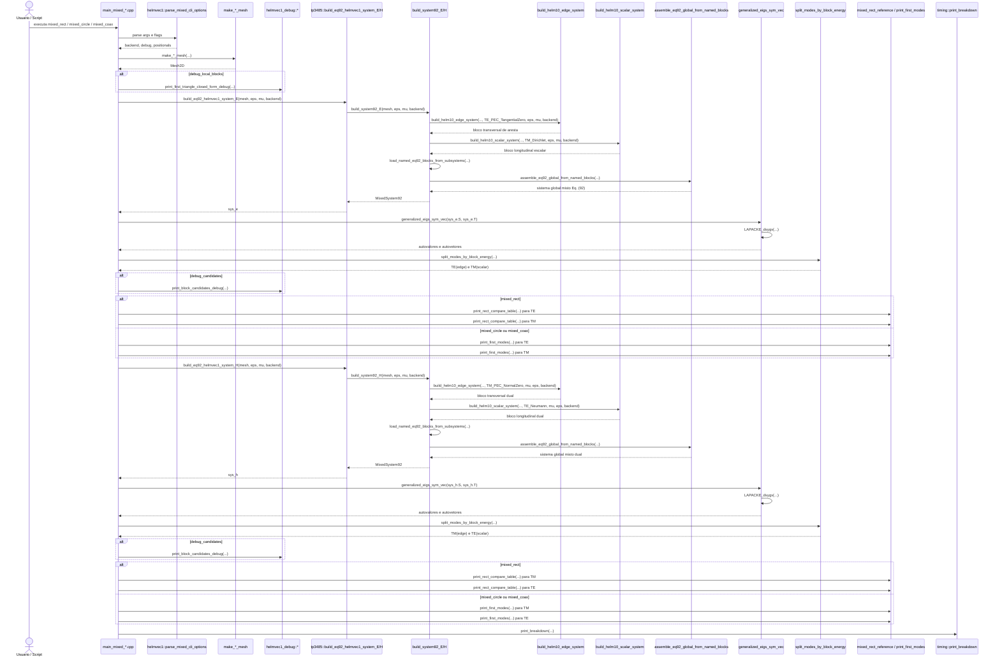

# R3 - HELMVEC1: Diagrama de Sequência e Árvore de Chamada

Este arquivo cobre a terceira família de execução do projeto, correspondente ao programa histórico `HELMVEC1` do artigo.

Casos do artigo cobertos diretamente por esta raiz:

- Caso 6: guia retangular misto no cutoff, Tabela 6
- Caso 7: guia circular misto no cutoff, Tabela 7

Extensão adicional do repositório nesta mesma família:

- `mixed_coax`, usado como ampliação de cobertura geométrica, mas não contado como caso original da Seção `2.2.2` na nossa lista do artigo.

Executáveis atuais correspondentes:

- `mixed_rect`
- `mixed_circle`
- `mixed_coax`

Entrada didática por equação:

- `tp3485::build_eq92_helmvec1_system_E(...)`
- `tp3485::build_eq92_helmvec1_system_H(...)`

## 1) Visão geral da família

Esta raiz é a primeira em que o projeto assume explicitamente uma natureza mista:

- um bloco transversal vetorial em arestas;
- um bloco longitudinal escalar em nós;
- um autovetor global no formato `x = [bloco_aresta ; bloco_escalar]`.

O ponto conceitual mais importante aqui é o seguinte: o repositório não cria um novo montador elemental independente para a Eq. `(92)`. Em vez disso, ele reaproveita dois troncos já maduros:

- o tronco vetorial de `R2`, vindo de `build_helm10_edge_system(...)`;
- o tronco escalar de `R1`, vindo de `build_helm10_scalar_system(...)`.

Depois disso, a família `HELMVEC1` faz três coisas novas:

- preserva explicitamente os blocos `St`, `Tt`, `Sz` e `Tz`;
- fecha o sistema global por `assemble_eq92_global_from_named_blocks(...)`;
- separa os modos pelo bloco dominante usando `split_modes_by_block_energy(...)`.

## 2) Diagrama de sequência da família `HELMVEC1`



## 3) Árvore de chamada completa da família

```text
mixed_rect / mixed_circle / mixed_coax
└── main_mixed_*.cpp
    ├── helmvec1::parse_mixed_cli_options(argc, argv)
    ├── make_*_mesh(...)
    │   ├── make_rect_mesh(...)
    │   ├── make_circle_mesh(...)
    │   └── make_coax_mesh(...)
    ├── constroi eps[] e mu[] por triângulo
    ├── [opcional] helmvec1_debug::print_first_triangle_closed_form_debug(...)
    │   ├── tri_geom(...)
    │   ├── tri_geom_edge(...)
    │   ├── explicit_tri2d::tri2d_edge_closed_form_eq_66_67(...)
    │   ├── explicit_tri2d::tri2d_scalar_closed_form_eq_30_33(...)
    │   └── print_block_3x3(...)
    ├── tp3485::build_eq92_helmvec1_system_E(mesh, eps, mu, backend)
    │   └── build_system92_E(mesh, eps, mu, backend)
    │       ├── build_helm10_edge_system(mesh, TE_PEC_TangentialZero, eps, mu, backend)
    │       │   └── mesmo tronco de montagem da família R2
    │       ├── build_helm10_scalar_system(mesh, TM_Dirichlet, eps, mu, backend)
    │       │   └── mesmo tronco de montagem da família R1
    │       ├── load_named_eq92_blocks_from_subsystems(...)
    │       │   ├── ms.St <- ms.edge.S
    │       │   ├── ms.Tt <- ms.edge.T
    │       │   ├── ms.Sz <- ms.scal.S
    │       │   └── ms.Tz <- ms.scal.T
    │       ├── assemble_eq92_global_from_named_blocks(...)
    │       │   ├── ms.nt = ms.edge.ed.ndof
    │       │   ├── ms.nz = ms.scal.ndof
    │       │   ├── block_diag(ms.St, ms.Sz)
    │       │   └── block_diag(ms.Tt, ms.Tz)
    │       └── return MixedSystem92
    ├── generalized_eigs_sym_vec(sys_e.S, sys_e.T)
    │   └── LAPACKE_dsygv(...)
    ├── split_modes_by_block_energy(res_e, nt, nz, rho, k_edge, k_scal)
    │   ├── percorre autovalores positivos
    │   ├── calcula energia no bloco 0
    │   ├── calcula energia no bloco 1
    │   ├── classifica por bloco dominante
    │   └── salva k = sqrt(lambda)
    ├── [opcional] helmvec1_debug::print_block_candidates_debug(...)
    │   └── print_first_modes(...)
    ├── saída da formulação E
    │   ├── mixed_rect -> print_rect_compare_table(...)
    │   │   ├── analytic_rect_te(...)
    │   │   └── analytic_rect_tm(...)
    │   └── mixed_circle / mixed_coax -> print_first_modes(...)
    ├── tp3485::build_eq92_helmvec1_system_H(mesh, eps, mu, backend)
    │   └── build_system92_H(mesh, eps, mu, backend)
    │       ├── build_helm10_edge_system(mesh, TM_PEC_NormalZero, mu, eps, backend)
    │       ├── build_helm10_scalar_system(mesh, TE_Neumann, mu, eps, backend)
    │       ├── load_named_eq92_blocks_from_subsystems(...)
    │       ├── assemble_eq92_global_from_named_blocks(...)
    │       └── return MixedSystem92
    ├── generalized_eigs_sym_vec(sys_h.S, sys_h.T)
    │   └── LAPACKE_dsygv(...)
    ├── split_modes_by_block_energy(res_h, nt, nz, rho, k_edge, k_scal)
    ├── [opcional] helmvec1_debug::print_block_candidates_debug(...)
    ├── saída da formulação H
    │   ├── mixed_rect -> print_rect_compare_table(...)
    │   └── mixed_circle / mixed_coax -> print_first_modes(...)
    └── timing::print_breakdown(...)
```

## 4) Núcleo que diferencia esta família

O coração do `R3` está em quatro peças que precisam ser lidas em conjunto.

### 4.1) Fechamento da Eq. `(92)` por reuso de troncos

```text
tp3485::build_eq92_helmvec1_system_E(...)
└── build_system92_E(...)
    ├── build_helm10_edge_system(...)
    ├── build_helm10_scalar_system(...)
    ├── load_named_eq92_blocks_from_subsystems(...)
    └── assemble_eq92_global_from_named_blocks(...)
```

Ponto conceitual importante:

- o bloco de aresta já chega pronto da formulação vetorial transversal;
- o bloco escalar já chega pronto da formulação nodal;
- a novidade do `HELMVEC1` é o empacotamento coerente desses dois mundos em um único autoproblema misto.

### 4.2) Versão `E` e versão `H`

```text
tp3485::build_eq92_helmvec1_system_E(...)
└── build_system92_E(...)
    ├── EdgeBC::TE_PEC_TangentialZero
    └── ScalarBC::TM_Dirichlet

tp3485::build_eq92_helmvec1_system_H(...)
└── build_system92_H(...)
    ├── EdgeBC::TM_PEC_NormalZero
    ├── ScalarBC::TE_Neumann
    └── troca constitutiva eps <-> mu
```

Ponto conceitual importante:

- a formulação `E` tende a produzir família `TE` no bloco de aresta e família `TM` no bloco escalar;
- a formulação `H` faz o dual: bloco de aresta mais associado a `TM`, bloco escalar mais associado a `TE`;
- o repositório implementa esse dual sem reinventar a geometria, apenas trocando pesos materiais e condições de contorno.

### 4.3) Separação modal por energia de bloco

```text
split_modes_by_block_energy(...)
├── extrai x = [x0 ; x1]
├── calcula E0 = ||x0||²
├── calcula E1 = ||x1||²
├── compara E0 e E1
└── classifica o modo no bloco dominante
```

Ponto conceitual importante:

- a diagonalidade em blocos não garante que a ordenação do solver venha pronta no formato pedagógico desejado;
- a rotina de energia de bloco reorganiza o espectro no vocabulário físico da seção `2.2.2`;
- é isso que permite imprimir famílias TE/TM de forma inteligível ao leitor.

### 4.4) Saída retangular versus saída circular/coaxial

```text
mixed_rect
├── analytic_rect_te(...)
├── analytic_rect_tm(...)
└── print_rect_compare_table(...)

mixed_circle / mixed_coax
└── print_first_modes(...)
```

Ponto conceitual importante:

- no caso retangular, o repositório fecha a comparação modal com referência analítica explícita;
- nos casos circular e coaxial, esta raiz assume um papel mais exploratório e imprime snapshots do espectro separado por bloco.

## 5) Substituições específicas por executável

| Executável | Papel no artigo | Geração de malha | Saída principal |
| --- | --- | --- | --- |
| `mixed_rect` | Caso 6, Tabela 6 | `make_rect_mesh(...)` | tabelas TE/TM para formulações `E` e `H` com comparação analítica |
| `mixed_circle` | Caso 7, Tabela 7 | `make_circle_mesh(...)` | primeiras frequências de cutoff por bloco dominante |
| `mixed_coax` | extensão do repositório | `make_coax_mesh(...)` | primeiras frequências de cutoff por bloco dominante |

## 6) Subárvore da classificação modal

O tronco novo desta família aparece depois do solve.

```text
generalized_eigs_sym_vec(...)
└── split_modes_by_block_energy(...)
    ├── para cada autovetor k
    │   ├── soma energia no bloco de aresta
    │   ├── soma energia no bloco escalar
    │   └── decide família dominante
    ├── ordena k_block0
    └── ordena k_block1
```

No caso retangular, esta classificação alimenta diretamente a comparação com a referência:

```text
mixed_rect
├── analytic_rect_te(...)
├── analytic_rect_tm(...)
└── print_rect_compare_table(...)
```

Nos casos circular e coaxial, ela alimenta a inspeção compacta do espectro:

```text
mixed_circle / mixed_coax
└── print_first_modes(...)
```

## 7) Leituras importantes para o próximo diagrama

Esta raiz prepara uma transição essencial do projeto:

- `R2` ainda tratava apenas um campo vetorial transversal;
- `R3` já ensina como conviver com incógnitas de naturezas diferentes dentro do mesmo problema;
- `R4` vai dar o próximo passo: abandonar o cutoff puro e introduzir acoplamento espectral real entre blocos.

Em linguagem de estudo, `HELMVEC1` é o laboratório onde o projeto aprende a montar, resolver e interpretar um sistema misto sem ainda entrar no problema completamente acoplado de `k0` e `beta`.

## 8) Arquivos-chave desta raiz

- [main_mixed_rect.cpp](/home/sperotto/tp3485-fem-eigen-em/src/helmvec1/main_mixed_rect.cpp)
- [main_mixed_circle.cpp](/home/sperotto/tp3485-fem-eigen-em/src/helmvec1/main_mixed_circle.cpp)
- [main_mixed_coax.cpp](/home/sperotto/tp3485-fem-eigen-em/src/helmvec1/main_mixed_coax.cpp)
- [helmvec1_mixed_system.cpp](/home/sperotto/tp3485-fem-eigen-em/src/helmvec1/helmvec1_mixed_system.cpp)
- [helmvec1_mixed_system.hpp](/home/sperotto/tp3485-fem-eigen-em/src/helmvec1/helmvec1_mixed_system.hpp)
- [mixed_mode_utils.hpp](/home/sperotto/tp3485-fem-eigen-em/src/helmvec1/mixed_mode_utils.hpp)
- [mixed_rect_reference.hpp](/home/sperotto/tp3485-fem-eigen-em/src/helmvec1/mixed_rect_reference.hpp)
- [mixed_debug.hpp](/home/sperotto/tp3485-fem-eigen-em/src/helmvec1/mixed_debug.hpp)
- [edge_assembly.cpp](/home/sperotto/tp3485-fem-eigen-em/src/edge/edge_assembly.cpp)
- [helm10_scalar_system.cpp](/home/sperotto/tp3485-fem-eigen-em/src/core/helm10_scalar_system.cpp)

## 9) Papel deste documento na sequência maior

Este é o terceiro diagrama-base da coleção. Ele ocupa uma posição pedagógica delicada: ainda depende fortemente dos troncos anteriores, mas já introduz a primeira organização explícita em blocos mistos. Por isso, ele funciona como ponte natural entre a formulação de cutoff da Seção `2.2.2` e os problemas acoplados completos de `R4` e `R5`.
