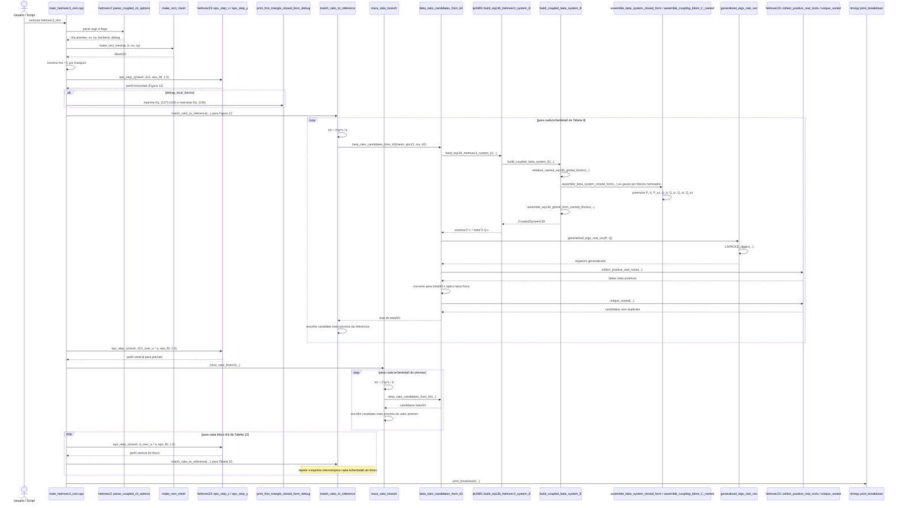

# R5 - HELMVEC3: Diagrama de Sequência e Árvore de Chamada

Este arquivo cobre a quinta família de execução do projeto, correspondente ao programa histórico `HELMVEC3` do artigo.

Casos do artigo cobertos por esta raiz:

- Caso 9: dispersão com interface horizontal, Figura 12 / Tabela 9
- Caso 10: dispersão com interface vertical, Figura 13 / Tabela 10

Executáveis atuais correspondentes:

- `helmvec3_fig12_rect`
- `helmvec3_fig13_rect`

Observacao de implementacao:

- `main_helmvec3_rect.cpp` permanece como nucleo compartilhado;
- os wrappers publicos ficam em `main_helmvec3_fig12_rect.cpp` e
  `main_helmvec3_fig13_rect.cpp`.

Entrada didática por equação:

- `tp3485::build_eq136_helmvec3_system_E(...)`

## 1) Visão geral da família

Esta raiz é a inversão direta da pergunta espectral de `R4`:

- em `R4`, o código fixa `beta` e procura `k0`;
- em `R5`, o código fixa `k0` e procura `beta`;
- o sistema global deixa de ser `A x = k0^2 B x`;
- passa a ser `P x = beta^2 Q x`.

Do ponto de vista estrutural, `R5` reaproveita quase toda a infraestrutura geométrica e de montagem de `R4`, mas altera profundamente o pós-processamento:

- o solve passa a produzir candidatos em `beta`;
- esses candidatos são convertidos em razões `beta / k0`;
- o código repete esse processo para vários valores de `k0`;
- por fim, organiza os resultados em curvas de dispersão e tabelas de validação.

Em outras palavras: esta família não resolve um único autoproblema “final”. Ela resolve uma sequência de autoproblemas acoplados, um para cada ponto amostrado da curva.

## 2) Diagrama de sequência da família `HELMVEC3`



## 3) Árvore de chamada completa da família

```text
helmvec3_rect
└── main_helmvec3_rect.cpp
    ├── helmvec2::parse_coupled_cli_options(argc, argv)
    ├── make_rect_mesh(a, b, nx, ny)
    ├── constroi mu[] uniforme
    ├── define tabelas de referencia
    │   ├── Figura 12 / Tabela 9
    │   └── Figura 13 / Tabela 10
    ├── helmvec23::eps_step_y(mesh, d12, eps_fill, 1.0)
    ├── [opcional] print_first_triangle_closed_form_debug(...)
    │   ├── tri_geom_edge(...)
    │   ├── explicit_tri2d::tri2d_beta_closed_form_eq_137_142(...)
    │   ├── explicit_tri2d::tri2d_beta_rearranged_closed_form_eq_136(...)
    │   └── print_block_3x3(...)
    ├── match_ratio_to_reference(...) para Figura 12
    │   ├── loop em br_over_lambda_9
    │   │   ├── k0 = 2*pi*s / b
    │   │   ├── beta_ratio_candidates_from_k0(...)
    │   │   │   ├── tp3485::build_eq136_helmvec3_system_E(mesh, k0, eps, mu, backend)
    │   │   │   │   └── build_coupled_beta_system_E(mesh, k0, eps, mu, backend)
    │   │   │   │       ├── initialize_named_eq136_global_blocks(...)
    │   │   │   │       ├── assemble_beta_system_closed_form(...) ou montagem gauss em blocos nomeados
    │   │   │   │       ├── assemble_coupling_block_C_named(...)
    │   │   │   │       └── assemble_eq136_global_from_named_blocks(...)
    │   │   │   ├── generalized_eigs_real_vec(sys.P, sys.Q)
    │   │   │   │   └── LAPACKE_dggev(...)
    │   │   │   ├── helmvec23::collect_positive_real_roots(...)
    │   │   │   ├── converte beta -> beta/k0
    │   │   │   ├── filtra faixa fisica
    │   │   │   └── helmvec23::unique_sorted(...)
    │   │   └── escolhe candidato mais proximo da referencia analitica
    │   └── retorna beta/k0(FEM)
    ├── helmvec23::eps_step_x(mesh, d13_over_a * a, eps_fill, 1.0)
    ├── trace_ratio_branch(...) para preview da Figura 13
    │   ├── loop em br_over_lambda_9
    │   │   ├── k0 = 2*pi*s / b
    │   │   ├── beta_ratio_candidates_from_k0(...)
    │   │   └── escolhe candidato mais proximo do valor anterior do ramo
    │   └── retorna ramo continuo beta/k0
    ├── loop em table10
    │   ├── helmvec23::eps_step_x(mesh, blk.d_over_a * a, eps_fill, 1.0)
    │   ├── match_ratio_to_reference(...) para br_over_lambda_10
    │   │   └── repete o mesmo tronco interno de solve e matching
    │   └── imprime linhas validas da Tabela 10
    └── timing::print_breakdown(...)
```

## 4) Núcleo que diferencia esta família

O coração do `R5` está em cinco peças que transformam solves isolados em curvas de dispersão.

### 4.1) Rearranjo espectral em `beta^2`

```text
tp3485::build_eq136_helmvec3_system_E(...)
└── build_coupled_beta_system_E(...)
    └── monta P x = beta^2 Q x
```

Ponto conceitual importante:

- a geometria e os blocos locais ainda pertencem à mesma família mista `Et/Ez`;
- o que muda é quem fica do lado esquerdo e do lado direito do autoproblema;
- os sub-blocos `P_tt`, `P_zz`, `Q_tt`, `Q_tz`, `Q_zt` e `Q_zz` agora ficam preservados explicitamente no código antes do fechamento final;
- essa troca basta para transformar o problema de “número de onda para beta dado” no problema de “constante de propagação para k0 dado”.

### 4.2) Geração de candidatos `beta / k0`

```text
beta_ratio_candidates_from_k0(...)
├── tp3485::build_eq136_helmvec3_system_E(...)
│   └── build_coupled_beta_system_E(...)
├── generalized_eigs_real_vec(...)
├── collect_positive_real_roots(...)
├── beta_ratio = beta / k0
└── unique_sorted(...)
```

Ponto conceitual importante:

- o solve elementar desta família já não interessa por si só;
- ele serve como gerador de candidatos para um `k0` específico;
- o objeto físico final comparado nas figuras e tabelas é a razão `beta / k0`.

### 4.3) Duas estratégias de organização modal

```text
match_ratio_to_reference(...)
└── escolhe o candidato mais proximo de uma referencia conhecida

trace_ratio_branch(...)
└── escolhe o candidato mais proximo do ponto anterior do ramo
```

Ponto conceitual importante:

- a primeira estratégia é adequada para tabelas com referências publicadas;
- a segunda é adequada para seguir continuidade modal em uma curva;
- o repositório usa as duas porque Figura 12 e Tabela 10 pedem comparação estática, enquanto a Figura 13 pede leitura de ramo.

### 4.4) Dois perfis materiais, dois estudos físicos

```text
Figura 12 / Tabela 9
└── helmvec23::eps_step_y(...)

Figura 13 / Tabela 10
└── helmvec23::eps_step_x(...)
```

Ponto conceitual importante:

- a física não muda apenas porque a fórmula mudou;
- a família `R5` também troca a orientação do preenchimento dielétrico para reproduzir os dois estudos da Seção `2.2.4`;
- isso explica por que o mesmo executável consegue cobrir dois casos do artigo.

### 4.5) Um executável, muitos solves internos

```text
main_helmvec3_rect.cpp
├── resolve Figura 12
├── resolve preview da Figura 13
└── resolve todos os blocos da Tabela 10
```

Ponto conceitual importante:

- esta é a primeira raiz em que o diagrama de sequência precisa representar uma família de solves aninhados;
- o custo numérico total da execução está espalhado por vários pontos de amostragem espectral;
- por isso, `assembly_ms` e `solve_ms` vão sendo acumulados ao longo de toda a execução.

## 5) Substituições específicas dos casos

| Caso | Perfil material | Estratégia dominante | Saída principal |
| --- | --- | --- | --- |
| Caso 9, Figura 12 / Tabela 9 | `eps_step_y(...)` | matching por proximidade à referência analítica | tabela `br/lambda0  beta/k0(FEM)  Analytic(ref)  HELMVEC3(ref)` |
| Caso 10, Figura 13 / Tabela 10 | `eps_step_x(...)` | preview por continuidade de ramo e validação por matching | preview de ramo e tabela completa por blocos `d/a` |

## 6) Subárvore do solve interno por ponto amostrado

Cada ponto de `b_r / lambda_0` dispara um solve interno com a seguinte espinha:

```text
s = br_over_lambda
└── k0 = 2*pi*s / b
    └── beta_ratio_candidates_from_k0(...)
        ├── tp3485::build_eq136_helmvec3_system_E(...)
        │   └── build_coupled_beta_system_E(...)
        ├── generalized_eigs_real_vec(...)
        ├── helmvec23::collect_positive_real_roots(...)
        ├── converte beta -> beta/k0
        ├── filtra 0 < beta/k0 <= sqrt(eps_max) + margem
        └── helmvec23::unique_sorted(...)
```

Depois desse solve local, a família segue por um de dois caminhos:

```text
Tabela 9 / Tabela 10
└── match_ratio_to_reference(...)

Preview de ramo
└── trace_ratio_branch(...)
```

Esse desenho é importante porque mostra que `HELMVEC3` não é apenas um “main” monolítico. Ele é um orquestrador de muitos pequenos solves espectrais.

## 7) Leituras importantes para o próximo diagrama

Esta raiz fecha a trilha 2D acoplada:

- `R3` ensinou a pensar em blocos mistos;
- `R4` mostrou o problema acoplado para encontrar `k0`;
- `R5` completa a dupla ao inverter a incógnita e construir curvas de dispersão.

Depois disso, o próximo salto natural é sair do guia 2D e entrar nas cavidades 3D, onde a complexidade deixa de estar no acoplamento `Et/Ez` e passa para a geometria tetraédrica e a montagem tridimensional.

## 8) Arquivos-chave desta raiz

- [main_helmvec3_rect.cpp](/home/sperotto/tp3485-fem-eigen-em/src/helmvec3/main_helmvec3_rect.cpp)
- [README.md](/home/sperotto/tp3485-fem-eigen-em/src/helmvec3/README.md)
- [helmvec2_coupled_system.cpp](/home/sperotto/tp3485-fem-eigen-em/src/helmvec2/helmvec2_coupled_system.cpp)
- [helmvec2_coupled_system.hpp](/home/sperotto/tp3485-fem-eigen-em/src/helmvec2/helmvec2_coupled_system.hpp)
- [helmvec23_shared.hpp](/home/sperotto/tp3485-fem-eigen-em/src/helmvec2/helmvec23_shared.hpp)
- [coupled_cli_options.hpp](/home/sperotto/tp3485-fem-eigen-em/src/helmvec2/coupled_cli_options.hpp)
- [lapack_eig.hpp](/home/sperotto/tp3485-fem-eigen-em/src/core/lapack_eig.hpp)

## 9) Papel deste documento na sequência maior

Este é o quinto diagrama-base da coleção. Ele conclui a parte 2D acoplada do projeto mostrando que o mesmo núcleo FEM pode responder duas perguntas espectrais complementares. Em termos de legado de estudo, `R5` é o ponto em que a formulação deixa de ser apenas uma tabela de cutoffs e passa a se comportar como ferramenta de leitura de dispersão.
