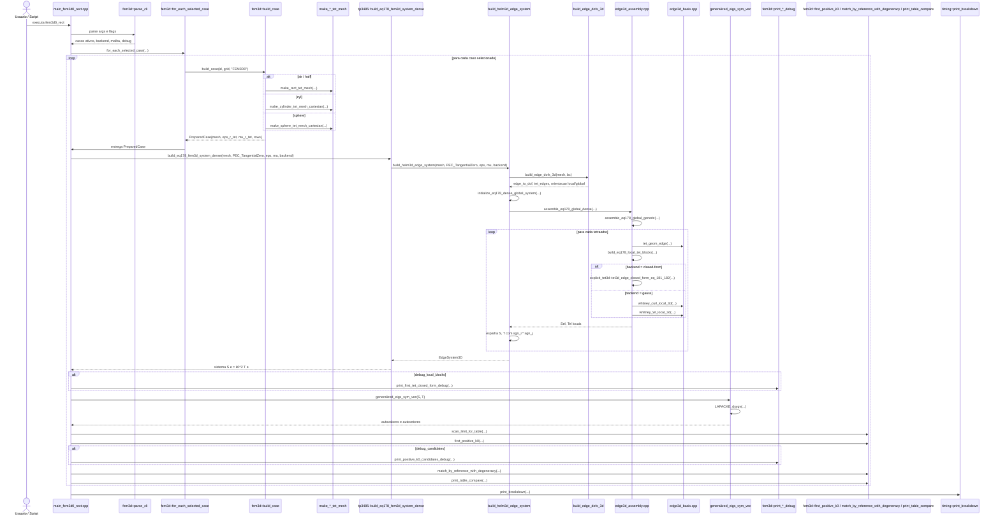

# R6 - FEM3D0: Diagrama de Sequência e Árvore de Chamada

Este arquivo cobre a sexta família de execução do projeto, correspondente ao programa histórico `FEM3D0` do artigo.

Casos do artigo cobertos por esta raiz:

- Caso 11: cavidade retangular com ar, Figura 15 / Tabela 12
- Caso 12: cavidade retangular semi-preenchida, Figura 16 / Tabela 13
- Caso 13: cavidade cilíndrica com ar, Figura 17 / Tabela 14
- Caso 14: cavidade esférica com ar, Tabela 15

Executável atual correspondente:

- `fem3d0_rect`

Entrada didática por equação:

- `tp3485::build_eq178_fem3d_system_dense(...)`

## 1) Visão geral da família

Esta raiz marca a entrada plena no domínio tridimensional:

- a malha deixa de ser triangular e passa a ser tetraédrica;
- o grau de liberdade continua em arestas, mas agora cada elemento local tem `6` arestas;
- o problema espectral volta à forma simétrica `S e = k0^2 T e`;
- o desafio maior deixa de ser o acoplamento `Et/Ez` e passa a ser a geometria 3D e o tratamento modal em cavidades com degenerescência.

Em linguagem estrutural, `R6` tem duas características novas:

- um único executável pode percorrer até `4` casos 3D distintos na mesma execução;
- a comparação modal precisa respeitar grupos degenerados, e não apenas ordenar raízes por proximidade isolada.

Esta é a versão densa da família 3D. Isso quer dizer:

- montagem global densa;
- solve simétrico denso por LAPACK;
- excelente como baseline de corretude;
- custo de memória e tempo muito mais pesado que nas famílias 2D.

## 2) Diagrama de sequência da família `FEM3D0`



## 3) Árvore de chamada completa da família

```text
fem3d0_rect
└── main_fem3d0_rect.cpp
    ├── fem3d::parse_cli(argc, argv, defaults, "fem3d0_rect")
    ├── fem3d::for_each_selected_case(...)
    │   ├── fem3d::selected_cases(...)
    │   ├── fem3d::default_grid_for_case(...) ou Grid3D customizado
    │   ├── fem3d::build_case(id, grid, "FEM3D0")
    │   │   ├── CaseId::air
    │   │   │   ├── fig15_geom()
    │   │   │   ├── make_rect_tet_mesh(...)
    │   │   │   ├── eps_r_tet = 1
    │   │   │   ├── mu_r_tet = 1
    │   │   │   └── table12_rows()
    │   │   ├── CaseId::half
    │   │   │   ├── fig16_geom()
    │   │   │   ├── make_rect_tet_mesh(...)
    │   │   │   ├── make_eps_r_tets_by_z(...)
    │   │   │   ├── mu_r_tet = 1
    │   │   │   └── table13_rows()
    │   │   ├── CaseId::cyl
    │   │   │   ├── fig17_geom()
    │   │   │   ├── make_cylinder_tet_mesh_cartesian(...)
    │   │   │   ├── eps_r_tet = 1
    │   │   │   ├── mu_r_tet = 1
    │   │   │   └── table14_rows()
    │   │   └── CaseId::sphere
    │   │       ├── table15_geom()
    │   │       ├── make_sphere_tet_mesh_cartesian(...)
    │   │       ├── eps_r_tet = 1
    │   │       ├── mu_r_tet = 1
    │   │       └── table15_rows()
    │   └── callback run_dense_case(...)
    ├── run_dense_case(...)
    │   ├── tp3485::build_eq178_fem3d_system_dense(mesh, PEC_TangentialZero, eps_r_tet, mu_r_tet, backend)
    │   │   └── build_helm3d_edge_system(mesh, PEC_TangentialZero, eps_r_tet, mu_r_tet, backend)
    │   │       ├── build_edge_dofs_3d(mesh, bc)
    │   │       │   ├── key_edge_undirected(...)
    │   │       │   ├── add_edge(...)
    │   │       │   ├── conta faces para detectar fronteira
    │   │       │   ├── marca arestas de fronteira
    │   │       │   └── cria edge_to_dof eliminando fronteira PEC
    │   │       ├── initialize_eq178_dense_global_system(...)
    │   │       └── assemble_eq178_global_dense(...)
    │   │           └── assemble_eq178_global_generic(...)
    │   │               ├── loop em mesh.tets
    │   │               ├── tet_geom_edge(mesh, tet)
    │   │               ├── build_eq178_local_tet_blocks(...)
    │   │               │   ├── backend closed-form
    │   │               │   │   └── explicit_tet3d::tet3d_edge_closed_form_eq_181_182(...)
    │   │               │   └── backend gauss
    │   │               │       ├── whitney_curl_local_3d(...)
    │   │               │       ├── kTetQuadP2
    │   │               │       └── whitney_W_local_3d(...)
    │   │               └── espalha S(I,J), T(I,J) com sgn_i * sgn_j
    │   ├── [opcional] fem3d::print_first_tet_closed_form_debug(...)
    │   │   ├── tet_geom_edge(...)
    │   │   └── explicit_tet3d::tet3d_edge_closed_form_eq_181_182(...)
    │   ├── generalized_eigs_sym_vec(sys.S, sys.T)
    │   │   └── LAPACKE_dsygv(...)
    │   ├── fem3d::scan_limit_for_table(...)
    │   ├── fem3d::first_positive_k0(...)
    │   ├── [opcional] fem3d::print_positive_k0_candidates_debug(...)
    │   ├── fem3d::match_by_reference_with_degeneracy(...)
    │   └── fem3d::print_table_compare(...)
    └── timing::print_breakdown(...)
```

## 4) Núcleo que diferencia esta família

O coração do `R6` está em cinco peças que fazem a formulação 3D funcionar como obra de validação, não apenas como solve bruto.

### 4.1) Preparação de casos por `PreparedCase`

```text
fem3d::build_case(...)
├── geometria
├── malha
├── eps_r_tet / mu_r_tet
└── linhas de referencia
```

Ponto conceitual importante:

- o executável 3D não codifica um único experimento;
- ele recebe uma seleção de casos e constrói cada um deles como um pacote completo;
- isso torna a raiz `R6` mais próxima de um mini framework de reprodução do artigo do que de um solver monolítico.

### 4.2) DOFs de aresta tetraédricos

```text
build_edge_dofs_3d(...)
├── cria catalogo global de arestas
├── registra tet_edges[tid].e
├── registra tet_edges[tid].sgn
├── detecta fronteira por contagem de faces
└── elimina arestas de fronteira para PEC
```

Ponto conceitual importante:

- em 3D, a topologia do contorno já não pode ser tratada olhando apenas arestas isoladas;
- o código detecta faces de fronteira e, a partir delas, marca as arestas de contorno;
- isso é o elo prático entre a cavidade PEC do artigo e a eliminação de DOFs no sistema linear.

### 4.3) Tetraedro local com 6 bases de Whitney

```text
tet_geom_edge(...)
├── volume V
├── grad_lambda[i]
├── lambda_coeff[i]
└── comprimentos L[m]

build_eq178_local_tet_blocks(...)
├── whitney_curl_local_3d(...)
└── whitney_W_local_3d(...)
```

Ponto conceitual importante:

- o tetraedro 3D tem `6` arestas locais, e portanto `6` funções de base vetoriais locais;
- o termo `curl-curl` continua especialmente limpo, porque o rotacional local da base é constante;
- a massa vetorial exige integração do produto `W_i . W_j` sobre o volume do tetraedro.

### 4.4) Duas rotas locais: `closed-form` e cubatura

```text
backend = closed-form
└── explicit_tet3d::tet3d_edge_closed_form_eq_181_182(...)

backend = gauss
├── whitney_curl_local_3d(...)
├── kTetQuadP2
└── whitney_W_local_3d(...)
```

Ponto conceitual importante:

- a filosofia é a mesma das famílias 2D, mas agora em geometria tetraédrica;
- o backend explícito preserva rastreabilidade direta com as Eq. `(181)` e `(182)`;
- o backend por cubatura recompõe a mesma física com avaliação local de bases e momentos volumétricos.

### 4.5) Matching com degenerescência

```text
first_positive_k0(...)
└── match_by_reference_with_degeneracy(...)
```

Ponto conceitual importante:

- em 3D, modos degenerados aparecem com naturalidade em geometrias simétricas;
- o repositório agrupa linhas de referência com o mesmo valor analítico antes de casar raízes numéricas;
- isso evita trocas artificiais de ordem que estragariam a leitura física das Tabelas 12 a 15.

## 5) Substituições específicas por caso

| Caso | Geometria / malha | Materiais | Referência |
| --- | --- | --- | --- |
| Caso 11, Figura 15 / Tabela 12 | `make_rect_tet_mesh(...)` | ar homogêneo | `table12_rows()` |
| Caso 12, Figura 16 / Tabela 13 | `make_rect_tet_mesh(...)` | meio preenchido por `make_eps_r_tets_by_z(...)` | `table13_rows()` |
| Caso 13, Figura 17 / Tabela 14 | `make_cylinder_tet_mesh_cartesian(...)` | ar homogêneo | `table14_rows()` |
| Caso 14, Tabela 15 | `make_sphere_tet_mesh_cartesian(...)` | ar homogêneo | `table15_rows()` |

## 6) Subárvore do matching modal em 3D

Depois do solve, esta raiz entra em uma etapa de interpretação modal diferente da trilha 2D:

```text
generalized_eigs_sym_vec(...)
└── fem3d::first_positive_k0(...)
    └── fem3d::match_by_reference_with_degeneracy(...)
        ├── agrupa linhas com mesmo k0 analitico
        ├── varre candidatos numericos nao usados
        ├── escolhe subconjunto mais proximo do grupo
        └── preserva ordenacao interna crescente
```

Esse trecho merece destaque porque a dificuldade aqui já não é separar TE/TM, nem filtrar modo propagante. A dificuldade é respeitar corretamente famílias degeneradas num problema vetorial 3D de cavidade.

## 7) Leituras importantes para o próximo diagrama

Esta raiz prepara a comparação direta com `R7`:

- `R6` usa armazenamento denso;
- `R7` manterá a mesma física, os mesmos casos e o mesmo matching;
- a diferença central passará a ser a montagem esparsa e a estratégia de armazenamento.

Em linguagem de estudo, `FEM3D0` é o baseline conceitual e numérico da parte 3D. `FEM3D1` será a continuação natural quando a preocupação principal deixar de ser clareza e passar a ser escala.

## 8) Arquivos-chave desta raiz

- [main_fem3d0_rect.cpp](/home/sperotto/tp3485-fem-eigen-em/src/fem3d0/main_fem3d0_rect.cpp)
- [README.md](/home/sperotto/tp3485-fem-eigen-em/src/fem3d0/README.md)
- [fem3d_case_driver.hpp](/home/sperotto/tp3485-fem-eigen-em/src/fem3d/fem3d_case_driver.hpp)
- [fem3d_compare.hpp](/home/sperotto/tp3485-fem-eigen-em/src/fem3d/fem3d_compare.hpp)
- [fem3d_reference_tables.hpp](/home/sperotto/tp3485-fem-eigen-em/src/fem3d/fem3d_reference_tables.hpp)
- [fem3d_debug.hpp](/home/sperotto/tp3485-fem-eigen-em/src/fem3d/fem3d_debug.hpp)
- [edge3d_assembly.cpp](/home/sperotto/tp3485-fem-eigen-em/src/edge3d/edge3d_assembly.cpp)
- [edge3d_assembly.hpp](/home/sperotto/tp3485-fem-eigen-em/src/edge3d/edge3d_assembly.hpp)
- [edge3d_basis.cpp](/home/sperotto/tp3485-fem-eigen-em/src/edge3d/edge3d_basis.cpp)
- [edge3d_dofs.cpp](/home/sperotto/tp3485-fem-eigen-em/src/edge3d/edge3d_dofs.cpp)

## 9) Papel deste documento na sequência maior

Este é o sexto diagrama-base da coleção. Ele abre a etapa 3D mostrando que o núcleo teórico do artigo continua o mesmo, mas agora vestido com geometria tetraédrica, bases de Whitney tridimensionais e um tratamento mais cuidadoso de degenerescência modal. É a raiz de referência para entender toda a camada tridimensional antes da variante esparsa.
