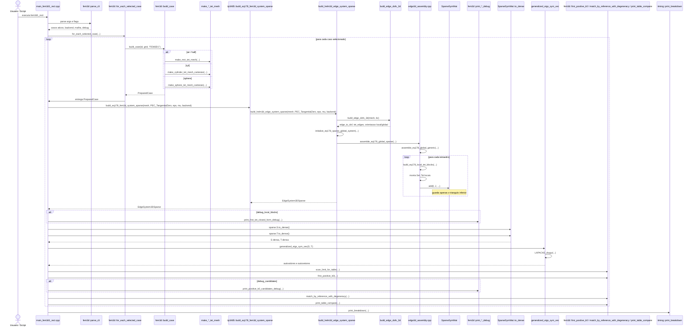

# R7 - FEM3D1: Diagrama de Sequência e Árvore de Chamada

Este arquivo cobre a sétima família de execução do projeto, correspondente ao programa histórico `FEM3D1` do artigo.

Casos do artigo cobertos por esta raiz:

- Caso 11: cavidade retangular com ar, Figura 15 / Tabela 12
- Caso 12: cavidade retangular semi-preenchida, Figura 16 / Tabela 13
- Caso 13: cavidade cilíndrica com ar, Figura 17 / Tabela 14
- Caso 14: cavidade esférica com ar, Tabela 15

Executável atual correspondente:

- `fem3d1_rect`

Entrada didática por equação:

- `tp3485::build_eq178_fem3d_system_sparse(...)`

## 1) Visão geral da família

Esta raiz fecha a coleção dos diagramas-base mostrando a contraparte esparsa de `R6`.

O ponto mais importante aqui é este:

- a formulação física é a mesma de `FEM3D0`;
- os casos, geometrias e tabelas de referência também são os mesmos;
- a diferença central está no armazenamento global das matrizes `S` e `T`;
- em vez de acumular tudo em denso, o código guarda apenas o triângulo inferior em `SparseSymMat`.

Portanto, `R7` não é uma nova teoria. É uma nova estratégia de engenharia numérica para a mesma teoria 3D.

Hoje, essa estratégia ainda para no meio do caminho:

- a montagem já é esparsa e simétrica;
- mas o solve ainda converte `S` e `T` para denso antes de chamar o LAPACK;
- isso preserva compatibilidade com a validação atual, ao mesmo tempo em que abre o caminho para um solver iterativo esparso futuro.

## 2) Diagrama de sequência da família `FEM3D1`



## 3) Árvore de chamada completa da família

```text
fem3d1_rect
└── main_fem3d1_rect.cpp
    ├── fem3d::parse_cli(argc, argv, defaults, "fem3d1_rect")
    ├── fem3d::for_each_selected_case(...)
    │   ├── fem3d::selected_cases(...)
    │   ├── fem3d::default_grid_for_case(...) ou Grid3D customizado
    │   ├── fem3d::build_case(id, grid, "FEM3D1")
    │   │   ├── CaseId::air -> make_rect_tet_mesh(...), table12_rows()
    │   │   ├── CaseId::half -> make_rect_tet_mesh(...), make_eps_r_tets_by_z(...), table13_rows()
    │   │   ├── CaseId::cyl -> make_cylinder_tet_mesh_cartesian(...), table14_rows()
    │   │   └── CaseId::sphere -> make_sphere_tet_mesh_cartesian(...), table15_rows()
    │   └── callback run_sparse_case(...)
    ├── run_sparse_case(...)
    │   ├── tp3485::build_eq178_fem3d_system_sparse(mesh, PEC_TangentialZero, eps_r_tet, mu_r_tet, backend)
    │   │   └── build_helm3d_edge_system_sparse(mesh, PEC_TangentialZero, eps_r_tet, mu_r_tet, backend)
    │   │       ├── build_edge_dofs_3d(mesh, bc)
    │   │       │   ├── key_edge_undirected(...)
    │   │       │   ├── add_edge(...)
    │   │       │   ├── conta faces para detectar fronteira
    │   │       │   ├── marca arestas de fronteira
    │   │       │   └── cria edge_to_dof eliminando fronteira PEC
    │   │       ├── initialize_eq178_sparse_global_system(...)
    │   │       └── assemble_eq178_global_sparse(...)
    │   │           └── assemble_eq178_global_generic(...)
    │   │               ├── loop em mesh.tets
    │   │               ├── tet_geom_edge(mesh, tet)
    │   │               ├── build_eq178_local_tet_blocks(...)
    │   │               │   ├── backend closed-form
    │   │               │   │   └── explicit_tet3d::tet3d_edge_closed_form_eq_181_182(...)
    │   │               │   └── backend gauss
    │   │               │       ├── whitney_curl_local_3d(...)
    │   │               │       ├── kTetQuadP2
    │   │               │       └── whitney_W_local_3d(...)
    │   │               └── SparseSymMat::add(...) apenas se I >= J
    │   ├── [opcional] fem3d::print_first_tet_closed_form_debug(...)
    │   ├── sparse.S.nnz_lower()
    │   ├── sparse.T.nnz_lower()
    │   ├── sparse.S.to_dense()
    │   ├── sparse.T.to_dense()
    │   ├── generalized_eigs_sym_vec(S, T)
    │   │   └── LAPACKE_dsygv(...)
    │   ├── fem3d::scan_limit_for_table(...)
    │   ├── fem3d::first_positive_k0(...)
    │   ├── [opcional] fem3d::print_positive_k0_candidates_debug(...)
    │   ├── fem3d::match_by_reference_with_degeneracy(...)
    │   └── fem3d::print_table_compare(...)
    └── timing::print_breakdown(...)
```

## 4) Núcleo que diferencia esta família

O coração do `R7` está em quatro peças que o separam de `R6` sem mudar a teoria física.

### 4.1) Mesma formulação, outro armazenamento

```text
R6: tp3485::build_eq178_fem3d_system_dense(...) -> build_helm3d_edge_system(...) -> assemble_eq178_global_dense(...)
R7: tp3485::build_eq178_fem3d_system_sparse(...) -> build_helm3d_edge_system_sparse(...) -> assemble_eq178_global_sparse(...)
```

Ponto conceitual importante:

- `Sel` e `Tel` locais são exatamente os mesmos;
- a malha, os materiais e os DOFs também são os mesmos;
- o que muda é o recipiente global onde cada contribuição é acumulada.

### 4.2) Simetria explorada no triângulo inferior

```text
SparseSymMat::add(i, j, v)
├── se i < j, troca indices
└── grava apenas na metade inferior
```

Ponto conceitual importante:

- como o problema global é simétrico, não há motivo para armazenar duas vezes a mesma informação;
- o código usa essa simetria para reduzir memória durante a montagem;
- isso aparece tanto no armazenamento quanto nas estatísticas `nnz_lower(S)` e `nnz_lower(T)` impressas pelo driver.

### 4.3) `assemble_eq178_global_generic(...)` reaproveitado

```text
assemble_eq178_global_generic(...)
├── calcula Sel, Tel locais
└── callback decide como acumular globalmente
```

Ponto conceitual importante:

- a rotina genérica de montagem 3D não sabe se o destino é denso ou esparso;
- essa decisão é empurrada para o callback `add_global`;
- isso faz `R6` e `R7` compartilharem praticamente toda a inteligência local da formulação 3D.

### 4.4) Conversão esparso -> denso antes do solve

```text
SparseSymMat::to_dense(...)
└── generalized_eigs_sym_vec(...)
```

Ponto conceitual importante:

- hoje o ganho principal de `R7` está na montagem e no armazenamento intermediário;
- o solve ainda usa o mesmo caminho LAPACK denso de `R6`;
- isso preserva comparabilidade direta entre as duas raízes, ao custo de ainda não explorar um eigensolver esparso de ponta a ponta.

## 5) Substituições específicas em relação ao `R6`

| Aspecto | `R6` (`FEM3D0`) | `R7` (`FEM3D1`) |
| --- | --- | --- |
| Montagem global | `DenseMat` | `SparseSymMat` |
| Acúmulo global | `out.S(I,J) += ...` | `out.S.add(I,J,...)` apenas no triângulo inferior |
| Estatística impressa | `nodes`, `tets`, `edges`, `dof` | `nodes`, `tets`, `edges`, `dof`, `nnz_lower(S)`, `nnz_lower(T)` |
| Solve atual | denso LAPACK | denso LAPACK após `to_dense()` |
| Física / matching | igual | igual |

## 6) Subárvore da transição esparsa para o solve

O trecho distintivo desta raiz aparece entre a montagem e o solve:

```text
tp3485::build_eq178_fem3d_system_sparse(...)
└── build_helm3d_edge_system_sparse(...)
    └── EdgeSystem3DSparse
        ├── SparseSymMat S
        └── SparseSymMat T

run_sparse_case(...)
├── sparse.S.nnz_lower()
├── sparse.T.nnz_lower()
├── sparse.S.to_dense()
├── sparse.T.to_dense()
└── generalized_eigs_sym_vec(S, T)
```

Esse é o ponto de engenharia mais importante do `R7`: o repositório já pensa como código esparso, embora ainda resolva como código denso.

## 7) Leituras importantes para fechar a coleção

Com `R7`, a coleção dos diagramas-base fica completa:

- `R1` a `R5` cobrem toda a trilha 2D do artigo;
- `R6` abre a camada 3D densa;
- `R7` mostra a mesma camada 3D preparada para escalabilidade.

O par `R6` / `R7` é especialmente valioso porque mostra uma decisão de engenharia muito madura: separar a formulação física da estratégia de armazenamento.

## 8) Arquivos-chave desta raiz

- [main_fem3d1_rect.cpp](/home/sperotto/tp3485-fem-eigen-em/src/fem3d1/main_fem3d1_rect.cpp)
- [README.md](/home/sperotto/tp3485-fem-eigen-em/src/fem3d1/README.md)
- [sparse_sym.hpp](/home/sperotto/tp3485-fem-eigen-em/src/core/sparse_sym.hpp)
- [fem3d_case_driver.hpp](/home/sperotto/tp3485-fem-eigen-em/src/fem3d/fem3d_case_driver.hpp)
- [fem3d_compare.hpp](/home/sperotto/tp3485-fem-eigen-em/src/fem3d/fem3d_compare.hpp)
- [fem3d_reference_tables.hpp](/home/sperotto/tp3485-fem-eigen-em/src/fem3d/fem3d_reference_tables.hpp)
- [fem3d_debug.hpp](/home/sperotto/tp3485-fem-eigen-em/src/fem3d/fem3d_debug.hpp)
- [edge3d_assembly.cpp](/home/sperotto/tp3485-fem-eigen-em/src/edge3d/edge3d_assembly.cpp)
- [edge3d_basis.cpp](/home/sperotto/tp3485-fem-eigen-em/src/edge3d/edge3d_basis.cpp)
- [edge3d_dofs.cpp](/home/sperotto/tp3485-fem-eigen-em/src/edge3d/edge3d_dofs.cpp)

## 9) Papel deste documento na sequência maior

Este é o sétimo e último diagrama-base da coleção. Ele fecha o arco do projeto mostrando que a evolução do artigo, no repositório, não termina na teoria: ela continua na forma como o código escolhe armazenar, montar e preparar problemas grandes. `FEM3D1` é a ponte entre a validação acadêmica fiel e uma arquitetura pronta para crescer.
