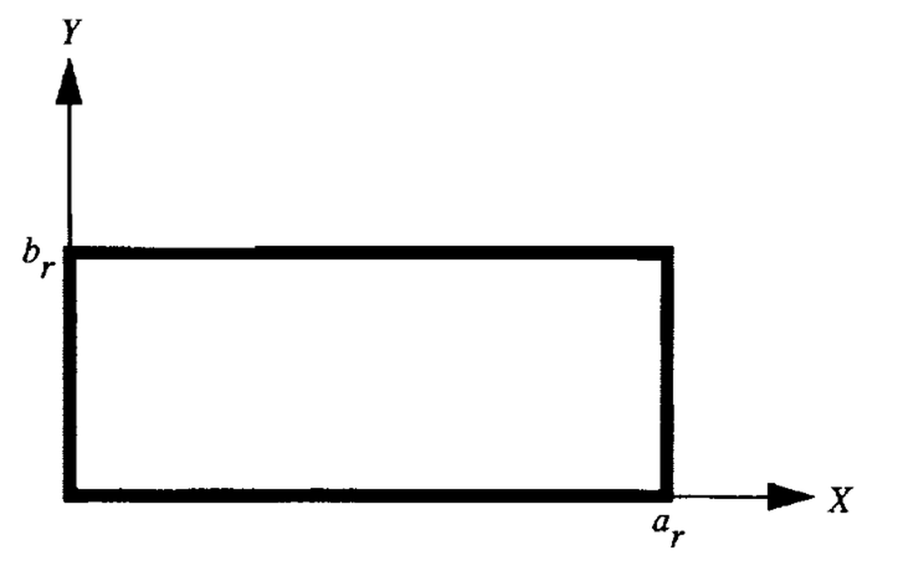
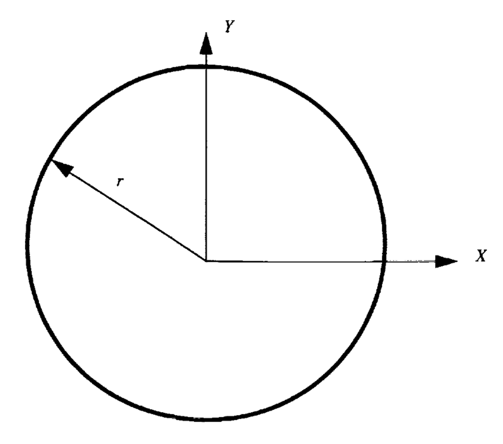
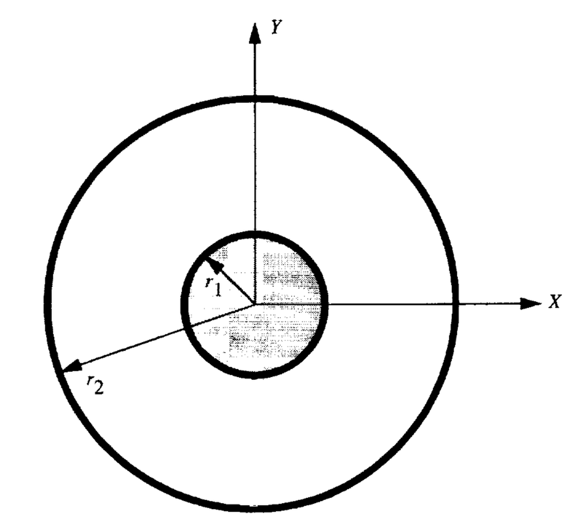
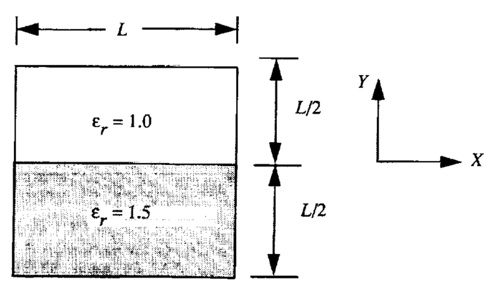
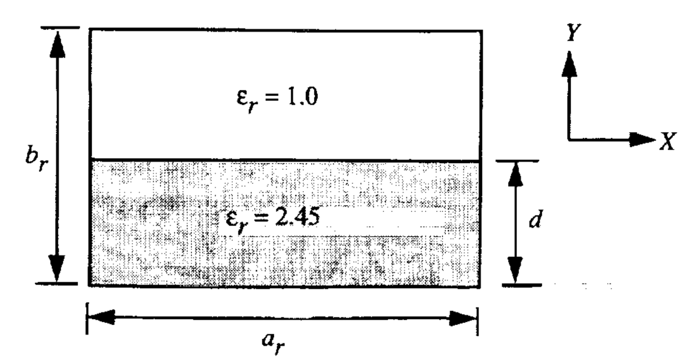
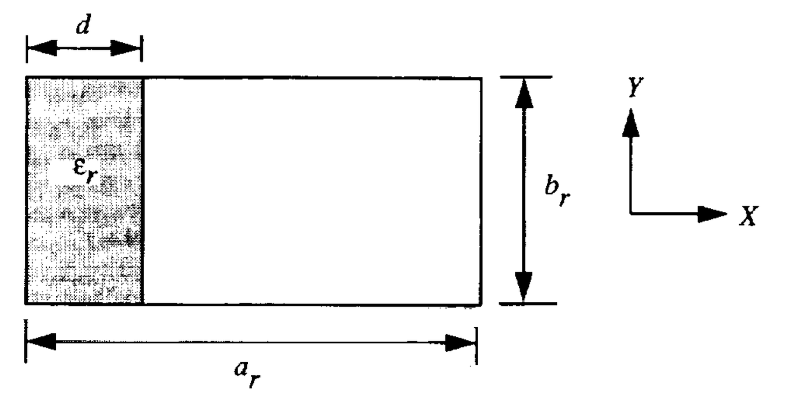
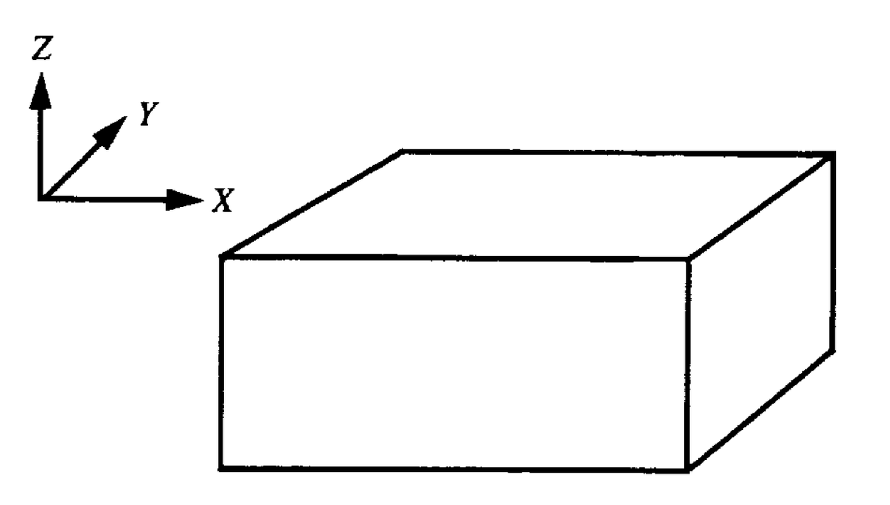
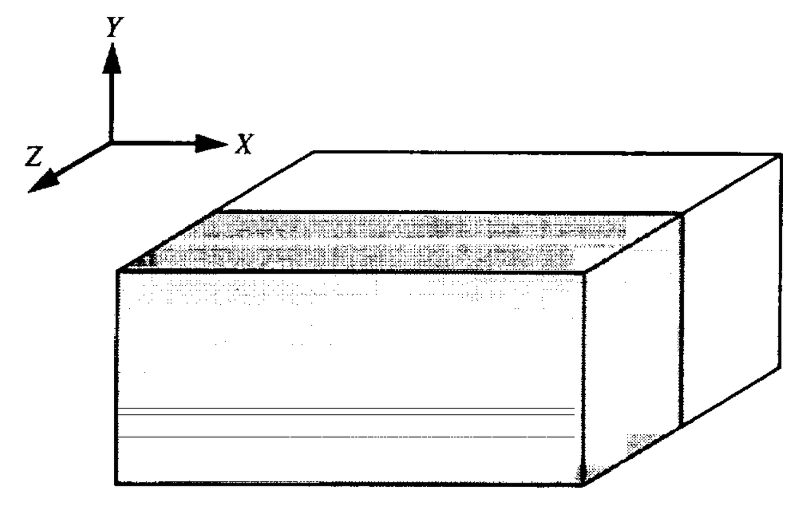
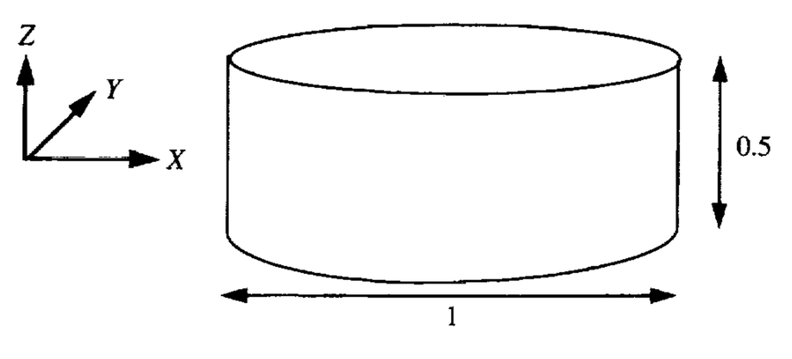

# Resultados Numéricos — NASA TP-3485

Reprodução computacional de todos os 14 casos numéricos publicados no artigo.
Cada página cobre: problema, condições de cálculo, resultados FEM, campos modais e comparação com EFGMI.

→ [Comparação consolidada FEM × EFGMI](fem_vs_efgmi.md)
→ [Índice geral de documentação](../INDICE.md)

## Casos 2D — Escalar (Sec. 2.1)

| # | Caso | Geometria | Grandeza | Figura |
|---|---|---|---|---|
| 01 | [Tabela 1 — Guia Retangular Escalar (Sec. 2.1)](caso_01_tab1_helm10_rect.md) | Guia retangular homogêneo, a/b = 2, PEC | `kc` (cutoff escalar) |  |
| 02 | [Tabela 2 — Guia Circular Escalar (Sec. 2.1)](caso_02_tab2_helm10_circle.md) | Guia circular homogêneo, raio unitário, PEC | `kc` |  |
| 03 | [Tabela 3 — Linha Coaxial Escalar (Sec. 2.1)](caso_03_tab3_helm10_coax.md) | Linha coaxial homogênea, r₂/r₁ = 4 | `kc` |  |

## Casos 2D — Vetorial Edge (Sec. 2.2.1)

| # | Caso | Geometria | Grandeza | Figura |
|---|---|---|---|---|
| 04 | [Tabela 4 — Guia Retangular Vetorial (Sec. 2.2.1)](caso_04_tab4_helmvec_rect.md) | Guia retangular homogêneo, elementos de aresta Whitney | `kc` vetorial |  |
| 05 | [Tabela 5 — Guia Circular Vetorial (Sec. 2.2.1)](caso_05_tab5_helmvec_circle.md) | Guia circular homogêneo, raio unitário, elementos de aresta | `kc` vetorial |  |

## Casos 2D — Sistema Misto (Sec. 2.2.2)

| # | Caso | Geometria | Grandeza | Figura |
|---|---|---|---|---|
| 06 | [Tabela 6 — Guia Retangular Misto 3 Comp. (Sec. 2.2.2)](caso_06_tab6_helmvec1_rect.md) | Guia retangular homogêneo, formulações E e H | `kc` sistema misto |  |
| 07 | [Tabela 7 — Guia Circular Misto 3 Comp. (Sec. 2.2.2)](caso_07_tab7_helmvec1_circle.md) | Guia circular homogêneo, raio unitário, formulações E e H | `kc` sistema misto |  |

## Casos 2D — Acoplados (Sec. 2.2.3 e 2.2.4)

| # | Caso | Geometria | Grandeza | Figura |
|---|---|---|---|---|
| 08 | [Figura 11 / Tabela 8 — Guia Parcialmente Preenchido, `k0` dado `β` (Sec. 2.2.3)](caso_08_fig11_tab8_helmvec2.md) | Guia retangular quadrado, dielétrico inferior (εr=1.5), β=10 | `k0L` (número de onda × comprimento) |  |
| 09 | [Figura 12 / Tabela 9 — Dispersão, `β` dado `k0`, Exemplo 1 (Sec. 2.2.4)](caso_09_fig12_tab9_helmvec3.md) | Guia retangular, b/a=0.45, d/a=0.5, εr=2.45 | `β/k0` (relação de dispersão) |  |
| 10 | [Figura 13 / Tabela 10 — Dispersão, `β` dado `k0`, Exemplo 2 (Sec. 2.2.4)](caso_10_fig13_tab10_helmvec3.md) | Guia retangular, b/a=0.45, εr=2.45, d/a variável | `β/k0` — múltiplos ramos por d/a |  |

## Casos 3D — Cavidades Ressonantes (Sec. 3.1)

| # | Caso | Geometria | Grandeza | Figura |
|---|---|---|---|---|
| 11 | [Tabela 12 — Cavidade Retangular 3D, Ar (Sec. 3.1)](caso_11_tab12_fem3d_air.md) | Cavidade retangular preenchida com ar, PEC | `k0` (número de onda de ressonância) |  |
| 12 | [Tabela 13 — Cavidade Retangular 3D Semi-Preenchida (Sec. 3.1)](caso_12_tab13_fem3d_half.md) | Cavidade retangular, dielétrico εr=2 em z=[0.5, 1] cm | `k0` |  |
| 13 | [Tabela 14 — Cavidade Cilíndrica 3D, Ar (Sec. 3.1)](caso_13_tab14_fem3d_cyl.md) | Cavidade cilíndrica circular com ar | `k0` |  |
| 14 | [Tabela 15 — Cavidade Esférica 3D (Sec. 3.1)](caso_14_tab15_fem3d_sphere.md) | Cavidade esférica, raio 1 cm | `k0` | — |

---

→ [README do repositório](../../README.md)