# Caso 04 — Tabela 4 — Guia Retangular Vetorial (Sec. 2.2.1)

## Problema

- **Seção do artigo:** 2.2.1
- **Formulação:** Eq. (65) — S e = kc² T e (edge 2D)
- **Grandeza calculada:** `kc` vetorial
- **Geometria:** Guia retangular homogêneo, elementos de aresta Whitney
- **Teoria:** [2.2.1_Guia de Onda Campos Vetoriais.md](../traducao/2.2.1_Guia de Onda Campos Vetoriais.md)
- **Rastreabilidade:** [Rastreabilidade_Equacoes_Artigo_Codigo.md](../Rastreabilidade_Equacoes_Artigo_Codigo.md)

## Figura do artigo


## Condições de cálculo

| Parâmetro | Valor |
|---|---|
| Malha | 231 nós, 400 triângulos (nx=10, ny=20) |
| Backend | `closed-form` |

```bash
./build/edge_rect --nx 10 --ny 20 --nmodos 10 --backend closed-form
```

## Resultados — FEM

| Modo | Familia | `kc` analitico | `kc` FEM | Erro (%) | ρ |
|---|---|---:|---:|---:|---:|
| TE_m1_n0 | TE | 3.1416 | 3.1433 | 0.055 | 1.000000 |
| TE_m0_n1 | TE | 6.2832 | 6.2332 | 0.795 | 0.999995 |
| TE_m2_n0 | TE | 6.2832 | 6.2966 | 0.214 | 0.999968 |
| TE_m1_n1 | TE | 7.0248 | 6.9971 | 0.394 | 0.999897 |
| TE_m2_n1 | TE | 8.8858 | 8.9113 | 0.287 | 0.999779 |
| TE_m3_n0 | TE | 9.4248 | 9.4685 | 0.463 | 0.999653 |
| TE_m3_n1 | TE | 11.3272 | 11.4274 | 0.885 | 0.999747 |
| TE_m0_n2 | TE | 12.5664 | 12.1809 | 3.068 | 0.999782 |
| TE_m1_n2 | TE | 12.9531 | 12.6130 | 2.626 | 0.999657 |
| TE_m4_n0 | TE | 12.5664 | 12.6611 | 0.754 | 0.999727 |

### Gráficos de resumo — FEM

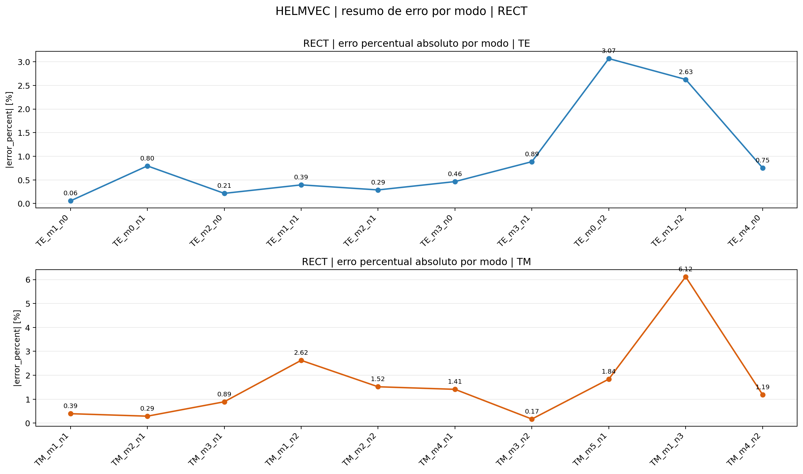
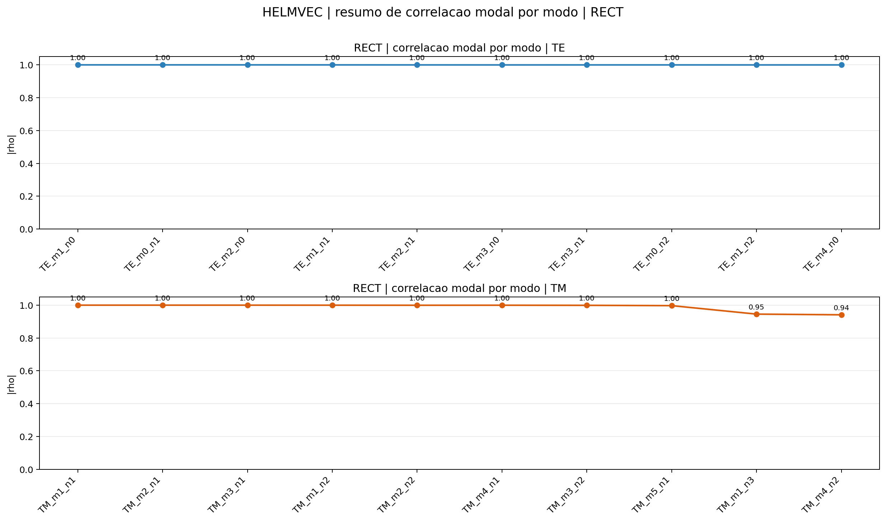


### Campos modais — FEM

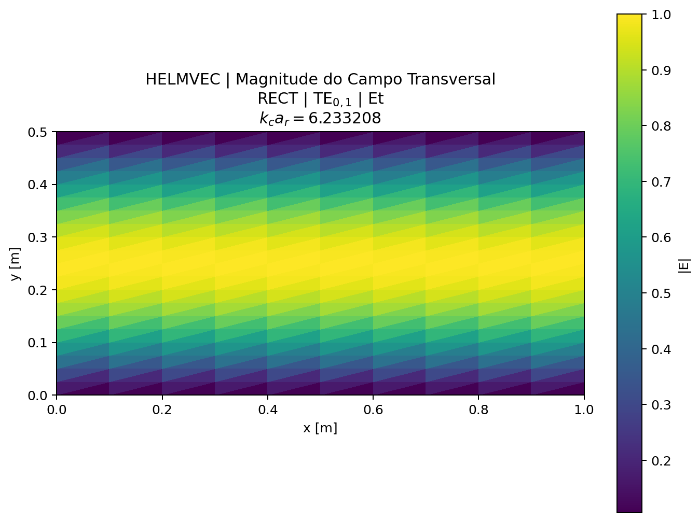
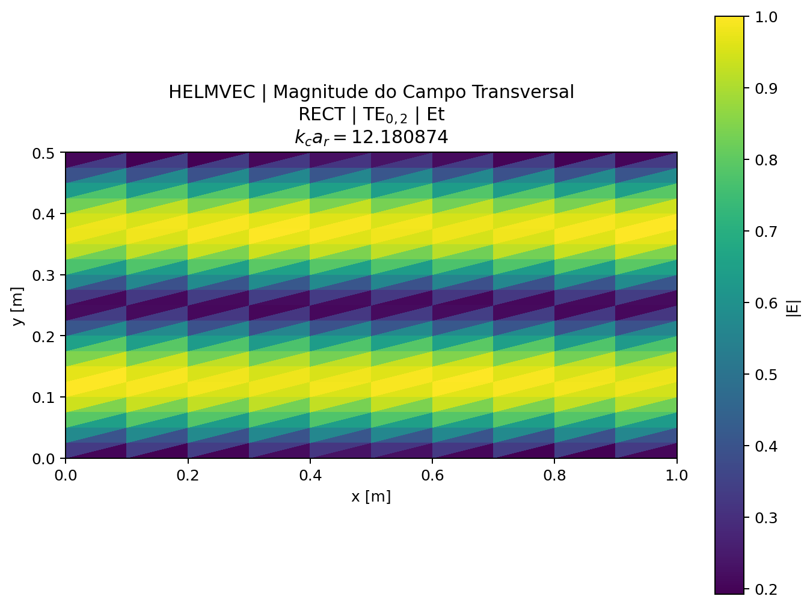
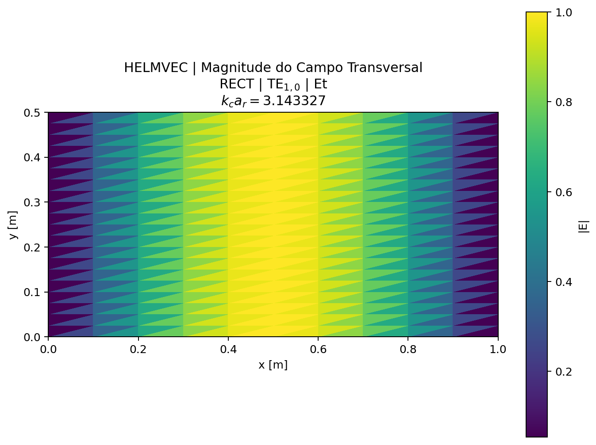

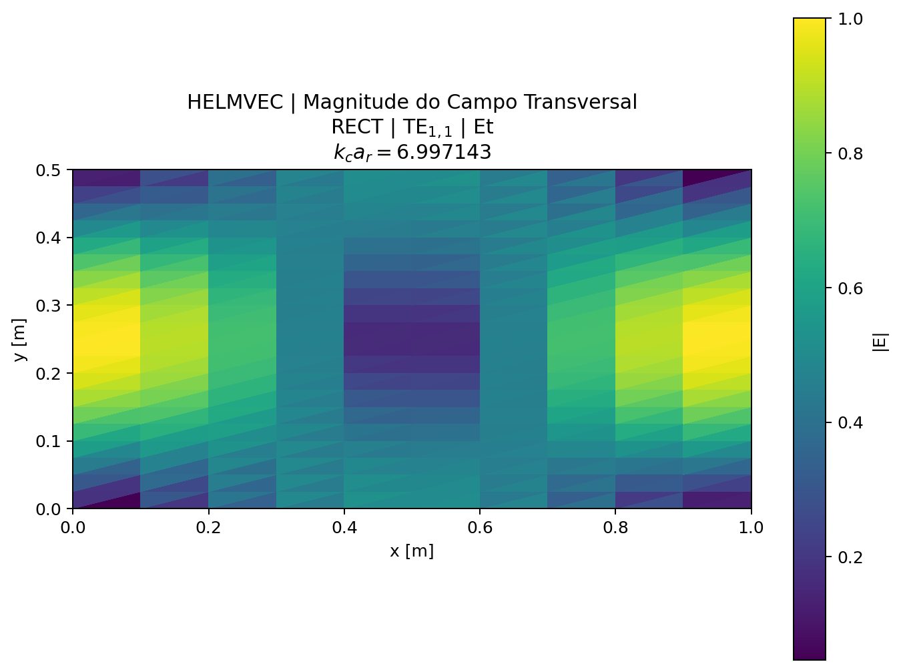
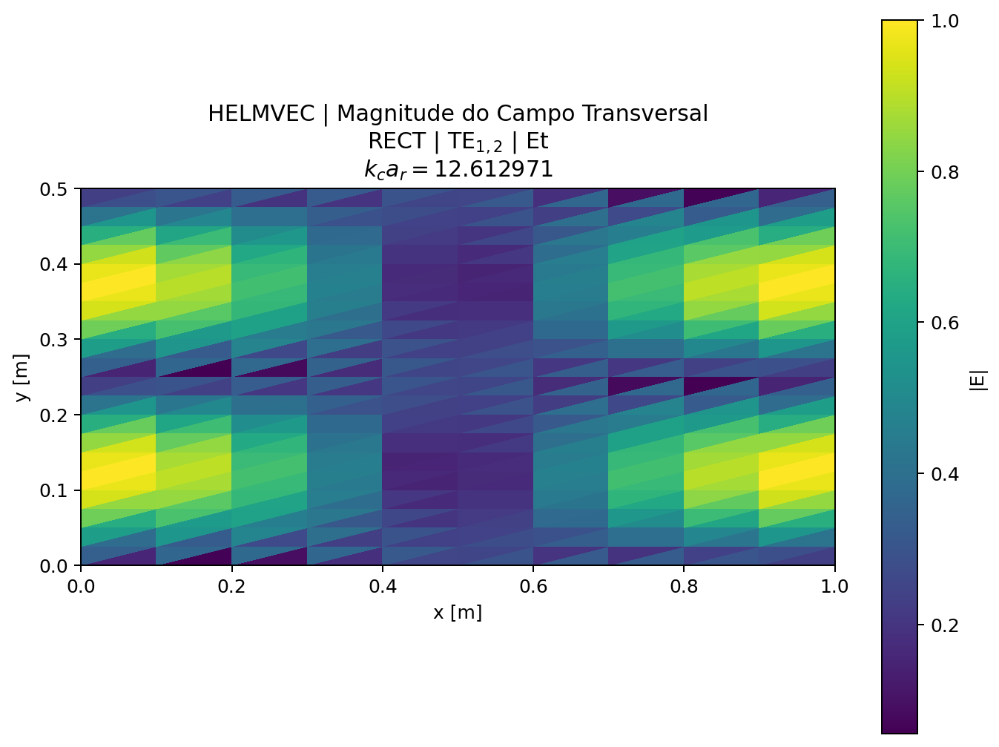
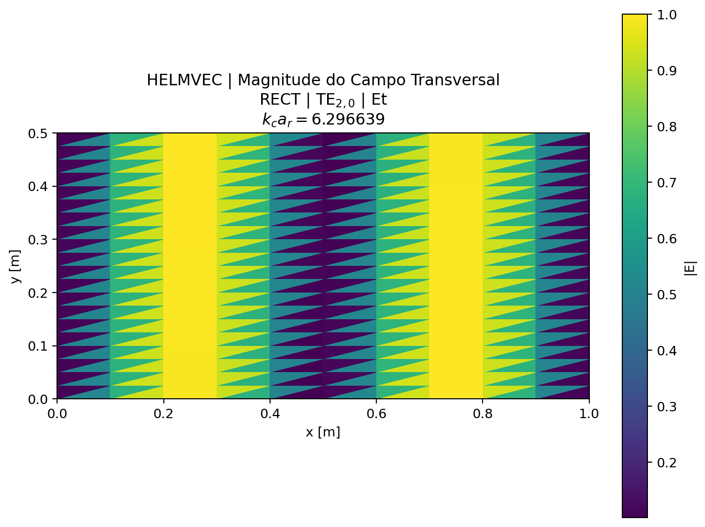

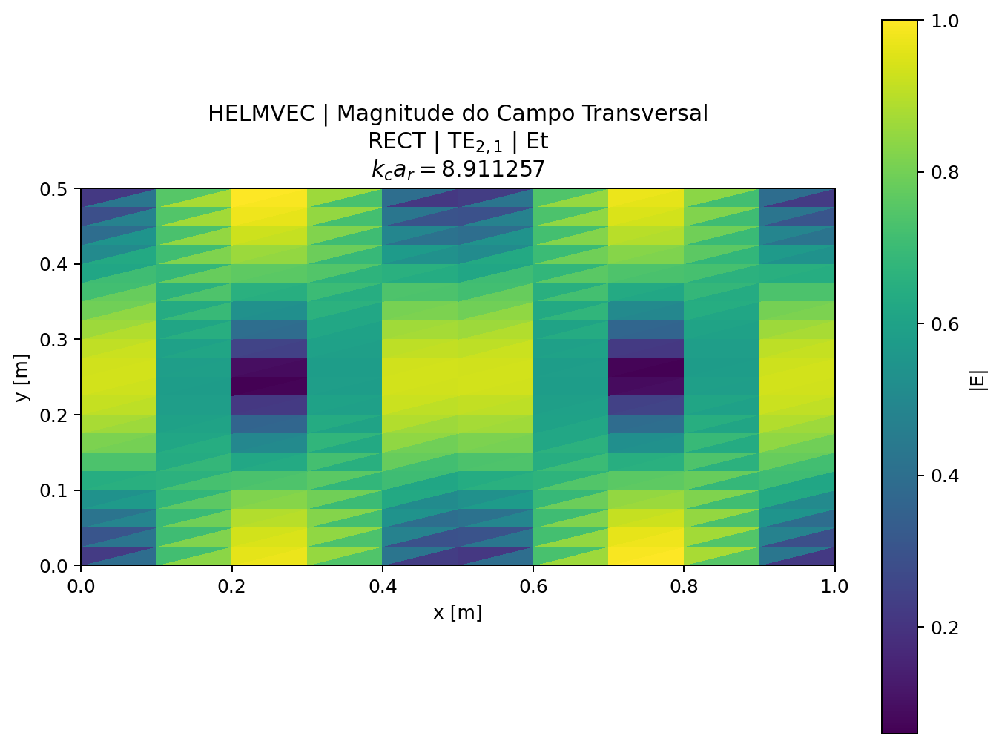
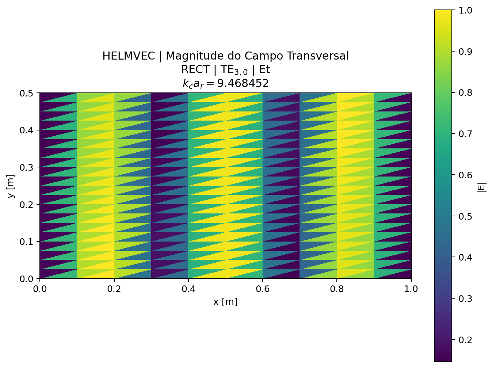
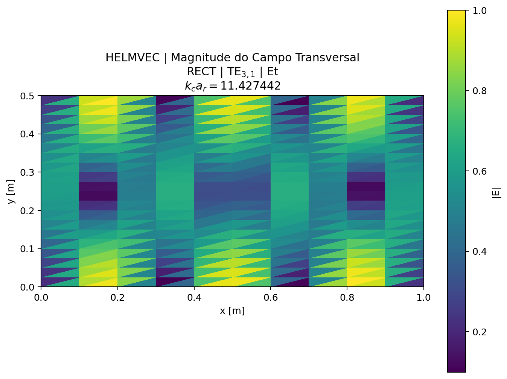


## Tempo de execução

| Backend | Assembly (ms) | Solve (ms) | Post (ms) | Total (ms) |
|---|---:|---:|---:|---:|
| FEM | 6.609531 | 601.9883560000001 |  | 2444.339148 |


---

[← Caso 03](caso_03_tab3_helm10_coax.md)  [Caso 05 →](caso_05_tab5_helmvec_circle.md)  [↑ Índice de Resultados](README.md)
