# Caso 05 — Tabela 5 — Guia Circular Vetorial (Sec. 2.2.1)

## Problema

- **Seção do artigo:** 2.2.1
- **Formulação:** Eq. (65)
- **Grandeza calculada:** `kc` vetorial
- **Geometria:** Guia circular homogêneo, raio unitário, elementos de aresta
- **Teoria:** [2.2.1_Guia de Onda Campos Vetoriais.md](../traducao/2.2.1_Guia de Onda Campos Vetoriais.md)
- **Rastreabilidade:** [Rastreabilidade_Equacoes_Artigo_Codigo.md](../Rastreabilidade_Equacoes_Artigo_Codigo.md)

## Figura do artigo


## Condições de cálculo

| Parâmetro | Valor |
|---|---|
| Malha | 121 nós, 225 triângulos (nr=8, nt=15) |
| Backend | `closed-form` |

```bash
./build/edge_circle --nr 8 --nt 15 --nmodos 10 --backend closed-form
```

## Resultados — FEM

| Modo | Familia | `kc` analitico | `kc` FEM | Erro (%) | ρ |
|---|---|---:|---:|---:|---:|
| TE_m1_p1 | TE | 1.8412 | 1.8726 | 1.707 | 0.973736 |
| TE_m1_p1 | TE | 1.8412 | 1.8726 | 1.707 | 0.973736 |
| TE_m2_p1 | TE | 3.0542 | 3.1486 | 3.090 | 0.999302 |
| TE_m2_p1 | TE | 3.0542 | 3.1486 | 3.090 | 0.999302 |
| TE_m0_p1 | TE | 3.8317 | 3.7704 | 1.600 | 0.999622 |
| TE_m3_p1 | TE | 4.2012 | 4.3931 | 4.569 | 0.986538 |
| TE_m3_p1 | TE | 4.2012 | 4.3931 | 4.569 | 0.986538 |
| TE_m1_p2 | TE | 5.3314 | 5.2175 | 2.138 | 0.903383 |
| TE_m1_p2 | TE | 5.3314 | 5.2175 | 2.138 | 0.903383 |
| TE_m4_p1 | TE | 5.3176 | 5.6395 | 6.054 | 0.962120 |

### Gráficos de resumo — FEM

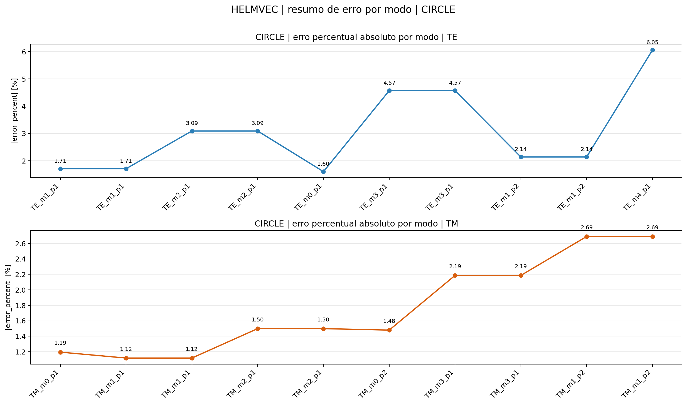
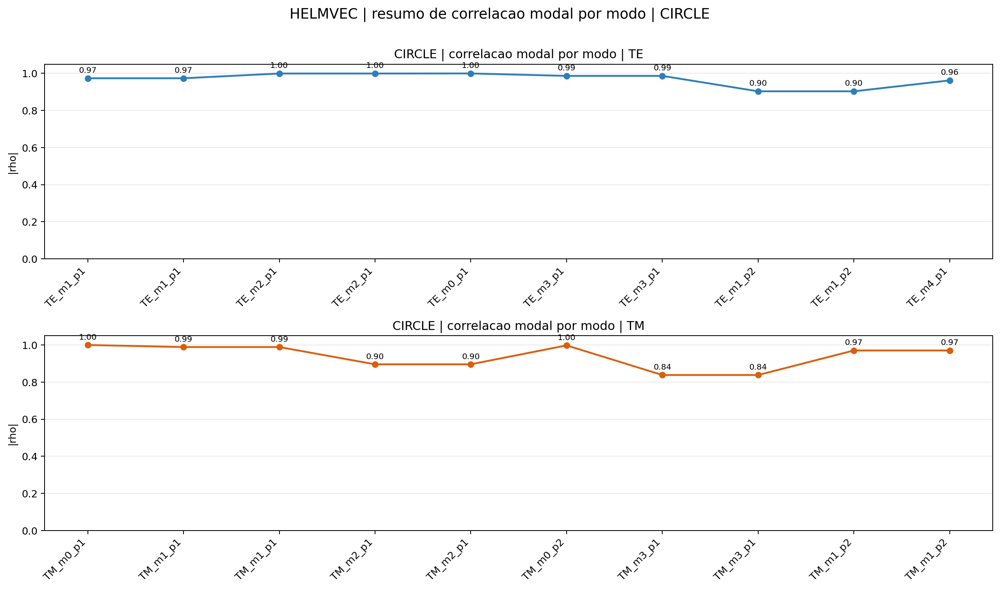


### Campos modais — FEM

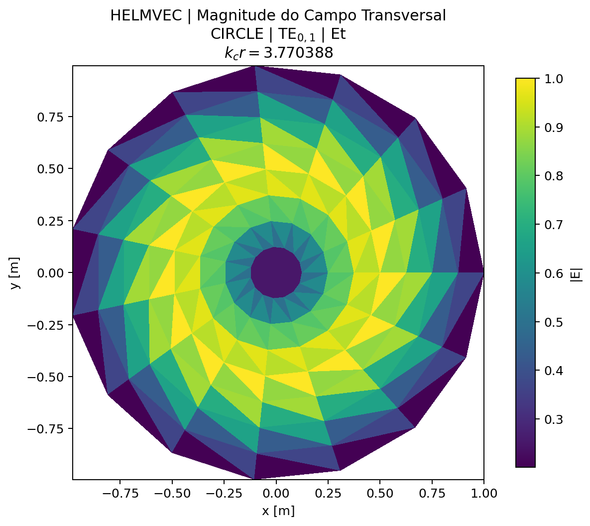
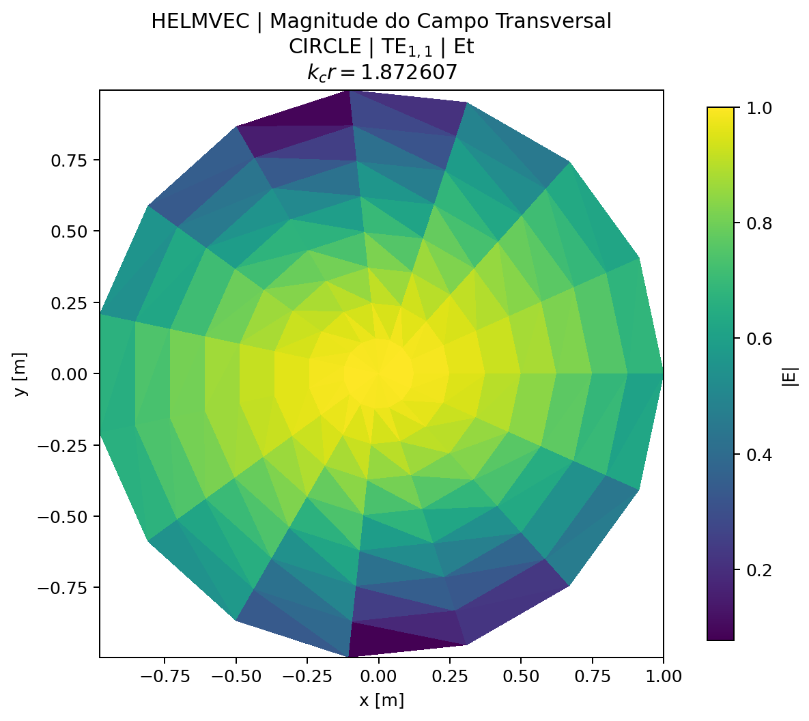
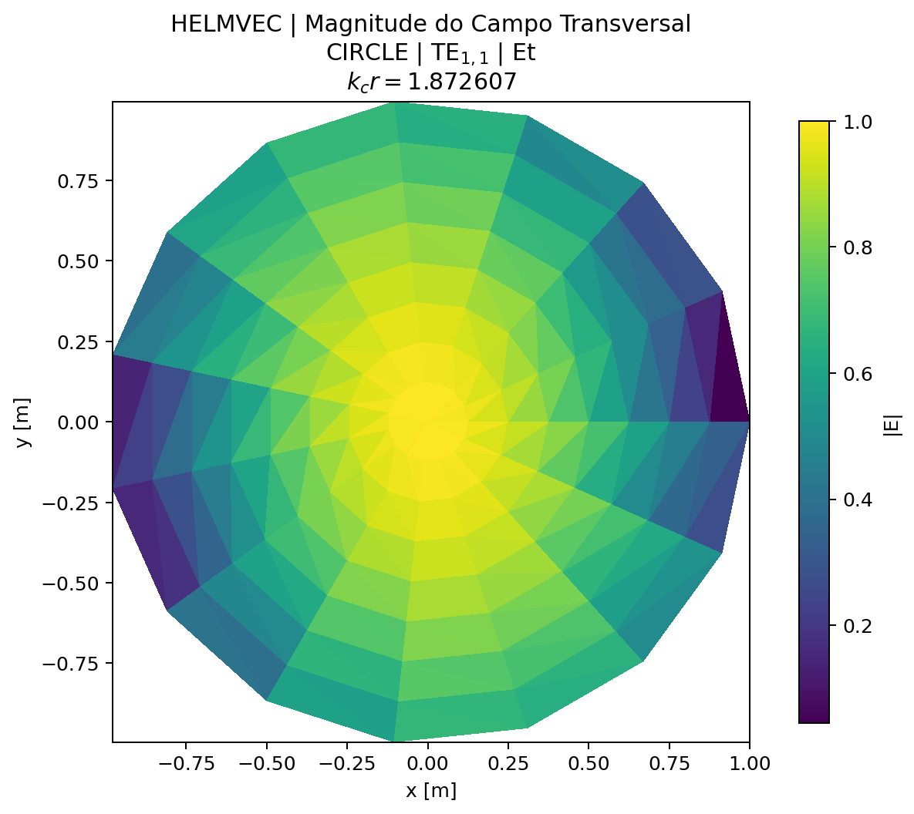

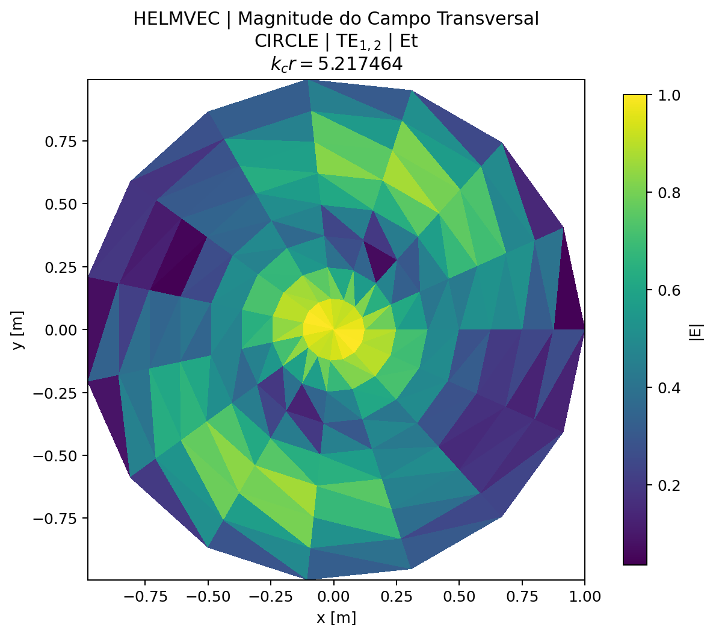
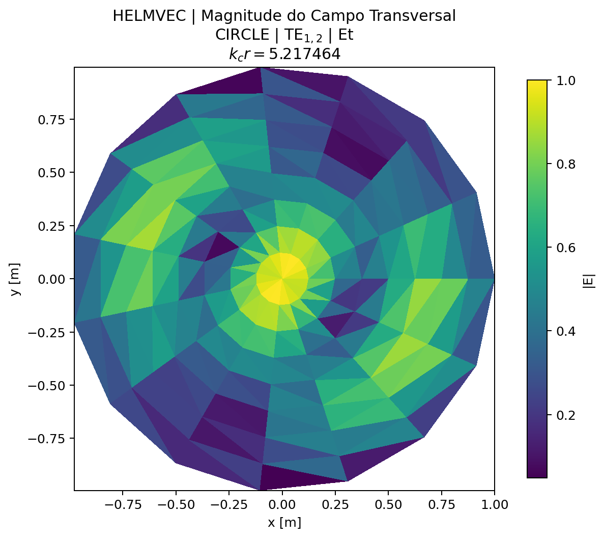
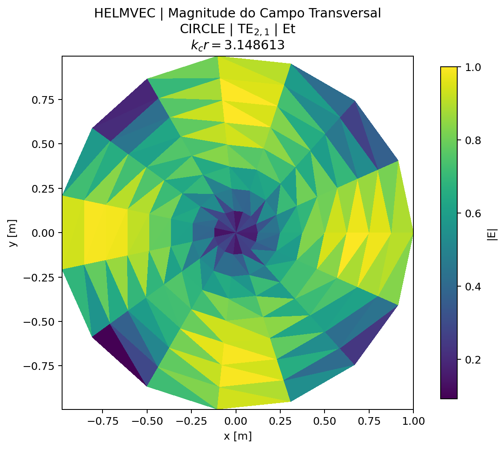

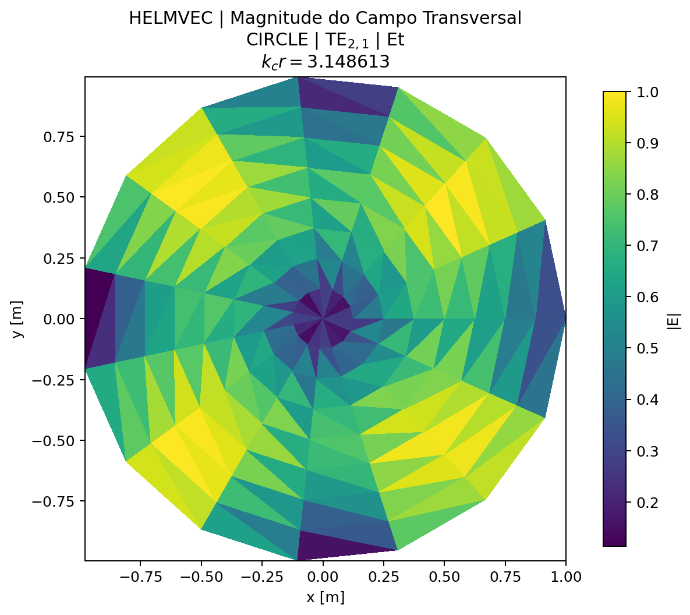
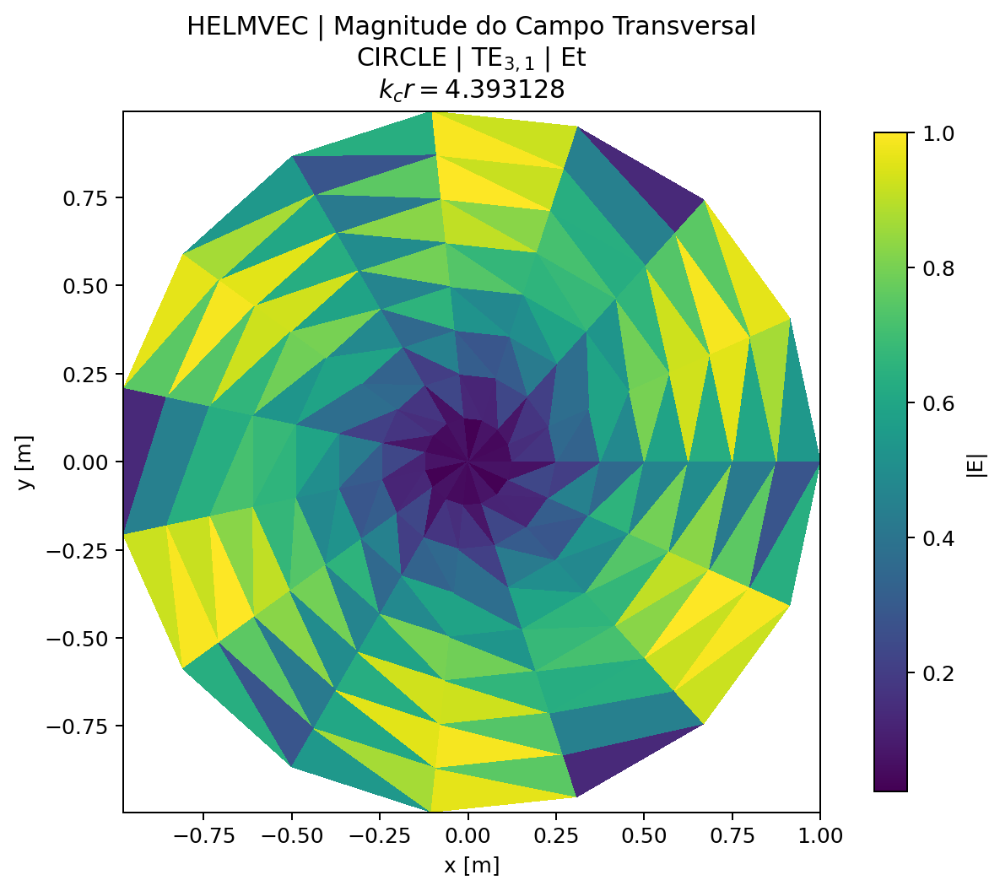
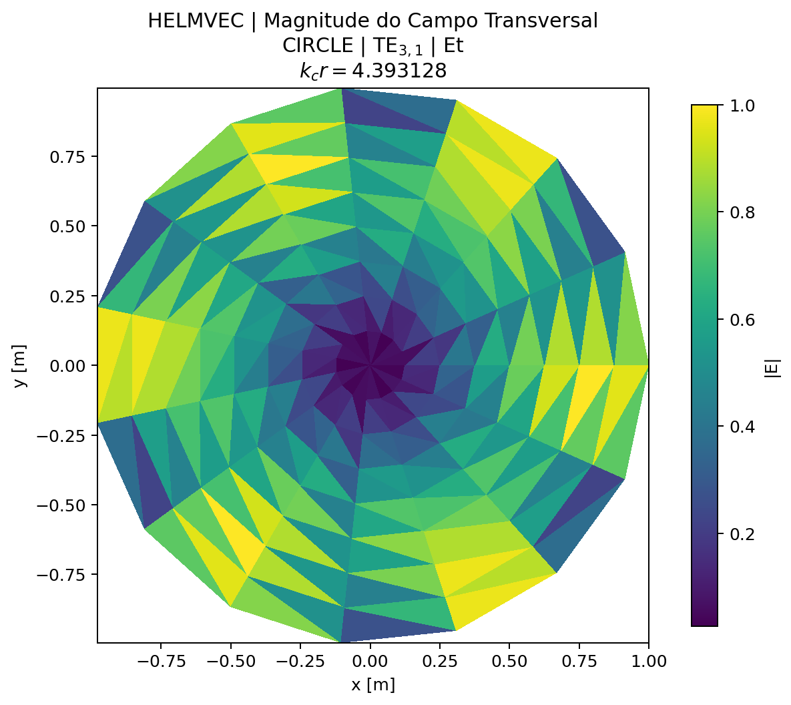


## Tempo de execução

| Backend | Assembly (ms) | Solve (ms) | Post (ms) | Total (ms) |
|---|---:|---:|---:|---:|
| FEM | 1.608658 | 286.048355 |  | 3621.011466 |


---

[← Caso 04](caso_04_tab4_helmvec_rect.md)  [Caso 06 →](caso_06_tab6_helmvec1_rect.md)  [↑ Índice de Resultados](README.md)
