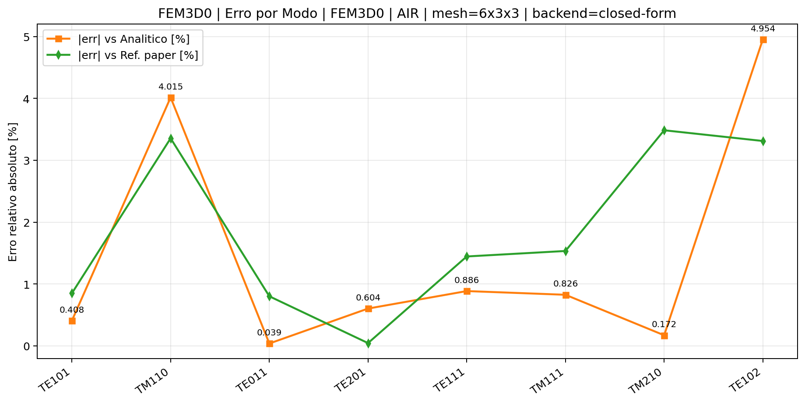
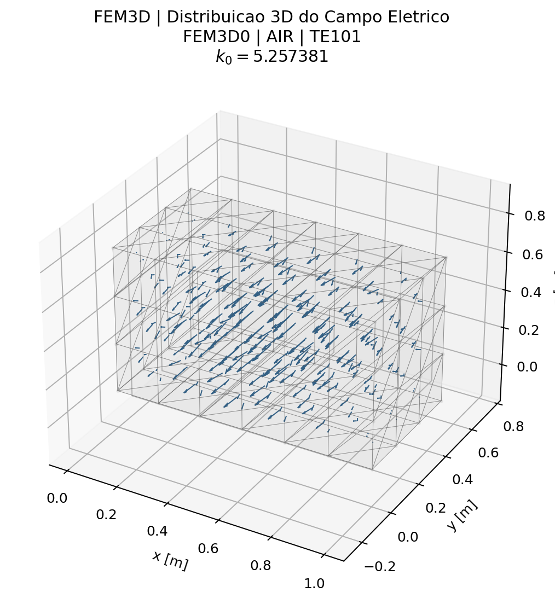
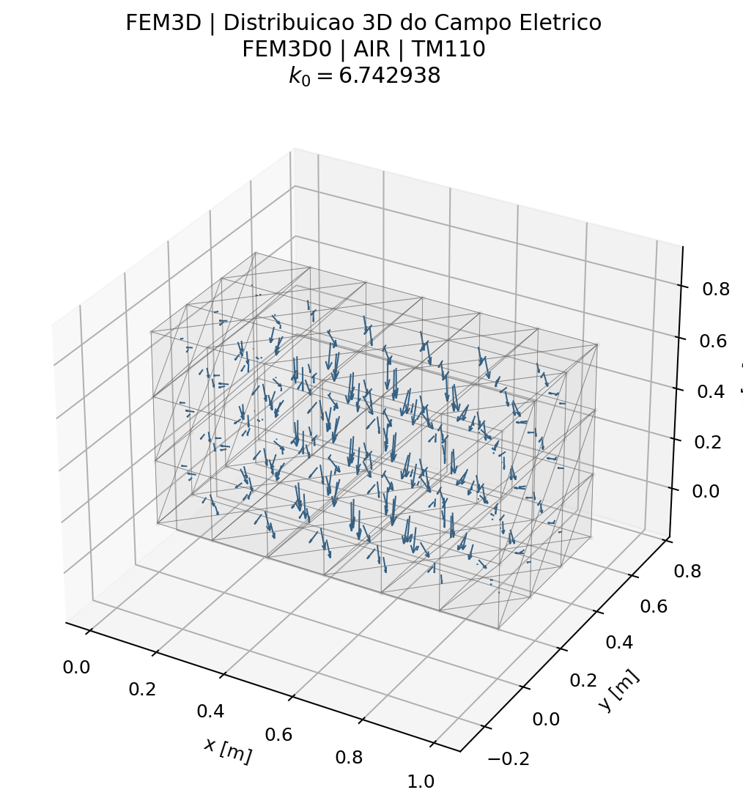
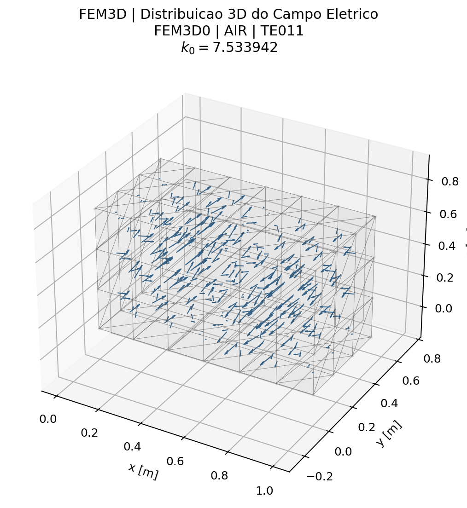
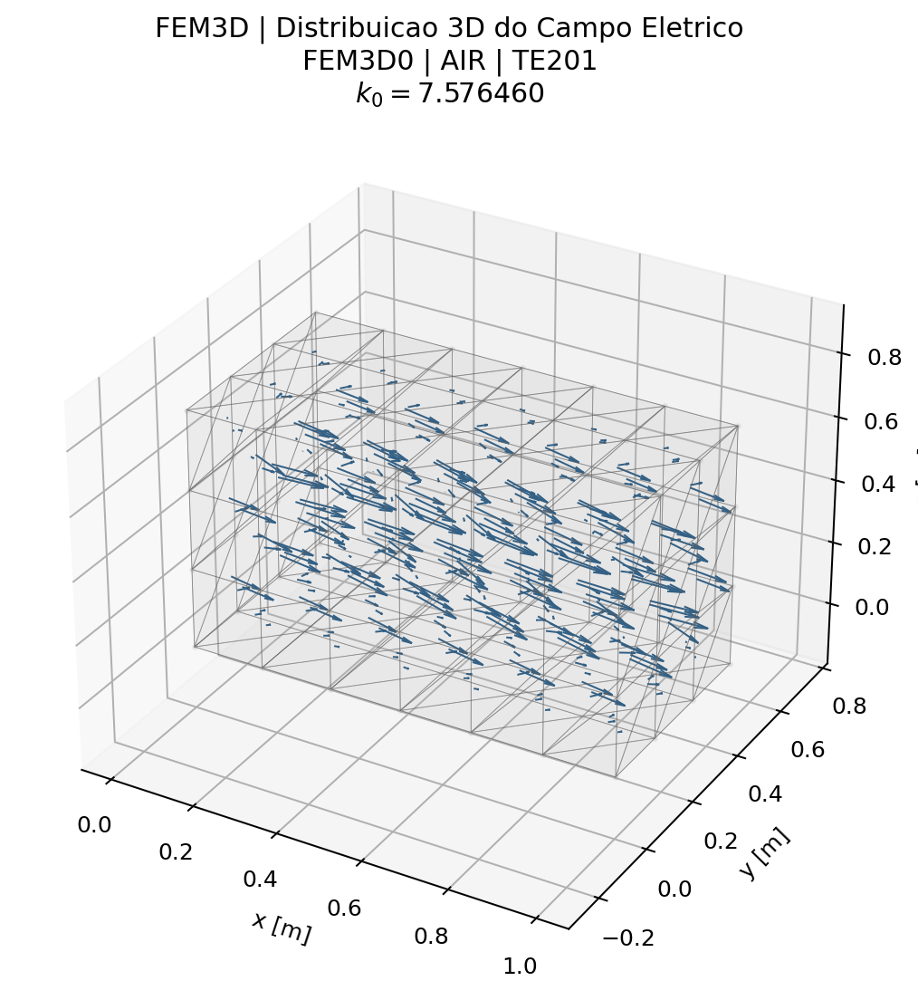
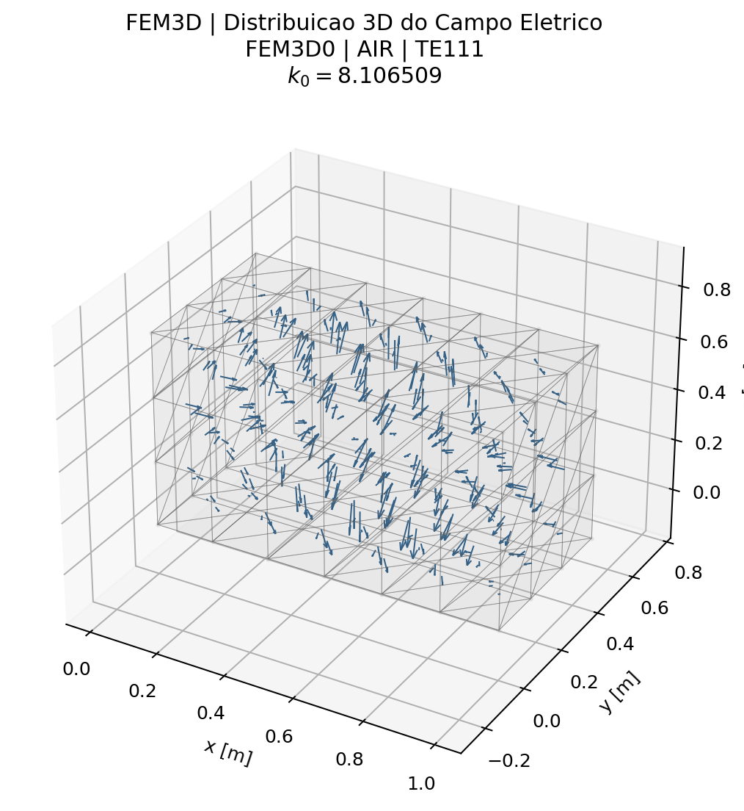
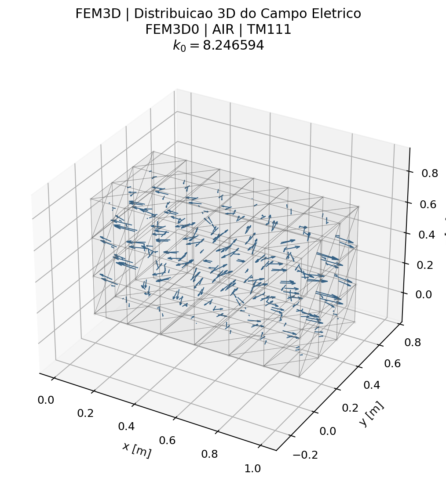
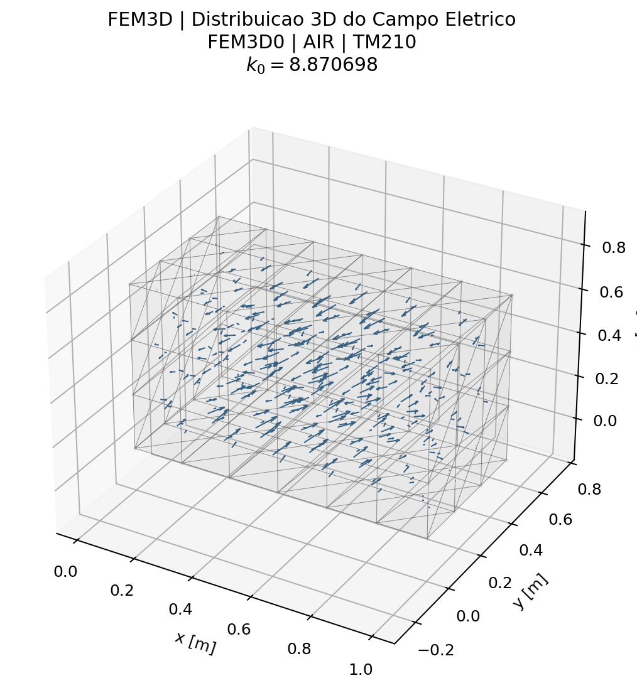
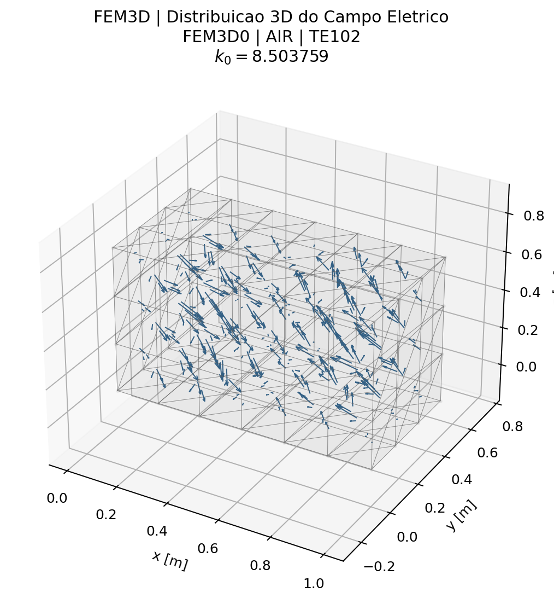
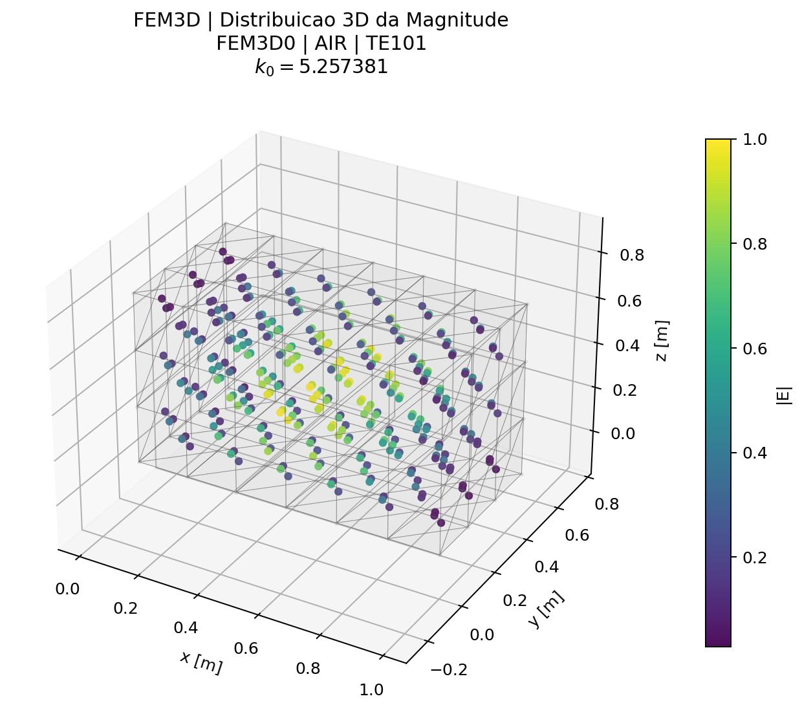

# Caso 11 — Tabela 12 — Cavidade Retangular 3D, Ar (Sec. 3.1)

## Problema

- **Seção do artigo:** 3.1
- **Formulação:** Eq. (178) — S e = k0² T e (aresta tetraédrica)
- **Grandeza calculada:** `k0` (número de onda de ressonância)
- **Geometria:** Cavidade retangular preenchida com ar, PEC
- **Teoria:** [3_Problemas_Tridimensionais.md](../traducao/3_Problemas_Tridimensionais.md)
- **Rastreabilidade:** [Rastreabilidade_Equacoes_Artigo_Codigo.md](../Rastreabilidade_Equacoes_Artigo_Codigo.md)

## Figura do artigo


## Condições de cálculo

| Parâmetro | Valor |
|---|---|
| Malha | ~112 nós, ~324 tetraedros (FEM3D0 denso / FEM3D1 esparso) |
| Backend | `closed-form` |

```bash
./build/fem3d0_air --backend closed-form
./build/fem3d1_air --backend closed-form
```

## Resultados — FEM

| # | Modo | `k0` analitico | `k0` FEM | Ref. artigo | Erro analítico (%) | Erro artigo (%) |
|---|---|---:|---:|---:|---:|---:|
| 1 | TE101 | 5.2360 | 5.2574 | 5.2130 | 0.408 | 0.851 |
| 2 | TM110 | 7.0250 | 6.7429 | 6.9770 | 4.015 | 3.355 |
| 3 | TE011 | 7.5310 | 7.5339 | 7.4740 | 0.039 | 0.802 |
| 4 | TE201 | 7.5310 | 7.5765 | 7.5730 | 0.604 | 0.046 |
| 5 | TE111 | 8.1790 | 8.1065 | 7.9910 | 0.886 | 1.445 |
| 6 | TM111 | 8.1790 | 8.2466 | 8.1220 | 0.826 | 1.534 |
| 7 | TM210 | 8.8860 | 8.8707 | 8.5720 | 0.172 | 3.485 |
| 8 | TE102 | 8.9470 | 8.5038 | 8.7950 | 4.954 | 3.311 |

### Gráficos de resumo — FEM



### Campos modais — FEM














## Tempo de execução

| Backend | Assembly (ms) | Solve (ms) | Post (ms) | Total (ms) |
|---|---:|---:|---:|---:|
| FEM | 8.9 | 86.3 | 105.1 | 200.3 |


---

[← Caso 10](caso_10_fig13_tab10_helmvec3.md)  [Caso 12 →](caso_12_tab13_fem3d_half.md)  [↑ Índice de Resultados](README.md)
