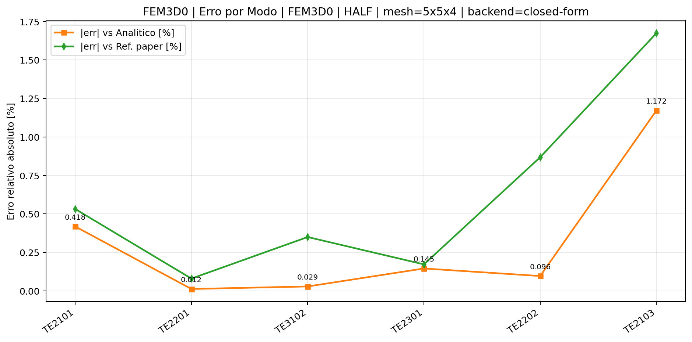
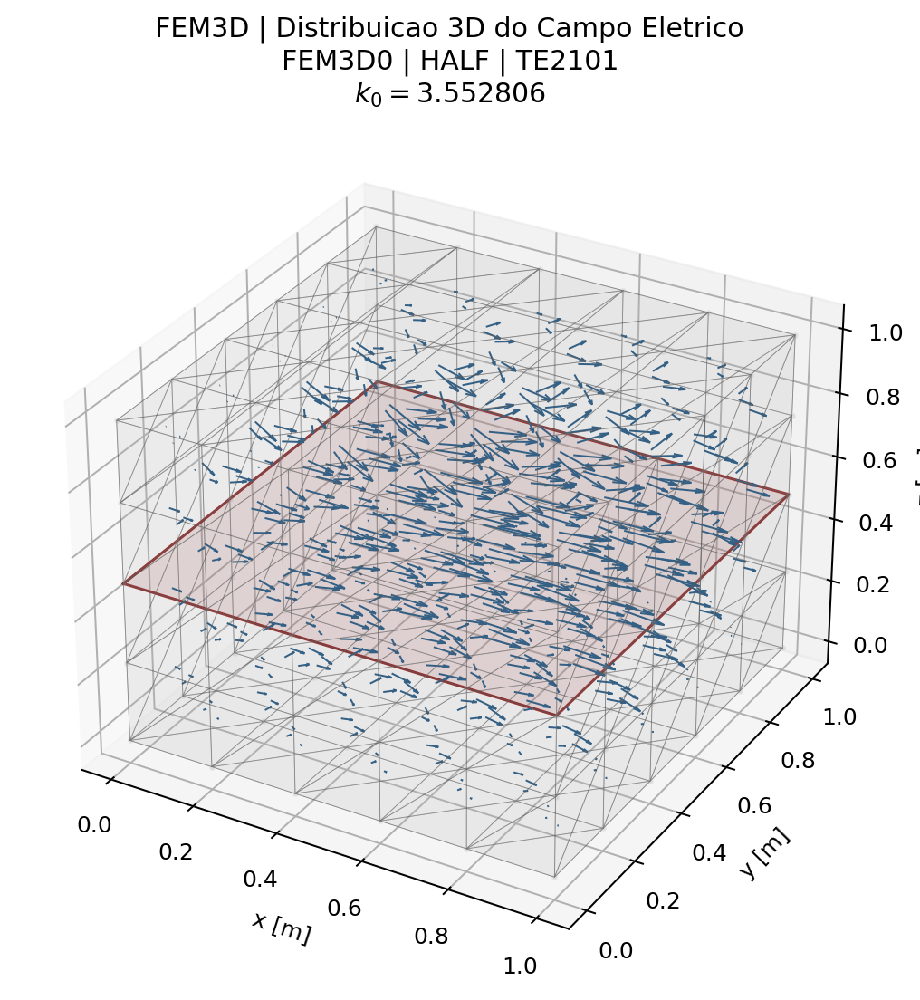
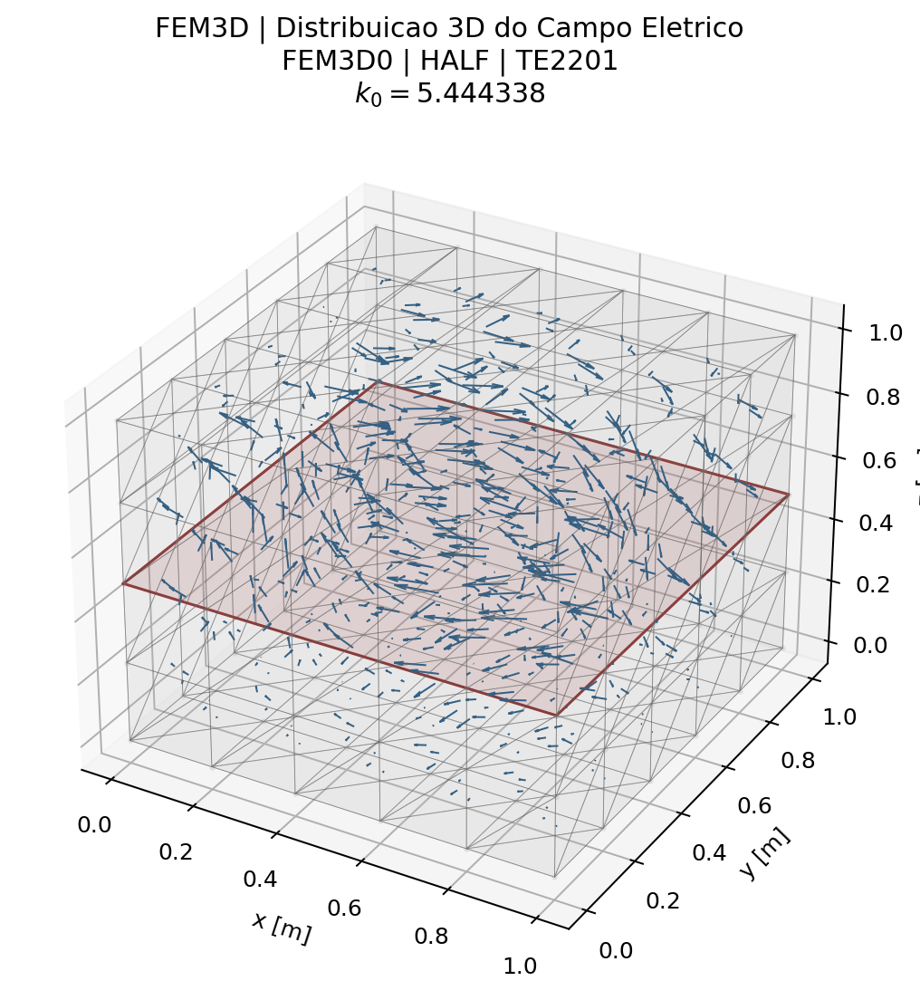
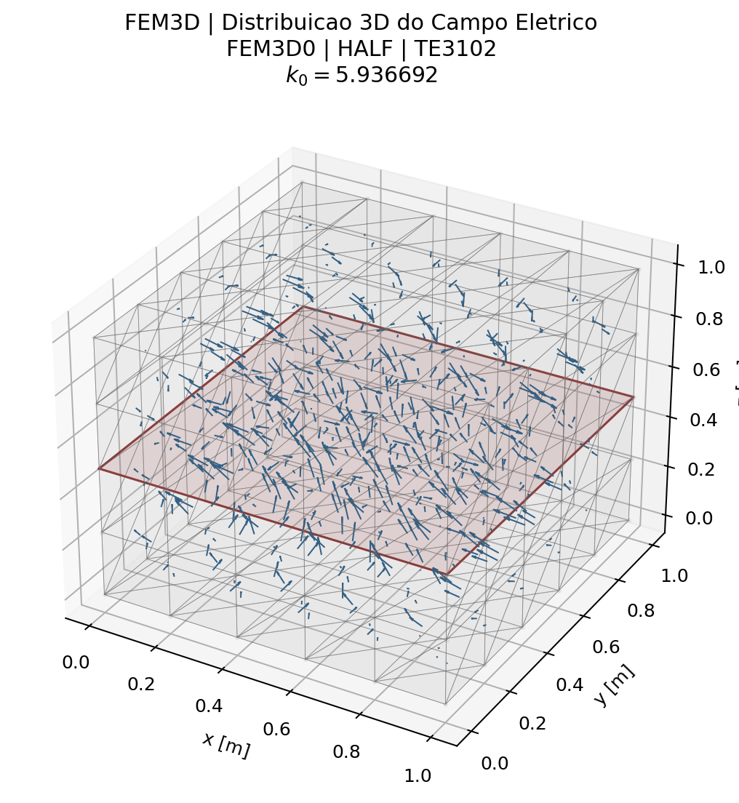
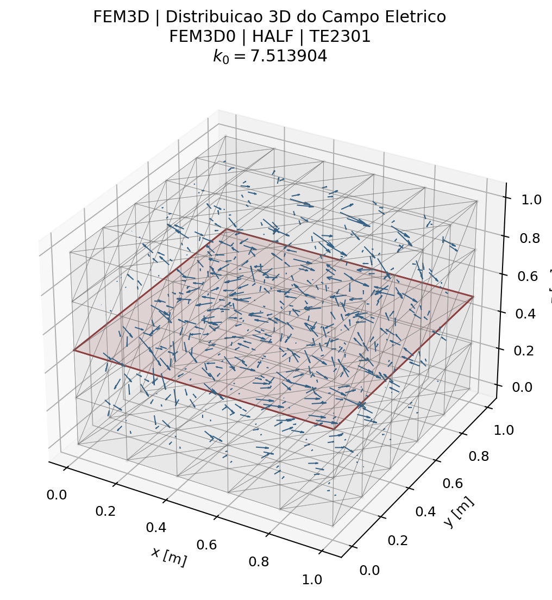
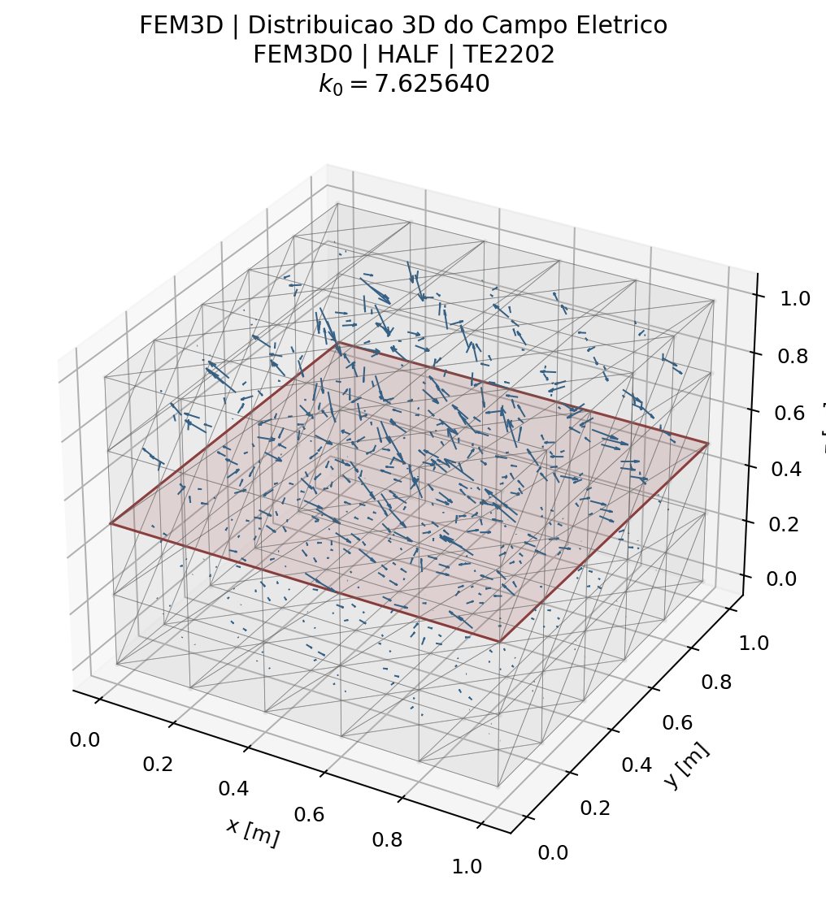
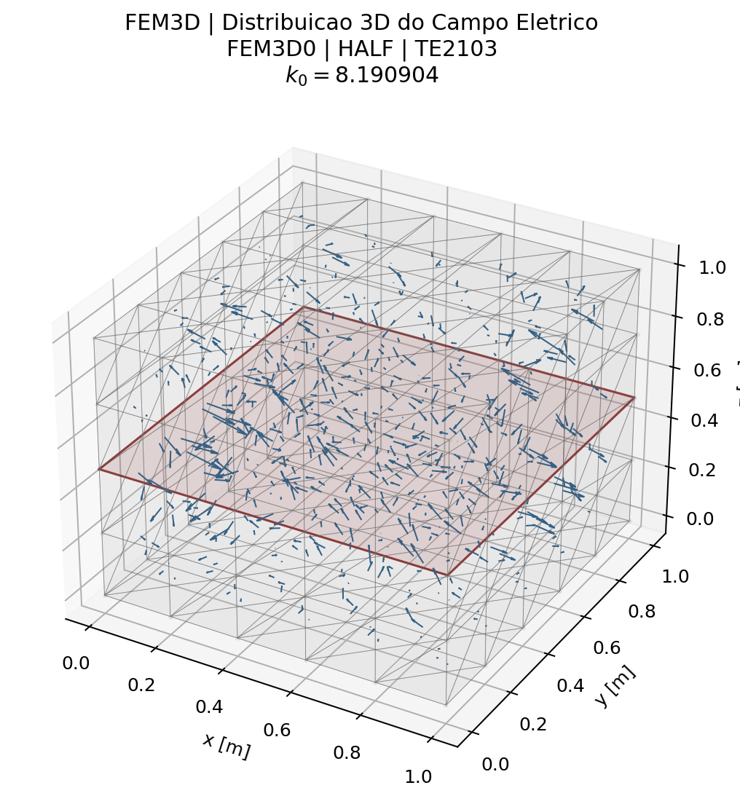
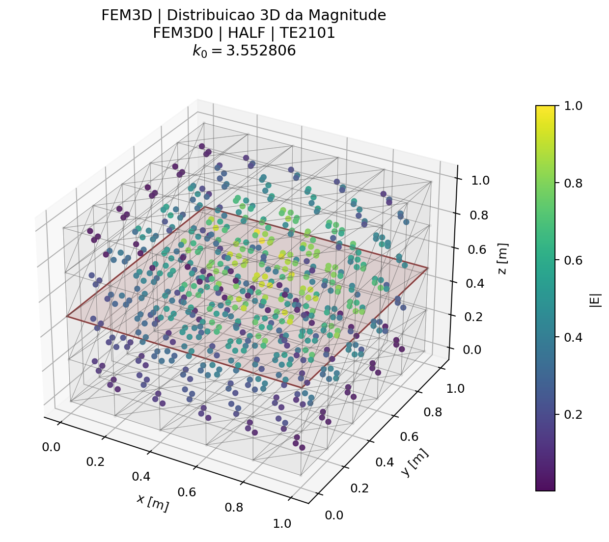
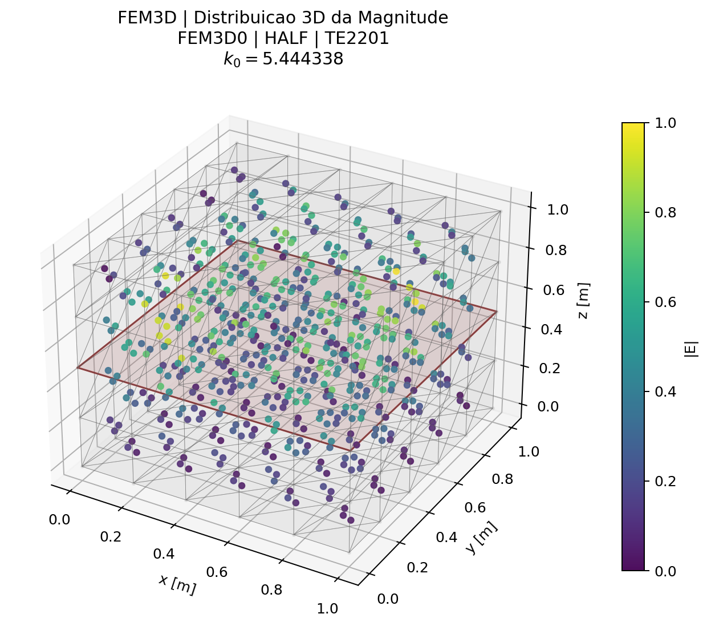
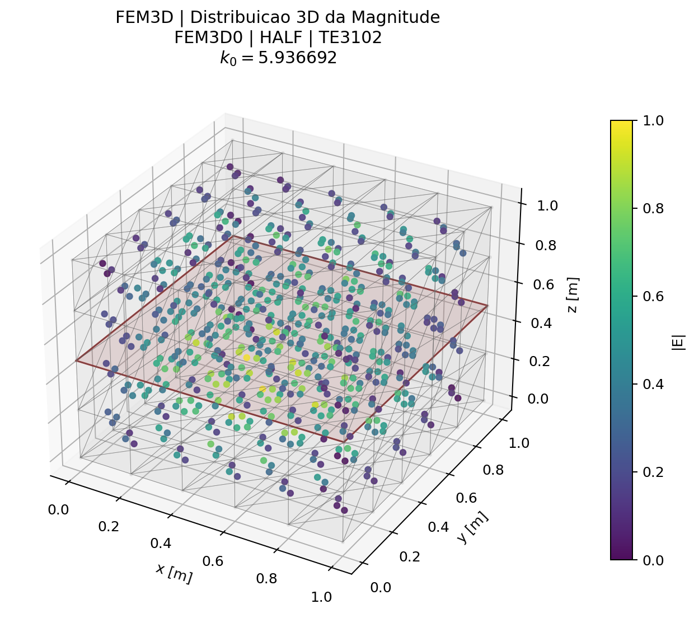

# Caso 12 — Tabela 13 — Cavidade Retangular 3D Semi-Preenchida (Sec. 3.1)

## Problema

- **Seção do artigo:** 3.1
- **Formulação:** Eq. (178)
- **Grandeza calculada:** `k0`
- **Geometria:** Cavidade retangular, dielétrico εr=2 em z=[0.5, 1] cm
- **Teoria:** [3_Problemas_Tridimensionais.md](../traducao/3_Problemas_Tridimensionais.md)
- **Rastreabilidade:** [Rastreabilidade_Equacoes_Artigo_Codigo.md](../Rastreabilidade_Equacoes_Artigo_Codigo.md)

## Figura do artigo


## Condições de cálculo

| Parâmetro | Valor |
|---|---|
| Malha | ~200 nós, ~615 tetraedros |
| Backend | `closed-form` |

```bash
./build/fem3d0_half --backend closed-form
./build/fem3d1_half --backend closed-form
```

## Resultados — FEM

| # | Modo | `k0` analitico | `k0` FEM | Ref. artigo | Erro analítico (%) | Erro artigo (%) |
|---|---|---:|---:|---:|---:|---:|
| 1 | TE2101 | 3.5380 | 3.5528 | 3.5340 | 0.418 | 0.532 |
| 2 | TE2201 | 5.4450 | 5.4443 | 5.4400 | 0.012 | 0.080 |
| 3 | TE3102 | 5.9350 | 5.9367 | 5.9160 | 0.029 | 0.350 |
| 4 | TE2301 | 7.5030 | 7.5139 | 7.5010 | 0.145 | 0.172 |
| 5 | TE2202 | 7.6330 | 7.6256 | 7.5600 | 0.096 | 0.868 |
| 6 | TE2103 | 8.0960 | 8.1909 | 8.0560 | 1.172 | 1.675 |

### Gráficos de resumo — FEM



### Campos modais — FEM














## Tempo de execução

| Backend | Assembly (ms) | Solve (ms) | Post (ms) | Total (ms) |
|---|---:|---:|---:|---:|
| FEM | 2.7 | 242.4 | 187.8 | 432.9 |


---

[← Caso 11](caso_11_tab12_fem3d_air.md)  [Caso 13 →](caso_13_tab14_fem3d_cyl.md)  [↑ Índice de Resultados](README.md)
