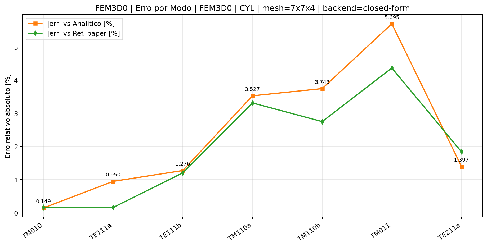
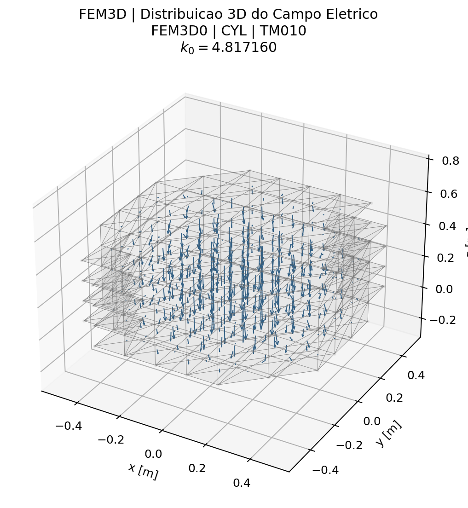
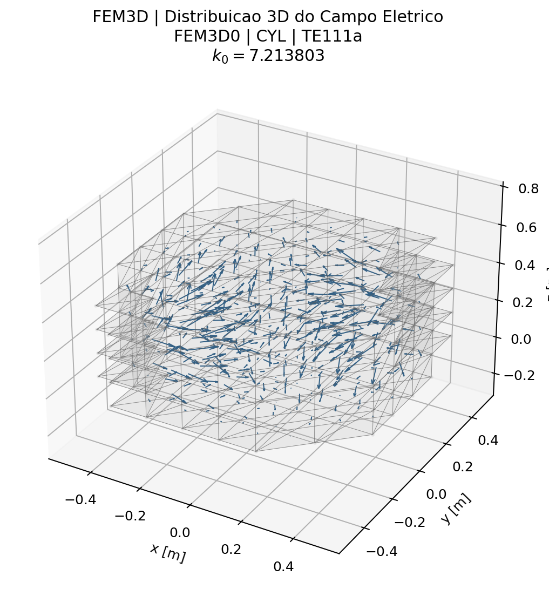
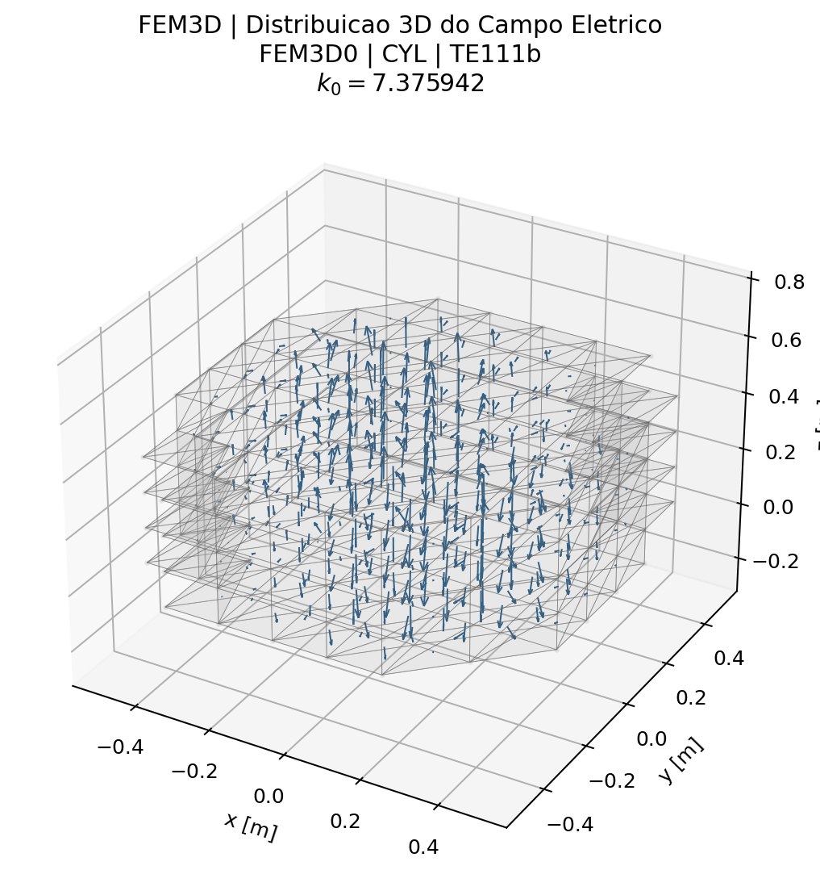
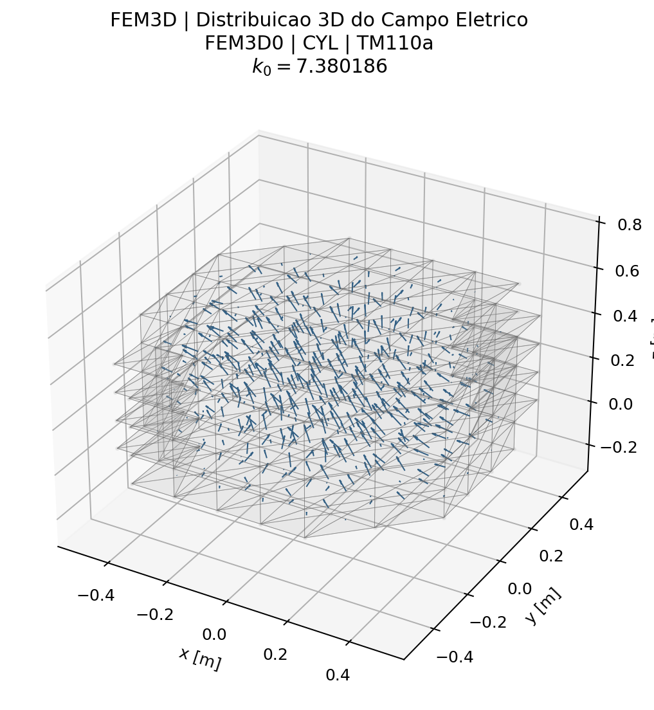
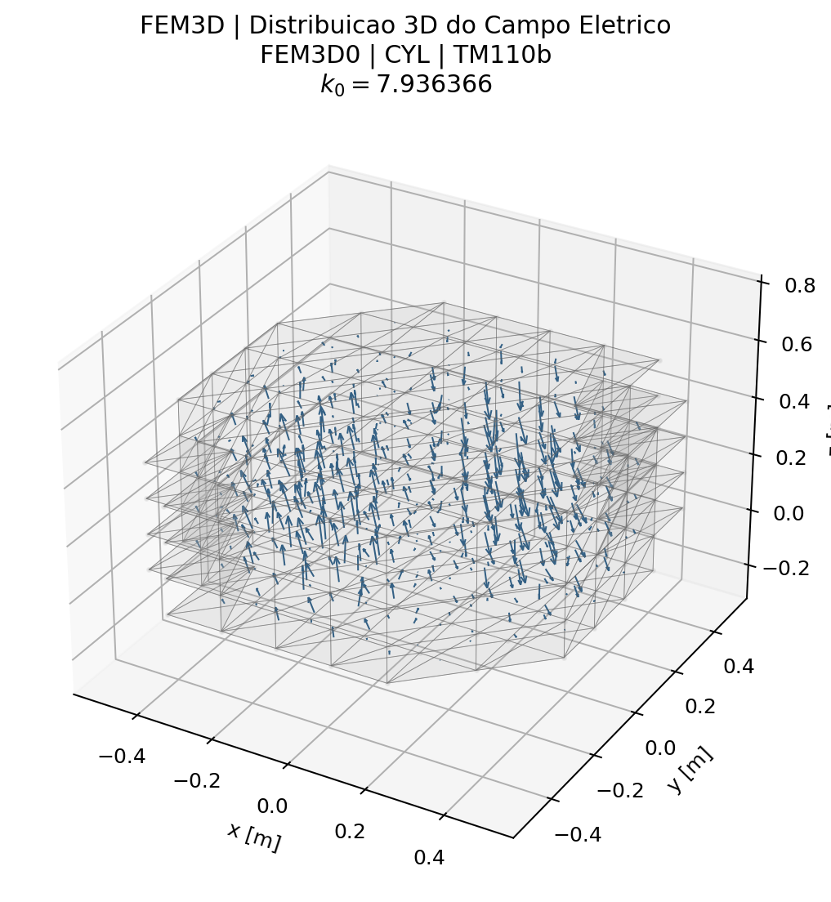
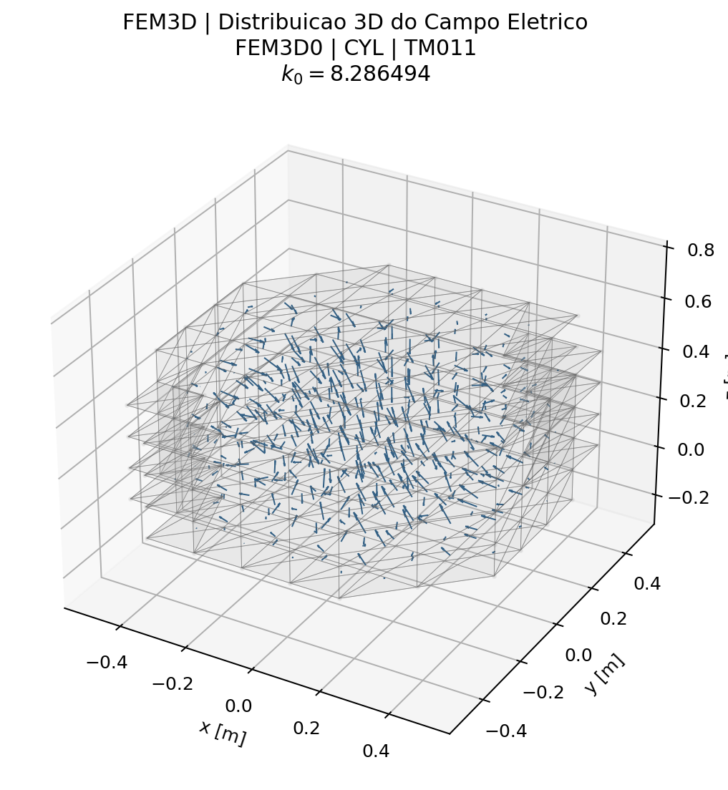
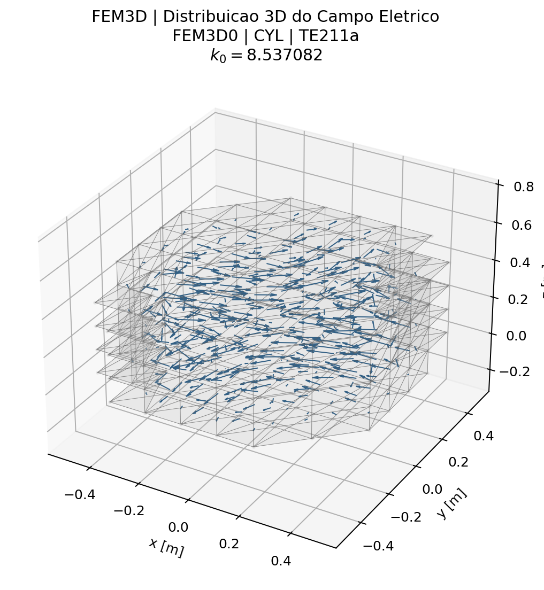
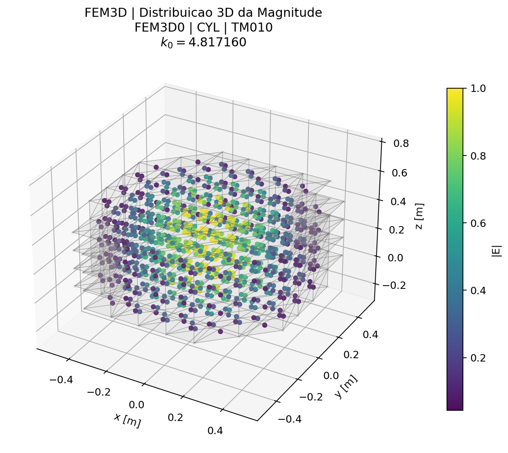
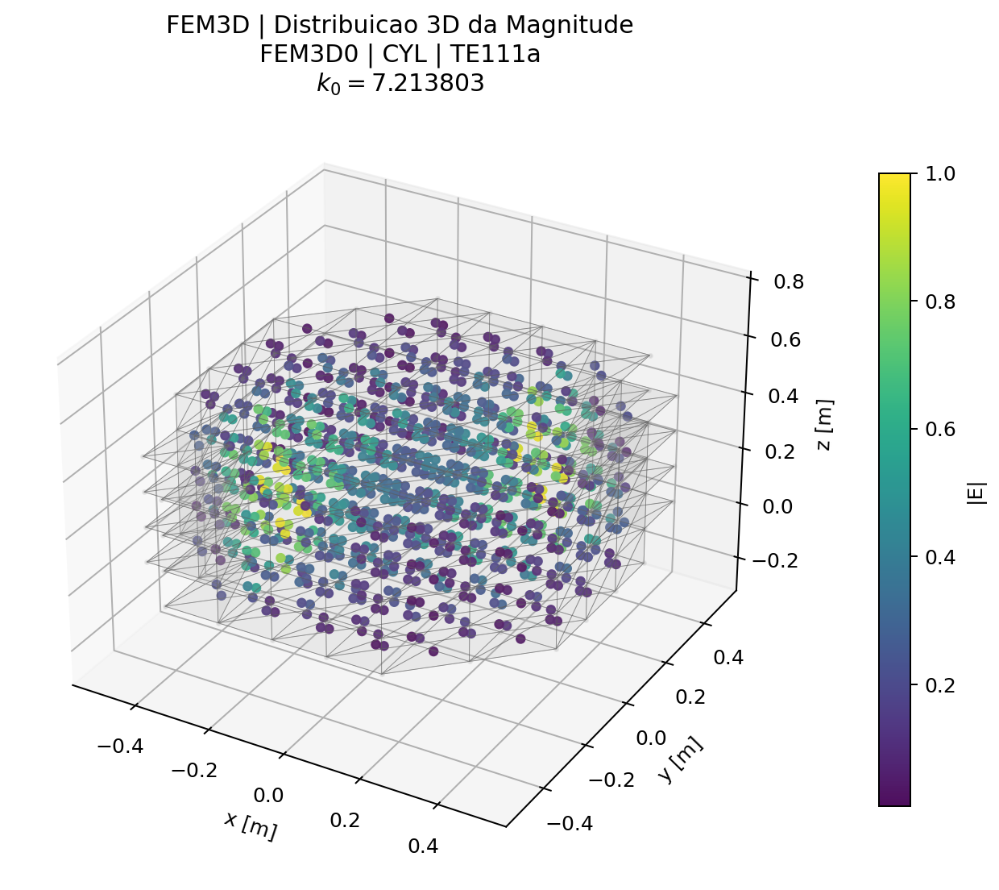

# Caso 13 — Tabela 14 — Cavidade Cilíndrica 3D, Ar (Sec. 3.1)

## Problema

- **Seção do artigo:** 3.1
- **Formulação:** Eq. (178)
- **Grandeza calculada:** `k0`
- **Geometria:** Cavidade cilíndrica circular com ar
- **Teoria:** [3_Problemas_Tridimensionais.md](../traducao/3_Problemas_Tridimensionais.md)
- **Rastreabilidade:** [Rastreabilidade_Equacoes_Artigo_Codigo.md](../Rastreabilidade_Equacoes_Artigo_Codigo.md)

## Figura do artigo


## Condições de cálculo

| Parâmetro | Valor |
|---|---|
| Malha | ~200 nós, ~633 tetraedros |
| Backend | `closed-form` |

```bash
./build/fem3d0_cyl --backend closed-form
./build/fem3d1_cyl --backend closed-form
```

## Resultados — FEM

| # | Modo | `k0` analitico | `k0` FEM | Ref. artigo | Erro analítico (%) | Erro artigo (%) |
|---|---|---:|---:|---:|---:|---:|
| 1 | TM010 | 4.8100 | 4.8172 | 4.8090 | 0.149 | 0.170 |
| 2 | TE111a | 7.2830 | 7.2138 | 7.2020 | 0.950 | 0.164 |
| 3 | TE111b | 7.2830 | 7.3759 | 7.2880 | 1.276 | 1.207 |
| 4 | TM110a | 7.6500 | 7.3802 | 7.6330 | 3.527 | 3.312 |
| 5 | TM110b | 7.6500 | 7.9364 | 7.7240 | 3.743 | 2.749 |
| 6 | TM011 | 7.8400 | 8.2865 | 7.9400 | 5.695 | 4.364 |
| 7 | TE211a | 8.6580 | 8.5371 | 8.6970 | 1.397 | 1.839 |

### Gráficos de resumo — FEM



### Campos modais — FEM














## Tempo de execução

| Backend | Assembly (ms) | Solve (ms) | Post (ms) | Total (ms) |
|---|---:|---:|---:|---:|
| FEM | 16.1 | 796.0 | 451.5 | 1263.6 |


---

[← Caso 12](caso_12_tab13_fem3d_half.md)  [Caso 14 →](caso_14_tab15_fem3d_sphere.md)  [↑ Índice de Resultados](README.md)
