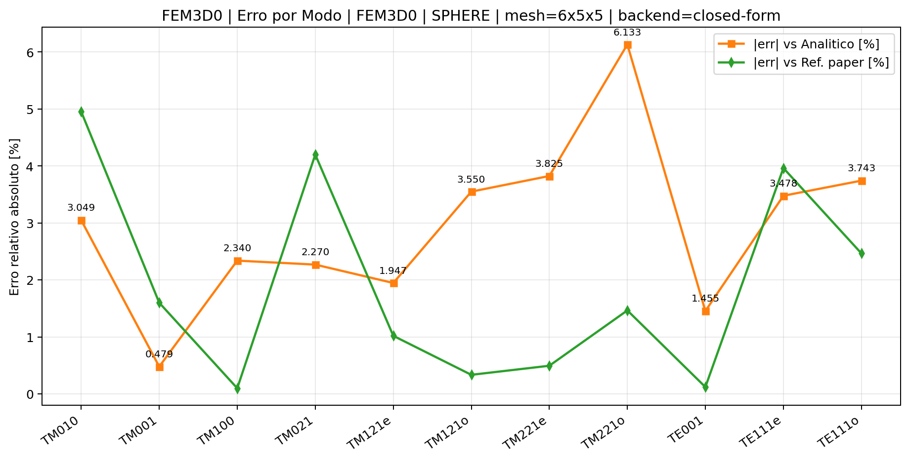
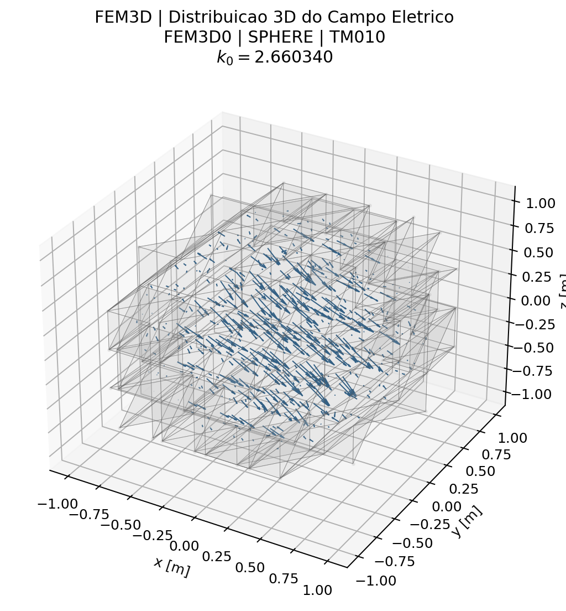
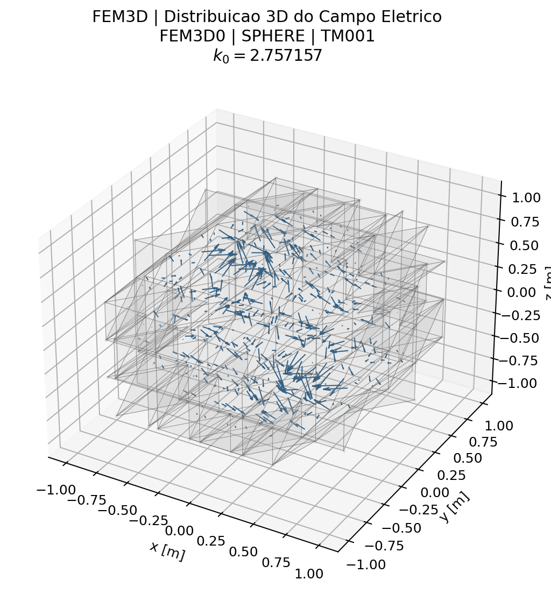
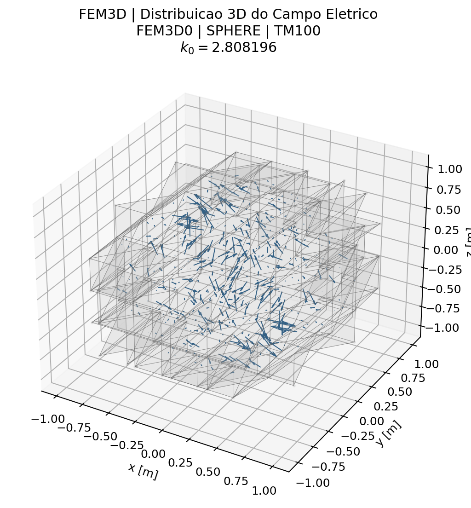
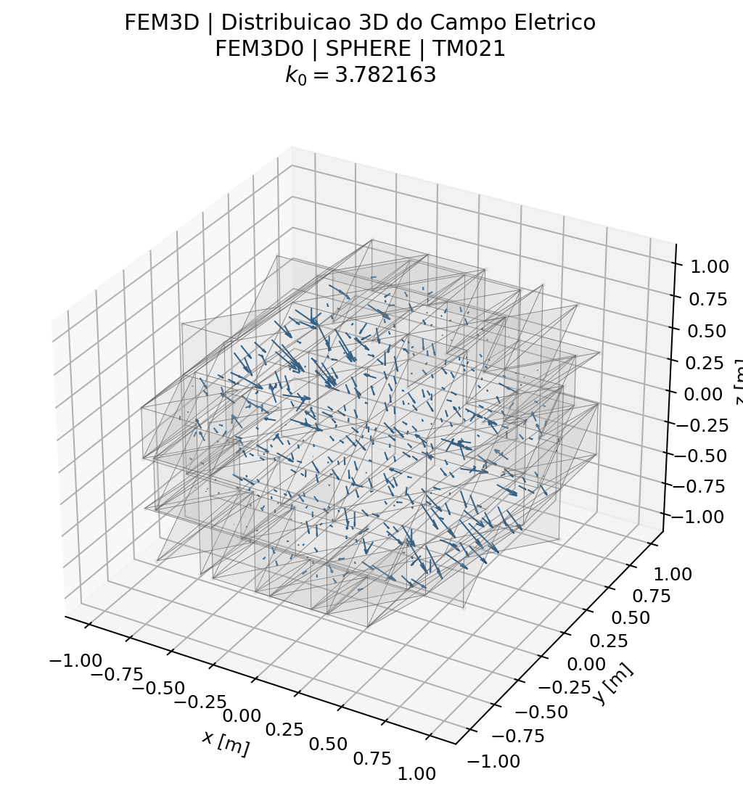
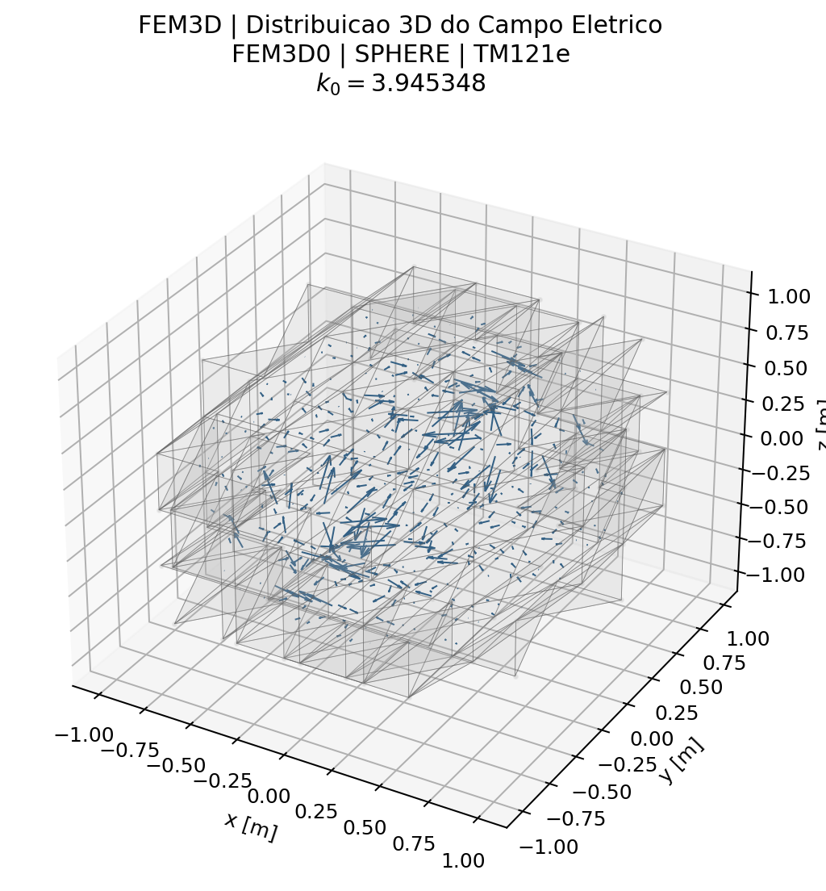
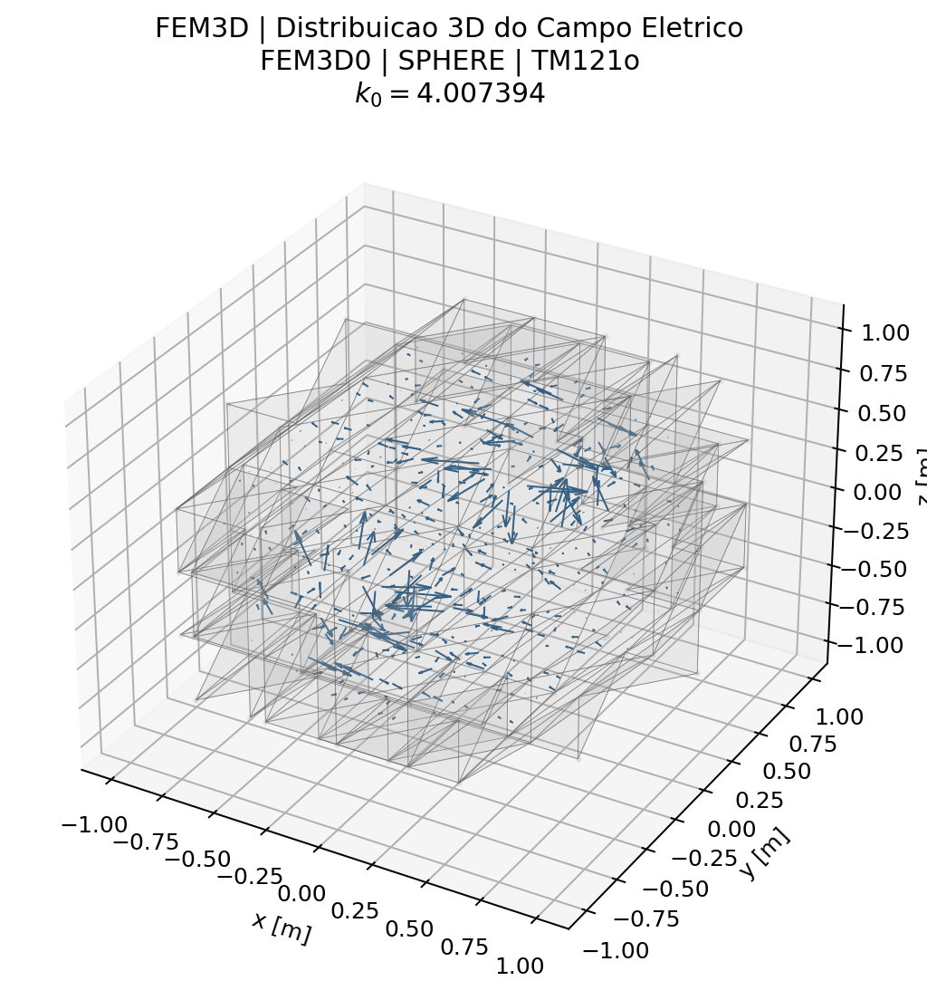
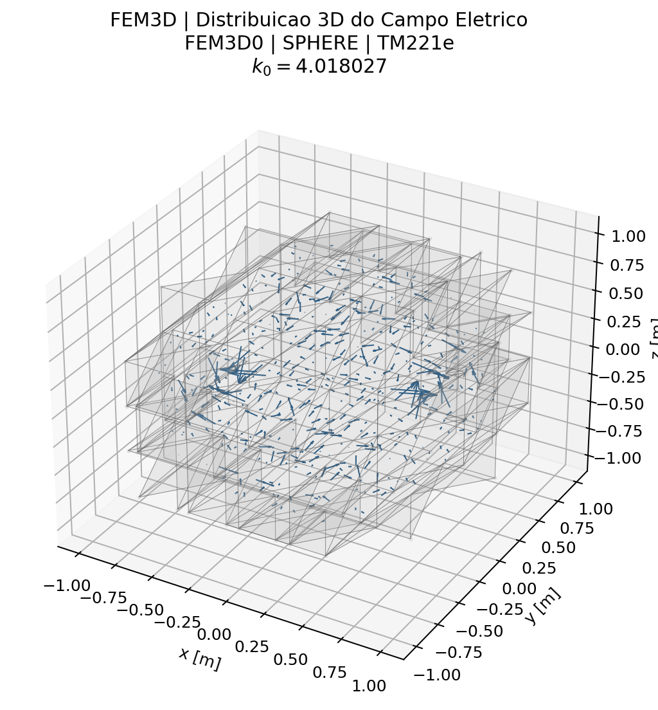
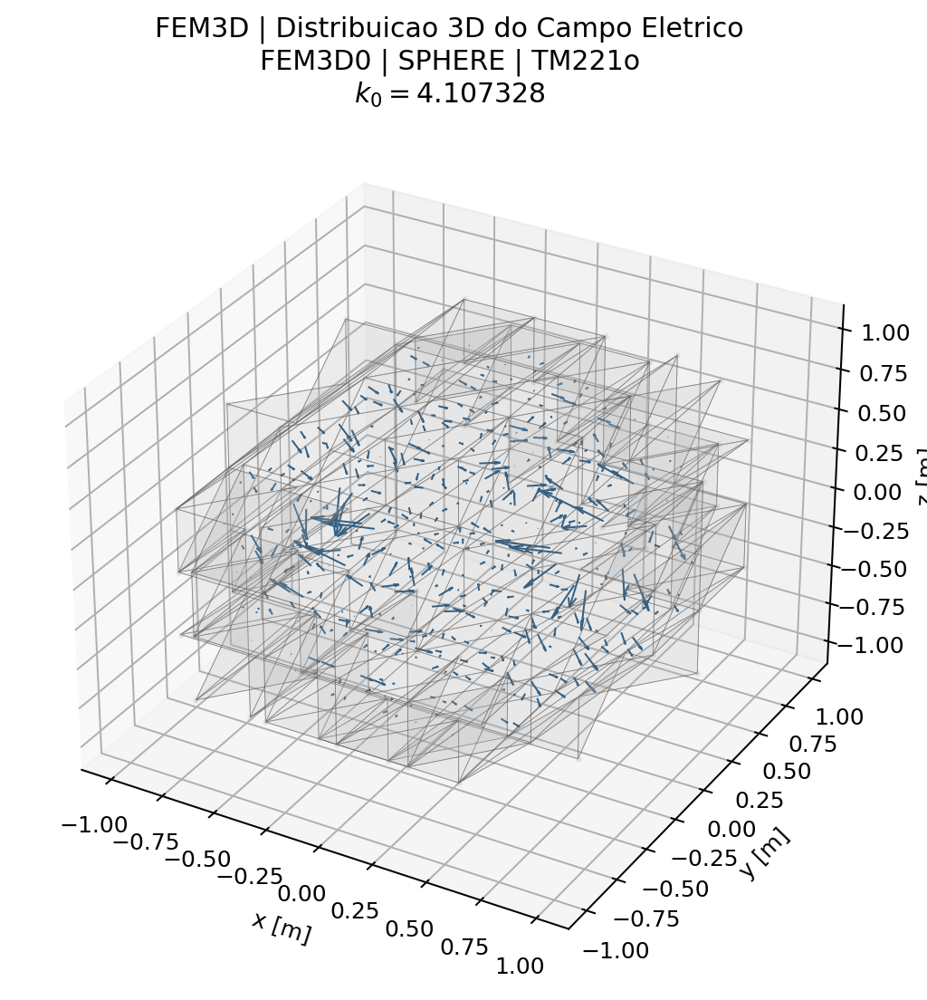
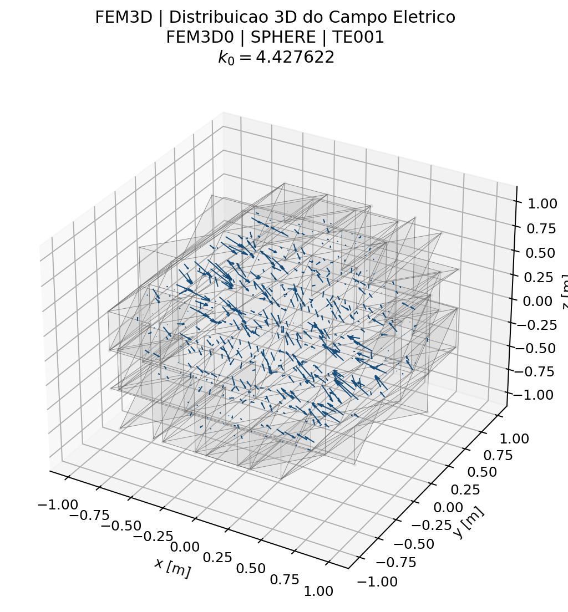

# Caso 14 — Tabela 15 — Cavidade Esférica 3D (Sec. 3.1)

## Problema

- **Seção do artigo:** 3.1
- **Formulação:** Eq. (178)
- **Grandeza calculada:** `k0`
- **Geometria:** Cavidade esférica, raio 1 cm
- **Teoria:** [3_Problemas_Tridimensionais.md](../traducao/3_Problemas_Tridimensionais.md)
- **Rastreabilidade:** [Rastreabilidade_Equacoes_Artigo_Codigo.md](../Rastreabilidade_Equacoes_Artigo_Codigo.md)

## Figura do artigo

_Figura do artigo não disponível._

## Condições de cálculo

| Parâmetro | Valor |
|---|---|
| Malha | ~166 nós, ~473 tetraedros |
| Backend | `closed-form` |

```bash
./build/fem3d0_sphere --backend closed-form
./build/fem3d1_sphere --backend closed-form
```

## Resultados — FEM

| # | Modo | `k0` analitico | `k0` FEM | Ref. artigo | Erro analítico (%) | Erro artigo (%) |
|---|---|---:|---:|---:|---:|---:|
| 1 | TM010 | 2.7440 | 2.6603 | 2.7990 | 3.049 | 4.954 |
| 2 | TM001 | 2.7440 | 2.7572 | 2.8020 | 0.479 | 1.600 |
| 3 | TM100 | 2.7440 | 2.8082 | 2.8110 | 2.340 | 0.100 |
| 4 | TM021 | 3.8700 | 3.7822 | 3.9480 | 2.270 | 4.201 |
| 5 | TM121e | 3.8700 | 3.9453 | 3.9860 | 1.947 | 1.020 |
| 6 | TM121o | 3.8700 | 4.0074 | 3.9940 | 3.550 | 0.335 |
| 7 | TM221e | 3.8700 | 4.0180 | 4.0380 | 3.825 | 0.495 |
| 8 | TM221o | 3.8700 | 4.1073 | 4.0480 | 6.133 | 1.466 |
| 9 | TE001 | 4.4930 | 4.4276 | 4.4330 | 1.455 | 0.121 |
| 10 | TE111e | 4.4930 | 4.6493 | 4.4720 | 3.478 | 3.964 |

### Gráficos de resumo — FEM



### Campos modais — FEM














## Tempo de execução

| Backend | Assembly (ms) | Solve (ms) | Post (ms) | Total (ms) |
|---|---:|---:|---:|---:|
| FEM | 2.1 | 378.4 | 158.1 | 538.7 |


---

[← Caso 13](caso_13_tab14_fem3d_cyl.md)  [↑ Índice de Resultados](README.md)
