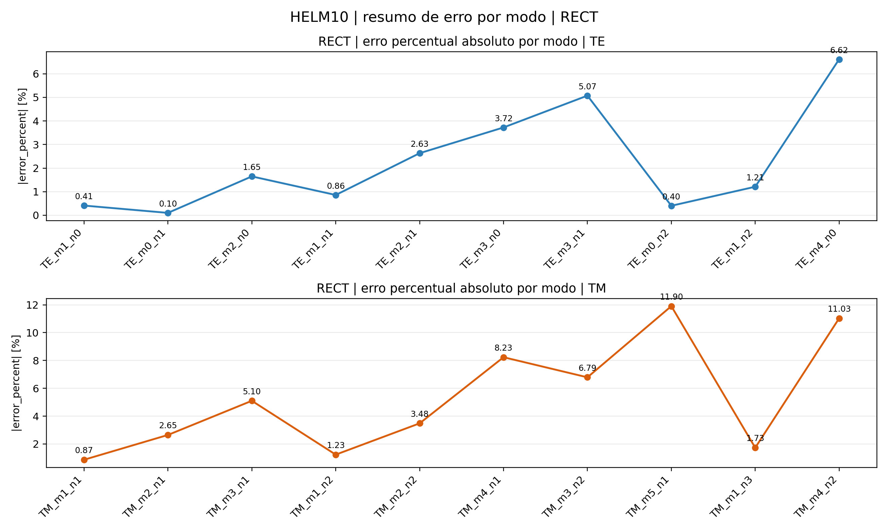
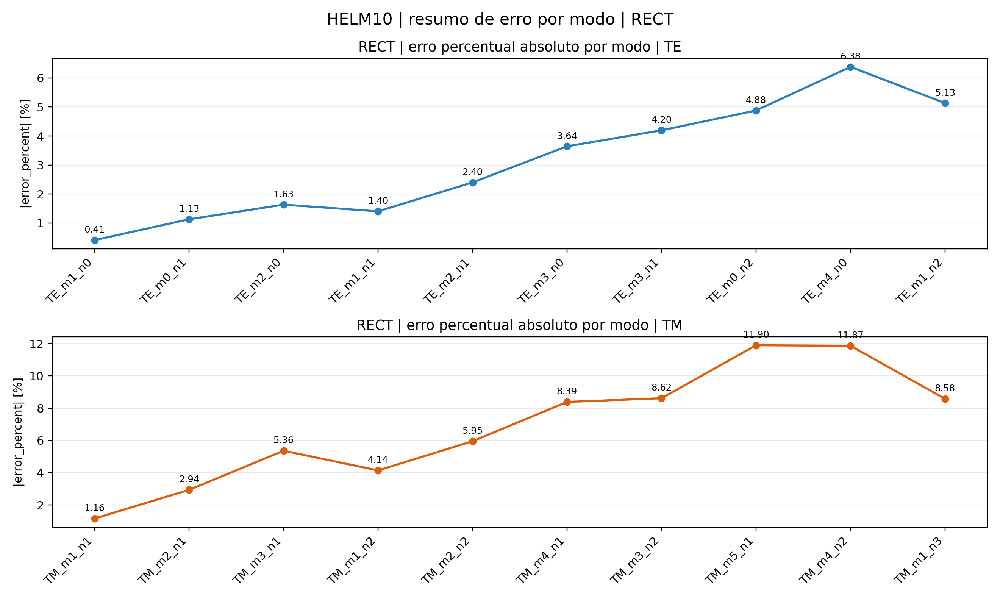

# Comparação FEM × EFGMI

Tabela consolidada de timing e erro médio por caso, comparando o backend FEM (formas fechadas) e o backend EFGMI (interpolantes de consistência, malha triangular como fundo de integração).

Para detalhes por modo e campos individuais, veja as páginas de cada caso.

## Timing por caso

| Caso | FEM assembly (ms) | FEM solve (ms) | FEM total (ms) | EFGMI assembly (ms) | EFGMI solve (ms) | EFGMI total (ms) |
|---|---:|---:|---:|---:|---:|---:|
| [01](caso_01_tab1_helm10_rect.md) | 1.0 | 54.1 | 421.9 | 609.5 | 45.7 | 3225.7 |
| [02](caso_02_tab2_helm10_circle.md) | 0.2 | 43.4 | 479.7 | 376.1 | 49.5 | 1725.2 |
| [03](caso_03_tab3_helm10_coax.md) | 0.6 | 51.7 | 1202.7 | 503.2 | 94.6 | 3834.2 |
| [06](caso_06_tab6_helmvec1_rect.md) | 46.6 | 5369.5 | 7933.1 | 651.3 | 765.2 | 16016.5 |
| [07](caso_07_tab7_helmvec1_circle.md) | 10.6 | 264.3 | 2561.1 | 326.4 | 204.5 | 7821.4 |
| [08](caso_08_fig11_tab8_helmvec2.md) | 101.5 | 25653.5 | 27346.5 | 924.4 | 24103.6 | 26503.4 |
| [09](caso_09_fig12_tab9_helmvec3.md) | 4.1 | 254.2 | 568.2 | 320.1 | 188.8 | 850.2 |
| [10](caso_10_fig13_tab10_helmvec3.md) | 11.3 | 2474.0 | 5587.8 | 2688.4 | 2518.4 | 8411.9 |

> **Nota:** EFGM tem assembly mais custoso (construção de interpolantes nodais por consistência para cada elemento), mas solve comparável (mesmo LAPACK dsygv).

## Imagens de resumo de erro — FEM

### Tabela 1 — Guia Retangular Escalar (Sec. 2.1)

### Tabela 2 — Guia Circular Escalar (Sec. 2.1)

### Tabela 3 — Linha Coaxial Escalar (Sec. 2.1)

### Tabela 4 — Guia Retangular Vetorial (Sec. 2.2.1)

### Tabela 5 — Guia Circular Vetorial (Sec. 2.2.1)

### Tabela 6 — Guia Retangular Misto 3 Comp. (Sec. 2.2.2)

### Tabela 7 — Guia Circular Misto 3 Comp. (Sec. 2.2.2)

## Imagens de resumo de erro — EFGMI

### Tabela 1 — Guia Retangular Escalar (Sec. 2.1)

### Tabela 2 — Guia Circular Escalar (Sec. 2.1)

### Tabela 3 — Linha Coaxial Escalar (Sec. 2.1)

### Tabela 6 — Guia Retangular Misto 3 Comp. (Sec. 2.2.2)

### Tabela 7 — Guia Circular Misto 3 Comp. (Sec. 2.2.2)

---

→ [Índice de Resultados](README.md)  → [Relatório completo FEM×EFGMI](../../out/fem_efgmi_mode_report_base/FEM_EFGM_MODE_REPORT.md)