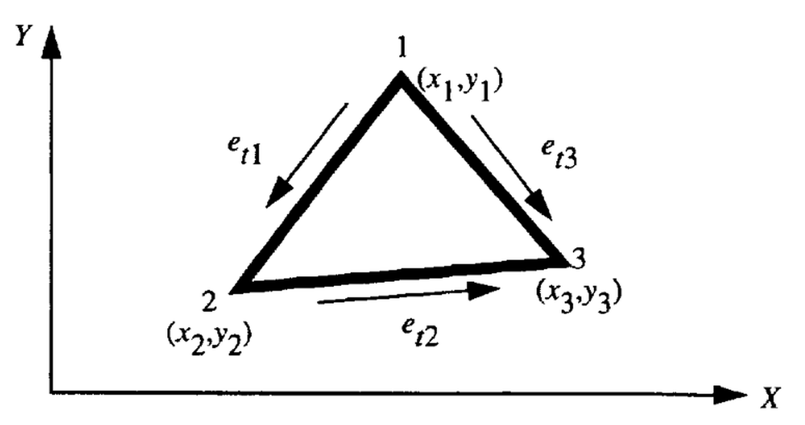

# 2.2.1. Solução do Problema de Guia de Onda Homogêneo com Campos Vetoriais Transversais de Duas Componentes

Para um guia de onda homogêneo, os modos propagantes podem ser divididos em modos elétricos transversais (TE) ou magnéticos transversais (TM), que podem ser resolvidos separadamente.

Para o modo TE, $E_z = 0$, o campo elétrico transversal $\mathbf{E}_t$ satisfaz a equação vetorial de onda:

### (42)

$$
\nabla_t \times \left( \frac{1}{\mu_r} \nabla_t \times \mathbf{E}_t \right) - k_c^2 \varepsilon_r \mathbf{E}_t = 0
$$

e para o modo TM, $H_z = 0$, o campo magnético transversal $\mathbf{H}_t$ satisfaz:

### (43)

$$
\nabla_t \times \left( \frac{1}{\varepsilon_r} \nabla_t \times \mathbf{H}_t \right) - k_c^2 \mu_r \mathbf{H}_t = 0
$$

onde $\mu_r$ e $\varepsilon_r$ são a permeabilidade e permissividade do material no guia de onda, respectivamente.

Nesta seção, ilustramos o procedimento para o modo TE, e o mesmo procedimento pode ser aplicado ao modo TM, exceto que condições de contorno de Neumann são aplicadas em contornos PEC em vez de condições de Dirichlet.

---

### 2.2.1.1. Formulação

Para o modo TE, considere a equação de onda:

$$
\nabla_t \times \left( \frac{1}{\mu_r} \nabla_t \times \mathbf{E}_t \right) - k_c^2 \varepsilon_r \mathbf{E}_t = 0
$$

Multiplicando escalarmente pela função de teste vetorial $\mathbf{T}_t$ e integrando sobre a seção transversal:

### (44)

$$
\iint_\Gamma \left( \mathbf{T}_t \cdot \nabla_t \times \left( \frac{1}{\mu_r} \nabla_t \times \mathbf{E}_t \right) - k_c^2 \varepsilon_r \mathbf{T}_t \cdot \mathbf{E}_t \right) ds = 0
$$

Das identidades vetoriais:

### (45)

$$
\mathbf{T}_t \cdot (\nabla_t \times \mathbf{A}) = (\nabla_t \times \mathbf{T}_t) \cdot \mathbf{A} - \nabla_t \cdot (\mathbf{T}_t \times \mathbf{A})
$$

### (46)

$$
(\mathbf{T}_t \times \mathbf{A}) \cdot \hat{n} = - \mathbf{T}_t \cdot (\hat{n} \times \mathbf{A})
$$

e do teorema da divergência:

### (47)

$$
\iint_\Gamma \nabla_t \cdot (\mathbf{T}_t \times \mathbf{A}) ds = \oint_{\partial \Gamma} (\mathbf{T}_t \times \mathbf{A}) \cdot \hat{n} dl
$$

A equação pode ser escrita na forma fraca:

### (48)

$$
\iint_\Gamma \frac{1}{\mu_r} (\nabla_t \times \mathbf{T}_t) \cdot (\nabla_t \times \mathbf{E}_t) ds = k_c^2 \varepsilon_r \iint_\Gamma \mathbf{T}_t \cdot \mathbf{E}_t ds - \oint_{\partial \Gamma} \mathbf{T}_t \cdot \left( \hat{n} \times \frac{1}{\mu_r} \nabla_t \times \mathbf{E}_t \right) dl
$$

Em um contorno condutor elétrico perfeito (PEC), a integral de contorno se anula, pois $\mathbf{T}_t$ é tomada como zero para satisfazer as condições de contorno de Dirichlet. Portanto, para todos os problemas delimitados por paredes PEC, o último termo do lado direito da equação (48) é igual a zero. Assim, a equação final pode ser escrita como

### (49)

$$
\iint_\Gamma \frac{1}{\mu_r} (\nabla_t \times \mathbf{T}_t) \cdot (\nabla_t \times \mathbf{E}_t) ds = k_c^2 \varepsilon_r \iint_\Gamma \mathbf{T}_t \cdot \mathbf{E}_t ds
$$

---

#### Passagem intermediária: como nasce a forma fraca vetorial

Para que a derivação não pareça uma simples mágica simbólica, vale isolar o papel da identidade vetorial. Se definirmos

$$
\mathbf{A} = \frac{1}{\mu_r} \nabla_t \times \mathbf{E}_t,
$$

então o primeiro termo da equação integral assume a forma

$$
\iint_\Gamma \mathbf{T}_t \cdot (\nabla_t \times \mathbf{A} ds.
$$

Aplicando a identidade vetorial usada no texto,

$$
\mathbf{T}_t \cdot (\nabla_t \times \mathbf{A}) = (\nabla_t \times \mathbf{T}_t)\cdot \mathbf{A} - \nabla_t \cdot (\mathbf{T}_t \times \mathbf{A}),
$$

obtemos

$$
\iint_\Gamma \mathbf{T}_t \cdot (\nabla_t \times \mathbf{A}) ds = \iint_\Gamma (\nabla_t \times \mathbf{T}_t)\cdot \mathbf{A} ds - \iint_\Gamma \nabla_t \cdot (\mathbf{T}_t \times  \mathbf{A}) ds.
$$

Pelo teorema da divergência no plano transversal,

$$
\iint_\Gamma \nabla_t \cdot (\mathbf{T}_t \times \mathbf{A}) ds = \oint_{\partial \Gamma} (\mathbf{T}_t \times \mathbf{A}) \cdot \hat{n} dl,
$$

de modo que a formulação fraca aparece como a versão vetorial da integração por partes que vimos no caso escalar. A grande diferença é que agora a grandeza conservada na interface entre elementos é a componente tangencial do campo.

---

## 2.2.1.2. Discretização

Os elementos finitos utilizados na seção 2.1 são escalares e possuem parâmetros desconhecidos, sendo os valores do campo escalar nos nós do elemento. Elementos finitos baseados em nós não são adequados para representar campos vetoriais em eletromagnetismo, pois as condições de contorno frequentemente assumem a forma de uma especificação apenas da parte do campo vetorial que é tangente ao contorno.

Com elementos baseados em nós, a restrição física deve ser transformada em relações lineares entre as componentes cartesianas, e nos nós onde o contorno muda de direção, uma direção tangencial média deve ser determinada primeiro. Estes são muito difíceis (se não impossíveis) de implementar em elementos finitos baseados em nós. A falha em implementar condições de contorno adequadas resulta em modos espúrios que são não físicos.

A abordagem mais elegante e simples para eliminar as desvantagens dos elementos baseados em nós é utilizar elementos de aresta. Elementos de aresta são bases de elementos finitos recentemente desenvolvidas para campos vetoriais. Com elementos de aresta, apenas a continuidade tangencial dos campos vetoriais é imposta ao longo das fronteiras dos elementos. As vantagens dos elementos de aresta são as seguintes:

1. Os elementos de aresta impõem a continuidade apenas das componentes tangenciais dos campos elétrico e magnético, o que é consistente com as restrições físicas desses campos.

2. As condições de contorno entre elementos são automaticamente obtidas através das condições de contorno naturais.

3. A condição de contorno de Dirichlet pode ser facilmente imposta ao longo das arestas dos elementos.

4. Como os elementos de aresta são escolhidos de modo a serem livres de divergência, as soluções espúrias não físicas são completamente eliminadas.

**Figura 10.** Configuração de elementos de aresta tangenciais.

Para um único elemento triangular mostrado na figura 10, o campo elétrico transversal pode ser expresso como uma superposição de elementos de aresta. Os elementos de aresta permitem uma componente tangencial constante da função base ao longo da aresta triangular, ao mesmo tempo permitindo uma componente tangencial nula ao longo das outras arestas. Essas funções base, sobrepondo-se em cada célula triangular, fornecem a expansão completa (ref. 11):

### (50)

$$
\mathbf{E}_t = \sum_{m=1}^{3} e_{tm} \mathbf{W}_{tm}
$$

onde

### (51)

$$
\mathbf{W}_{tm} = L_{tm} (\alpha_i \nabla_t \alpha_j - \alpha_j \nabla_t \alpha_i)
$$

$\alpha_i$ é a função de forma de primeira ordem associada aos nós 1, 2 e 3, definida pela equação (15); e $L_{tm}$ é o comprimento da aresta $m$ conectando os nós $i$ e $j$, isto é, explicitamente, as funções base que representam as arestas 1, 2 e 3 com coeficientes $e_{t1}$, $e_{t2}$ e $e_{t3}$ são escritas como

### (52)

$$
\mathbf{W}_{t1} = L_{t1} (\alpha_1 \nabla_t \alpha_2 - \alpha_2 \nabla_t \alpha_1)
$$

### (53)

$$
\mathbf{W}_{t2} = L_{t2} (\alpha_2 \nabla_t \alpha_3 - \alpha_3 \nabla_t \alpha_2)
$$

### (54)

$$
\mathbf{W}_{t3} = L_{t3} (\alpha_3 \nabla_t \alpha_1 - \alpha_1 \nabla_t \alpha_3)
$$

---

### Passagem intermediária: por que a base de aresta é a escolha correta

Ao longo da aresta que conecta os nós `i` e `j`, temos duas propriedades cruciais:

$$
\alpha_k = 0 \quad \text{na aresta oposta ao nó } k,
$$

e

$$
\alpha_i + \alpha_j = 1 \quad \text{sobre a aresta } (i,j).
$$

Por isso, quando observamos a base

$$
\mathbf{W}_{tm} = L_{tm} (\alpha_i \nabla_t \alpha_j - \alpha_j \nabla_t \alpha_i),
$$

vemos que ela foi construída para privilegiar exatamente a aresta `m`. Em linguagem de interpolação tangencial, o resultado desejado é

$$
\hat{t}_{tn} \cdot \mathbf{W}_{tm} = \delta_{mn} \quad \text{ao longo das arestas},
$$

isto é: a base associada à aresta `m` tem traço tangencial unitário nessa aresta e traço tangencial nulo nas demais. Esta é a propriedade que torna os graus de liberdade $e_{tm}$ fisicamente interpretáveis.

---

Os três parâmetros desconhecidos são $e_{tm}$. Pode-se mostrar que

### (55)

$$
\hat{t}_{tm} \cdot \mathbf{E}_t = e_{tm} \quad \text{(na aresta } m\text{)}
$$

onde $\hat{t}_{tm}$ é um vetor unitário ao longo da aresta $m$ na direção da aresta; por exemplo,

$$
\hat{t}_{t1} = \frac{(x_2 - x_1)\hat{x} + (y_2 - y_1)\hat{y}}{L_{t1}}
$$

para a aresta 1 conectando os nós 1 e 2. Em outras palavras, $e_{tm}$ controla o campo tangencial ao longo da aresta $m$. Posteriormente, $\nabla_t \cdot \mathbf{W}_{tm} = 0$ é verificado e, portanto, o campo elétrico obtido através da equação (50) satisfaz $\nabla_t \cdot \mathbf{E}_t = 0$, a equação da divergência, dentro do elemento. Assim, a solução por elementos finitos é livre de soluções espúrias.

Com o uso das coordenadas simplex, como definidas pela equação (15), a função base dada pela equação (51) pode ser escrita como

### (56)

$$
\mathbf{W}_{tm} = \frac{L_{tm}}{4A^2} \left[ (A_m + B_m y)\hat{x} + (C_m + D_m x)\hat{y} \right]
$$

onde

### (57)

$$
A_m = a_i b_j - a_j b_i
$$

### (58)

$$
B_m = c_i b_j - c_j b_i
$$

### (59)

$$
C_m = a_i c_j - a_j c_i
$$

### (60)

$$
D_m = b_i c_j - b_j c_i = -B_m
$$

A partir da equação (56), $\nabla_t \cdot \mathbf{W}_{tm} = 0$, o que resulta em um campo elétrico sem divergência, isto é, $\nabla_t \cdot \mathbf{E}_t = 0$.

---

Uma forma rápida de entender essa propriedade é notar que, para funções de forma lineares,

$$
\nabla_t^2 \alpha_i = 0,
$$

e então

$$
\nabla_t \cdot \mathbf{W}_{tm} = L_{tm}\,\nabla_t \cdot (\alpha_i \nabla_t \alpha_j - \alpha_j \nabla_t \alpha_i) = L_{tm}\left[ (\nabla_t \alpha_i)\cdot(\nabla_t \alpha_j) - (\nabla_t \alpha_j)\cdot(\nabla_t \alpha_i) + \alpha_i \nabla_t^2 \alpha_j - \alpha_j \nabla_t^2 \alpha_i \right] = 0.
$$

Este pequeno cálculo é valioso: ele mostra que a condição de divergência não está sendo imposta artificialmente depois da discretização; ela já está embutida na própria escolha da base.

---

## 2.2.1.3. Formulação por elementos finitos

Substituindo a equação (50) na equação (49) para um único elemento triangular, obtém-se a seguinte equação:

### (61)

$$
\frac{1}{\mu_r} \iint_\Delta \sum_{m=1}^{3} (\nabla_t \times \mathbf{W}_{tm}) \cdot (\nabla_t \times \mathbf{W}_{tn}) e_{tm} ds = k_c^2 \varepsilon_r \iint_\Delta \sum_{m=1}^{3} (\mathbf{W}_{tm} \cdot \mathbf{W}_{tn}) e_{tm} ds \quad (n = 1, 2, 3)
$$

onde $\Delta$ indica a integração sobre o elemento triangular.

---

### Passagem intermediária: da expansão do campo ao sistema elemental

Aqui ocorre a mesma ideia central já vista em 2.1, mas agora em linguagem vetorial. Como

$$
\mathbf{E}_t = \sum_{m=1}^{3} e_{tm}\mathbf{W}_{tm},
$$

temos também

$$
\nabla_t \times \mathbf{E}_t = \sum_{m=1}^{3} e_{tm} (\nabla_t \times \mathbf{W}_{tm}).
$$

Substituindo isso na forma fraca e escolhendo a função de teste associada à aresta `n`, o sistema passa a ser

$$
\sum_{m=1}^{3} e_{tm}
\left[
\frac{1}{\mu_r}
\iint_\Delta
(\nabla_t \times \mathbf{W}_{tm})\cdot(\nabla_t \times \mathbf{W}_{tn}) ds
\right] =
k_c^2
\sum_{m=1}^{3} e_{tm}
\left[
\varepsilon_r
\iint_\Delta
(\mathbf{W}_{tm}\cdot \mathbf{W}_{tn}) ds
\right].
$$

É justamente essa escrita que permite identificar cada entrada matricial do elemento.

---

Trocando a ordem da integração e das somas, a equação (61) pode ser escrita na forma matricial como

### (62)

$$
[S_{el}] [e_t]_{el} = k_c^2 [T_{el}] [e_t]_{el},
$$

onde

$$
[e_t]_{el} =
\begin{Bmatrix}
e_{t1} \\
e_{t2} \\
e_{t3}
\end{Bmatrix}.
$$

Escrito assim, fica evidente que a equação elemental já é um pequeno problema de autovalor no espaço das três arestas do triângulo.

Assim, as matrizes de elementos finitos para um único elemento são dadas por

### (63)

$$
[S_{el}] = \frac{1}{\mu_r} \iint_\Delta (\nabla_t \times \mathbf{W}_{tm}) \cdot (\nabla_t \times \mathbf{W}_{tn}) ds
$$

e

### (64)

$$
[T_{el}] = \varepsilon_r \iint_\Delta (\mathbf{W}_{tm} \cdot \mathbf{W}_{tn}) ds
$$

---

Essas matrizes de elemento podem ser montadas sobre todos os triângulos na seção transversal do guia de onda para obter uma equação matricial global de autovalores:

### (65)

$$
[S][e_t] = k_c^2 [T][e_t]
$$

## 2.2.1.4. Matrizes de elementos finitos

Expressões em forma fechada para as integrais nas equações (63) e (64) podem ser escritas como

### (66)

$$
\iint_\Delta (\nabla_t \times \mathbf{W}_{tm}) \cdot (\nabla_t \times \mathbf{W}_{tn}) ds = \frac{L_{tm} L_{tn}}{4A^3} D_m D_n
$$

---

### Passagem intermediária: por que o termo `curl-curl` fecha tão bem

Quando a base é escrita na forma explícita

$$
\mathbf{W}_{tm} = \frac{L_{tm}}{4A^2} \left[ (A_m + B_m y)\hat{x} + (C_m + D_m x)\hat{y} \right],
$$

seu rotacional transversal é constante no elemento:

$$
\nabla_t \times \mathbf{W}_{tm} = \frac{\partial W_{y}}{\partial x} - \frac{\partial W_{x}}{\partial y} = \frac{L_{tm}}{4A^2}(D_m - B_m).
$$

Como o próprio texto já registra que

$$
D_m = -B_m,
$$

segue que

$$
\nabla_t \times \mathbf{W}_{tm} = \frac{L_{tm}}{2A^2} D_m.
$$

Portanto, o produto

$$
(\nabla_t \times \mathbf{W}_{tm})(\nabla_t \times \mathbf{W}_{tn})
$$

é constante sobre o triângulo, e a integração se reduz a multiplicar pela área `A`. É isso que produz, de forma tão limpa, o fator

$$
\frac{L_{tm} L_{tn}}{4A^3} D_m D_n.
$$

---

e

### (67)

$$
\iint_\Delta (\mathbf{W}_{tm} \cdot \mathbf{W}_{tn}) ds = \frac{L_{tm} L_{tn}}{16A^3} (I_{t1} + I_{t2} + I_{t3} + I_{t4} + I_{t5})
$$

---

Já o termo de massa vetorial é mais rico porque envolve o produto interno completo das duas bases. Se expandirmos apenas a estrutura algébrica antes da integração, obtemos simbolicamente

$$
\mathbf{W}_{tm} \cdot \mathbf{W}_{tn} = \frac{L_{tm}L_{tn}}{16A^4} \left[ (A_m + B_m y)(A_n + B_n y) + (C_m + D_m x)(C_n + D_n x) \right].
$$

Ao expandir os produtos, surgem exatamente cinco famílias de termos:

- parte constante;
- parte linear em `x`;
- parte linear em `y`;
- parte quadrática em `y`;
- parte quadrática em `x`.

É essa decomposição que organiza naturalmente os termos $I_{t1}$ até $I_{t5}$.

---

onde

### (68)

$$
I_{t1} = \frac{1}{A} (A_m A_n + C_m C_n) \iint_\Delta dx dy
$$

### (69)

$$
I_{t2} = \frac{1}{A} (C_m D_n + C_n D_m) \iint_\Delta x dx dy
$$

### (70)

$$
I_{t3} = \frac{1}{A} (A_m B_n + A_n B_m) \iint_\Delta y dx dy
$$

### (71)

$$
I_{t4} = \frac{1}{A} (B_m B_n) \iint_\Delta y^2 dx dy
$$

### (72)

$$
I_{t5} = \frac{1}{A}(D_m D_n) \iint_\Delta x^2 dx dy
$$

Essas equações podem ser reduzidas ainda mais pelas seguintes fórmulas de integração para integração sobre um triângulo, dadas na referência 14:

### (73)

$$
I_{t1} = (A_m A_n + C_m C_n)
$$

### (74)

$$
I_{t2} = (C_m D_n + C_n D_m) \bar{x}_{tri}
$$

### (75)

$$
I_{t3} = (A_m B_n + A_n B_m) \bar{y}_{tri}
$$

### (76)

$$
I_{t4} = \frac{B_m B_n}{12} \left( \sum_{i=1}^{3} y_i^2 + 9\bar{y}_{tri}^2 \right)
$$

### (77)

$$
I_{t5} = \frac{D_m D_n}{12} \left( \sum_{i=1}^{3} x_i^2 + 9\bar{x}_{tri}^2 \right)
$$

## 2.2.1.5. Exemplos numéricos

Um programa computacional HELMVEC foi desenvolvido para resolver o problema de autovalores apresentado na seção 2.2.1. Dados numéricos computados com este programa para um guia de onda retangular e um guia de onda circular são apresentados a seguir.

**Guia de onda retangular:** Os números de onda de corte de um guia de onda retangular preenchido com ar (mostrado na figura 4, $a_r/b_r = 2$) foram calculados com o procedimento utilizado na seção 2.2.1 (HELMVEC) e são apresentados na tabela 4 para ambos os modos TE e TM juntamente com dados analíticos da referência 9. Quatrocentos elementos triangulares foram utilizados para representar a geometria.

## Tabela 4. Guia de Onda Retangular

### Tabela 4. Números de onda de corte para guia de onda retangular

| Modo | Analítico (ref. 9) | HELMVEC |
| ------ | ------------------- | --------- |
| **TE mode** | | |
| TE₁₀ | 3.142 | 3.140 |
| TE₂₀ | 6.285 | 6.274 |
| TE₃₀ | 9.428 | 9.396 |
| TE₀₁ | 6.285 | 6.274 |
| TE₁₁ | 7.027 | 7.024 |
| TE₂₁ | 8.889 | 8.897 |
| TE₃₁ | 11.331 | 11.339 |
| TE₀₂ | 12.571 | 12.497 |
| **TM mode** | | |
| TM₁₁ | 7.027 | 7.024 |
| TM₁₂ | 8.889 | 8.889 |
| TM₁₃ | 11.331 | 11.340 |
| TM₂₁ | 12.958 | 12.902 |
| TM₂₂ | 14.055 | 14.044 |
| TM₂₃ | 15.710 | 15.757 |
| TM₃₁ | 19.117 | 18.906 |
| TM₃₂ | 19.877 | 19.728 |

**Guia de onda circular:** Os números de onda de corte para um guia de onda circular preenchido com ar (raio = 1) também foram calculados com HELMVEC e comparados com valores analíticos calculados da referência 9. Esses resultados são apresentados na tabela 5 para ambos os modos TE e TM. A geometria do guia de onda é representada por 200 elementos triangulares.

## Tabela 5. Guia de Onda Circular

### Tabela 5. Números de onda de corte para guia de onda circular

| Modo | Analítico (ref. 9) | HELMVEC |
| ------ | ------------------- | --------- |
| **TE mode** | | |
| TE₀₁ | 3.832 | 3.834 |
| TE₁₁ | 1.841 | 1.846 |
| TE₁₂ | 3.054 | 3.070 |
| TE₁₃ | 4.201 | 4.192 |
| TE₂₀ | 7.016 | 7.002 |
| TE₂₁ | 5.331 | 5.332 |
| TE₂₂ | 6.706 | 6.620 |
| TE₂₃ | 8.015 | 8.178 |
| **TM mode** | | |
| TM₁₀ | 2.405 | 2.416 |
| TM₁₁ | 3.832 | 3.831 |
| TM₁₂ | 5.136 | 5.155 |
| TM₁₃ | 6.380 | 6.358 |
| TM₂₀ | 5.520 | 5.508 |
| TM₂₁ | 7.016 | 7.054 |
| TM₂₂ | 8.417 | 8.403 |
| TM₂₃ | 9.761 | 9.644 |

### Fecho pedagógico da subseção 2.2.1

Se o leitor compreender bem esta subseção, compreenderá quase toda a lógica que será reaproveitada nas subseções seguintes. O que muda depois não é o abandono desta estrutura, mas sua ampliação: primeiro surgirá a componente longitudinal, depois o acoplamento entre blocos e, por fim, a troca do parâmetro espectral procurado.

---

## Notas de revisão complementar

### Papel desta seção dentro do artigo

A mudança decisiva aqui não é apenas trocar uma equação escalar por uma vetorial, mas trocar o próprio espaço discreto: os graus de liberdade deixam de estar concentrados apenas em nós e passam a ser associados às arestas.

### Como a seção 2.2 progride

- A subseção 2.2.1 constrói o problema vetorial transversal homogêneo e introduz as matrizes $S_t$ e $T_t$.
- A subseção 2.2.2 acrescenta a componente longitudinal e, no cutoff, obtém uma estrutura em blocos sem acoplamento cruzado.
- As subseções 2.2.3 e 2.2.4 reaproveitam a mesma discretização mista, mas trocam o parâmetro espectral procurado.

### Passagens que merecem destaque

- A justificativa para abandonar a formulação escalar é física e matemática ao mesmo tempo: em guias não homogêneos, as componentes do campo deixam de se desacoplar da forma simples usada em 2.1.
- A continuidade tangencial fornecida pelos elementos de aresta é a ideia estrutural que sustenta todo o restante da seção 2.2.
- As expressões fechadas das matrizes vetoriais elementares obtidas em 2.2.1 passam a ser reutilizadas nas subseções seguintes; por isso, esta parte serve como base algébrica do restante da teoria bidimensional vetorial.

### Ligacoes diretas com o codigo atual

- Implementacao do modulo:
  [src/helmvec/README.md](/home/sperotto/tp3485-fem-eigen-em/src/helmvec/README.md)
- Glossario do CSV de modos:
  [HELMVEC_CSV_Modos_Referencia.md](../HELMVEC_CSV_Modos_Referencia.md)
- Glossario do CSV por celula:
  [HELMVEC_CSV_Campos_Referencia.md](../HELMVEC_CSV_Campos_Referencia.md)
- Guia do script de imagens:
  [HELMVEC_Imagens_Referencia.md](../HELMVEC_Imagens_Referencia.md)
- Tabela operacional de entradas e saidas:
  [Tabela_Executaveis_Entradas_Saidas.md](../Tabela_Executaveis_Entradas_Saidas.md)

---

## Navegação

Anterior: [2.2 Guias de Onda Não Homogêneos](2.2_Guia_Nao_Homogeneo.md) | Índice: [README.md](../README.md) | Próximo: [2.2.2 Três Componentes](2.2.2_Guias_de_Onda_Nao_Homogeneos_Tres_Componentes.md)
