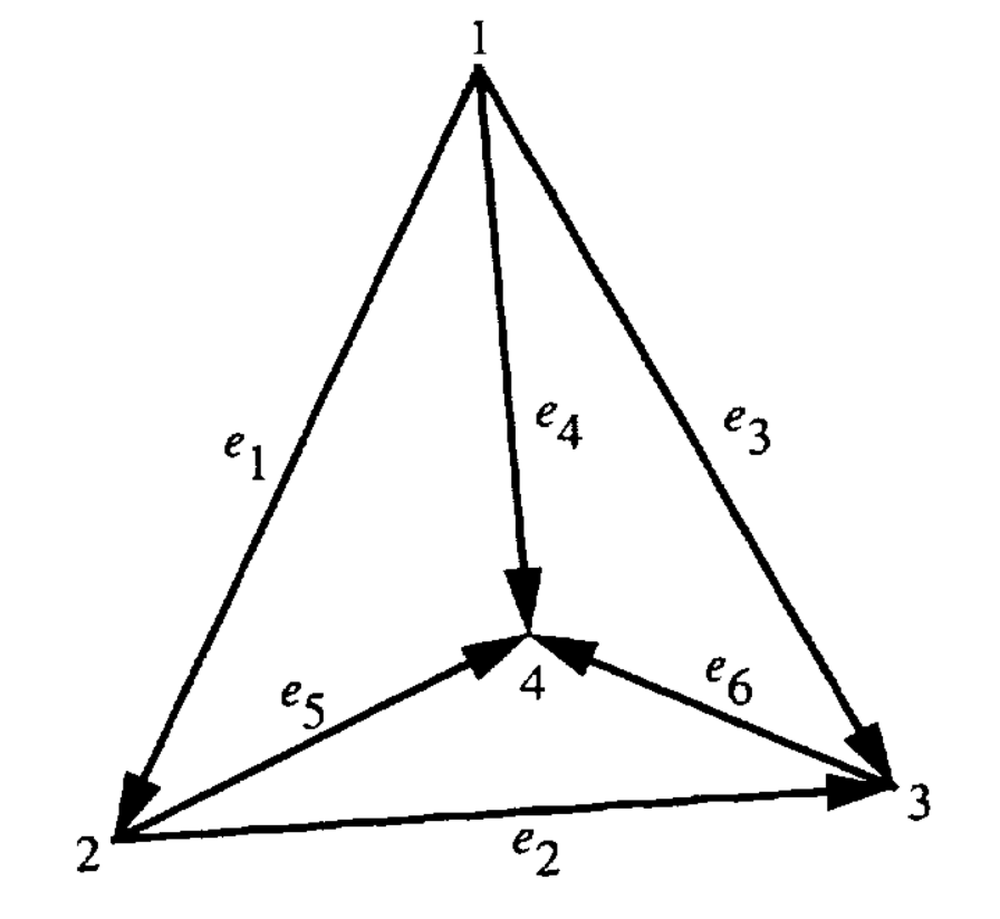

# 3. Problemas Tridimensionais

## 3.1. Autovalores de Cavidades Tridimensionais - Formulação Vetorial

O problema de calcular frequências de ressonância em cavidades tridimensionais tem sido historicamente dificultado pela presença de **modos espúrios**.

Como mencionado na seção 2.2, esse problema foi recentemente superado utilizando **elementos de aresta tangenciais vetoriais** (refs. 15 e 16).

Nesta seção, formula-se o método de elementos finitos de Galerkin para cavidades tridimensionais e apresentam-se resultados para diversas geometrias.

---

## Leitura orientadora desta seção

O leitor deve entrar nesta seção com uma expectativa correta: o salto para 3D não muda a filosofia do método, mas amplia seu cenário geométrico e algébrico. Em 2D, já havíamos aprendido que a escolha adequada dos espaços discretos é decisiva para evitar modos espúrios. Em 3D, essa mesma lição retorna com mais força, porque agora o campo vive em volume, a malha é tetraédrica e a continuidade tangencial precisa ser respeitada em todas as arestas do elemento.

## 3.1.1. Formulação

Essa formulação pode ser desenvolvida utilizando o campo elétrico $\mathbf{E}$ ou o campo magnético $\mathbf{H}$. Aqui, será utilizada a formulação em termos do campo elétrico.

Considere a equação vetorial de onda:

### (143)

$$
\nabla \times \left( \frac{1}{\mu_r} \nabla \times \mathbf{E} \right) - k_0^2 \varepsilon_r \mathbf{E} = 0
$$

onde:

$$
\mathbf{E} = E_x \hat{x} + E_y \hat{y} + E_z \hat{z}
$$

---

Introduz-se uma função teste:

$$
\mathbf{T} = T_x \hat{x} + T_y \hat{y} + T_z \hat{z}
$$

Para aplicar o método de Galerkin, multiplica-se a equação (143) por $\mathbf{T}$ e integra-se sobre o volume da cavidade:

### (144)

$$
\iiint_V \left[ \mathbf{T} \cdot \nabla \times \left( \frac{1}{\mu_r} \nabla \times \mathbf{E} \right) - k_0^2 \varepsilon_r \mathbf{T} \cdot \mathbf{E} \right] dv = 0
$$

---

Utilizando a identidade vetorial:

### (145)

$$
\mathbf{A} \cdot (\nabla \times \mathbf{B}) = (\nabla \times \mathbf{A}) \cdot \mathbf{B} - \nabla \cdot (\mathbf{A} \times \mathbf{B})
$$

---

#### Passagem intermediária: a integração por partes vetorial em 3D

Esta é a etapa central da formulação variacional. Se definirmos

$$
\mathbf{B} = \frac{1}{\mu_r}\nabla \times \mathbf{E},
$$

então a identidade (145) com $\mathbf{A} = \mathbf{T}$ produz imediatamente

$$
\mathbf{T}\cdot \nabla \times \left(\frac{1}{\mu_r}\nabla \times \mathbf{E}\right) = (\nabla \times \mathbf{T})\cdot \left(\frac{1}{\mu_r}\nabla \times \mathbf{E}\right) - \nabla \cdot \left[\mathbf{T}\times \left(\frac{1}{\mu_r}\nabla \times \mathbf{E}\right)\right].
$$

Ao integrar essa identidade em todo o volume, o primeiro termo gera a parte interna da forma fraca e o segundo termo prepara o nascimento da contribuição de contorno. É exatamente a versão tridimensional da integração por partes que, em problemas escalares, costuma aparecer escondida sob o nome de fórmula de Green.

---

a equação (144) pode ser reescrita como:

### (146)

$$
\iiint_V (\nabla \times \mathbf{T}) \cdot \left( \frac{1}{\mu_r} \nabla \times \mathbf{E} \right) dv = k_0^2 \varepsilon_r \iiint_V \mathbf{T} \cdot \mathbf{E} dv + \iiint_V \nabla \cdot \left[ \mathbf{T} \times \left( \frac{1}{\mu_r} \nabla \times \mathbf{E} \right) \right] dv
$$

Aplicando o **teorema da divergência**:

### (147)

$$
\iiint_V \nabla \cdot \mathbf{A} dv = \iint_S \mathbf{A} \cdot \hat{n} ds
$$

e a identidade:

### (148)

$$
(\mathbf{A} \times \mathbf{B}) \cdot \hat{n} = - \mathbf{A} \cdot (\hat{n} \times \mathbf{B})
$$

onde:

* $V$: volume da cavidade
* $S$: superfície externa
* $\hat{n}$: vetor normal unitário externo

A equação (146) torna-se:

### (149)

$$
\iiint_V (\nabla \times \mathbf{T}) \cdot \left( \frac{1}{\mu_r} \nabla \times \mathbf{E} \right) dv = k_0^2 \varepsilon_r \iiint_V \mathbf{T} \cdot \mathbf{E} dv - \iint_S \mathbf{T} \cdot \left[ \hat{n} \times \left( \frac{1}{\mu_r} \nabla \times \mathbf{E} \right) \right] ds
$$

Para uma cavidade delimitada por um **condutor elétrico perfeito (PEC)**:

👉 o campo elétrico tangencial na superfície é nulo
👉 a componente tangencial da função teste $\mathbf{T}$ também é nula na superfície

Logo, o termo de superfície desaparece.

---

#### Passagem intermediária: por que a condição PEC fecha a forma fraca

Em uma cavidade PEC, a condição física essencial é

$$
\hat{n}\times \mathbf{E} = 0 \quad \text{em } S.
$$

No método de Galerkin, a função teste pertence ao mesmo espaço admissível do campo aproximado, de modo que também satisfaz

$$
\hat{n}\times \mathbf{T} = 0 \quad \text{em } S.
$$

Por isso, o termo de contorno de (149) deixa de contribuir. Em linguagem funcional, a formulação passa a viver em um subespaço de $H(\mathrm{curl},V)$ com traço tangencial homogêneo no contorno. Essa observação é importante porque não se trata de um cancelamento acidental, mas de uma consequência direta das condições físicas impostas à cavidade.

---

A equação (149) pode ser reescrita nesta forma final:

### (150)

$$
\iiint_V (\nabla \times \mathbf{T}) \cdot \left( \frac{1}{\mu_r} \nabla \times \mathbf{E} \right) dv = k_0^2 \varepsilon_r \iiint_V \mathbf{T} \cdot \mathbf{E} dv
$$

---

## 3.1.2. Discretização

O volume da cavidade é discretizado utilizando **elementos tetraédricos de primeira ordem**, como o mostrado na Figura 14.

Um tetraedro de primeira ordem possui:

* **4 nós**
* **6 arestas**

As seis arestas são formadas conforme apresentado na Tabela 11.

---

## Figura 14

**Figura 14.** Elemento tetraédrico de primeira ordem.

---

## Tabela 11. Formação das Arestas do Elemento Tetraédrico

| Aresta ( m ) | Nó ( i ) | Nó ( j ) |
| ------------ | -------- | -------- |
| 1            | 1        | 2        |
| 2            | 2        | 3        |
| 3            | 1        | 3        |
| 4            | 1        | 4        |
| 5            | 2        | 4        |
| 6            | 3        | 4        |

---

O campo elétrico em um único elemento tetraédrico é representado por:

### (151)

$$
\mathbf{E} = \sum_{m=1}^{6} e_m \mathbf{W}_m
$$

onde os seis parâmetros desconhecidos associados a cada aresta são:

$$
e_1, e_2, \dots, e_6
$$

O campo total é obtido avaliando a equação (151).

---

#### Passagem intermediária: o que representam os seis coeficientes de aresta

Os coeficientes $e_m$ não devem ser lidos como simples "valores do campo em pontos". Esse seria um pensamento nodal, adequado a problemas escalares, mas insuficiente aqui. No espírito dos elementos de aresta, cada grau de liberdade está associado à circulação tangencial do campo ao longo de uma aresta:

$$
e_m \sim \int_{l_m} \mathbf{E}\cdot \hat{t}_m\, dl.
$$

Essa é a chave geométrica do método. O campo é reconstruído a partir de quantidades tangenciais integradas ao longo das arestas, o que preserva precisamente a continuidade física que interessa em eletromagnetismo.

## Elementos de Aresta Tangenciais

Os elementos de aresta vetoriais $\mathbf{W}_m$ são dados por:

### (152)

$$
\mathbf{W}_m = L_m \left( \alpha_{ti} \nabla \alpha_{tj} - \alpha_{tj} \nabla \alpha_{ti} \right)
$$

onde:

* $i$ e $j$: nós que definem a aresta $m$
* $L_m$: comprimento da aresta
* $\alpha_{ti}, \alpha_{tj}$: coordenadas simplex associadas aos nós

---

## Coordenadas Simplex

As coordenadas simplex dos nós do tetraedro são:

### (153)–(156)

$$
\alpha_{t1} = \frac{V_1}{V}, \quad \alpha_{t2} = \frac{V_2}{V}, \quad \alpha_{t3} = \frac{V_3}{V}, \quad \alpha_{t4} = \frac{V_4}{V}
$$

---

#### Passagem intermediária: por que as coordenadas simplex são tão poderosas

As coordenadas simplex organizam toda a geometria do tetraedro em uma linguagem afim muito econômica. Elas satisfazem, em qualquer ponto interno do elemento,

$$
\alpha_{t1} + \alpha_{t2} + \alpha_{t3} + \alpha_{t4} = 1,
$$

e cada $\alpha_{ti}$ vale $1$ no nó $i$ e $0$ nos outros três nós. Com isso, o tetraedro inteiro passa a ser descrito por funções lineares simples, cujos gradientes são constantes no interior do elemento. É essa linearidade que torna possível obter fórmulas fechadas para muitos blocos da formulação.

---

### Volume do tetraedro

### (157)

$$
V = \frac{1}{6}
\begin{vmatrix}
1 & x_1 & y_1 & z_1 \\
1 & x_2 & y_2 & z_2 \\
1 & x_3 & y_3 & z_3 \\
1 & x_4 & y_4 & z_4
\end{vmatrix}
$$

---

### Subvolumes

### (158)

$$
V_1 = \frac{1}{6}
\begin{vmatrix}
1 & x & y & z \\
1 & x_2 & y_2 & z_2 \\
1 & x_3 & y_3 & z_3 \\
1 & x_4 & y_4 & z_4
\end{vmatrix}
$$

---

### (159)

$$
V_2 = \frac{1}{6}
\begin{vmatrix}
1 & x_1 & y_1 & z_1 \\
1 & x & y & z \\
1 & x_3 & y_3 & z_3 \\
1 & x_4 & y_4 & z_4
\end{vmatrix}
$$

---

### (160)

$$
V_3 = \frac{1}{6}
\begin{vmatrix}
1 & x_1 & y_1 & z_1 \\
1 & x_2 & y_2 & z_2 \\
1 & x & y & z \\
1 & x_4 & y_4 & z_4
\end{vmatrix}
$$

---

### (161)

$$
V_4 = \frac{1}{6}
\begin{vmatrix}
1 & x_1 & y_1 & z_1 \\
1 & x_2 & y_2 & z_2 \\
1 & x_3 & y_3 & z_3 \\
1 & x & y & z
\end{vmatrix}
$$

Para qualquer nó $i = 1, 2, 3, 4$:

### (162)

$$
\alpha_{ti} = \frac{ a_{ti} + b_{ti} x + c_{ti} y + d_{ti} z }{6V}
$$

onde $a_{ti}, b_{ti}, c_{ti}, d_{ti}$ são coeficientes obtidos dos determinantes de $V_1, V_2, V_3, V_4$.

---

#### Passagem intermediária: de $\alpha_{ti}$ para seus gradientes

Como $\alpha_{ti}$ é linear em $x$, $y$ e $z$, seu gradiente é constante dentro do tetraedro:

$$
\nabla \alpha_{ti} = \frac{1}{6V} \left( b_{ti}\hat{x} + c_{ti}\hat{y} + d_{ti}\hat{z} \right).
$$

Essa observação é preciosa. Ela mostra por que os elementos de aresta de primeira ordem conseguem produzir fórmulas explícitas: os objetos básicos da interpolação já nascem com dependência afim simples, e seus gradientes não variam de ponto para ponto no interior do elemento.

---

Substituindo (152) e (162):

### (163)

$$
\mathbf{W}_m = \frac{L_m}{36V^2} \left[ (A_{xm} + B_{xm} y + C_{xm} z)\hat{x} + (A_{ym} + B_{ym} x + C_{ym} z)\hat{y} + (A_{zm} + B_{zm} x + C_{zm} y)\hat{z} \right]
$$

---

#### Passagem intermediária: como nasce a forma explícita da base de aresta

Se substituirmos a expressão linear de $\alpha_{ti}$ e o gradiente constante de $\alpha_{ti}$ em

$$
\mathbf{W}_m = L_m\left(\alpha_{ti}\nabla \alpha_{tj} - \alpha_{tj}\nabla \alpha_{ti}\right),
$$

obtemos um produto entre termos lineares e gradientes constantes. Em forma expandida, isso gera componentes afins em $x$, $y$ e $z$, todas divididas por $(6V)(6V) = 36V^2$:

$$
\mathbf{W}_m = \frac{L_m}{36V^2} \left[ \bigl(\text{termo constante} + \text{termo em } y + \text{termo em } z\bigr)\hat{x} + \bigl(\text{termo constante} + \text{termo em } x + \text{termo em } z\bigr)\hat{y} + \bigl(\text{termo constante} + \text{termo em } x + \text{termo em } y\bigr)\hat{z} \right].
$$

Os coeficientes $A_{\bullet m}$, $B_{\bullet m}$ e $C_{\bullet m}$ que aparecem em (164)–(172) são justamente o resultado desse agrupamento algébrico. Em outras palavras, a equação (163) não cai do céu: ela é a forma reorganizada da definição geométrica da base de Whitney.

---

### Coeficientes

#### (164)

$$
A_{xm} = a_{ti} b_{tj} - a_{tj} b_{ti}
$$

#### (165)

$$
B_{xm} = c_{ti} b_{tj} - c_{tj} b_{ti}
$$

#### (166)

$$
C_{xm} = d_{ti} b_{tj} - d_{tj} b_{ti}
$$

---

#### (167)

$$
A_{ym} = a_{ti} c_{tj} - a_{tj} c_{ti}
$$

#### (168)

$$
B_{ym} = b_{ti} c_{tj} - b_{tj} c_{ti} = -B_{xm}
$$

#### (169)

$$
C_{ym} = d_{ti} c_{tj} - d_{tj} c_{ti}
$$

---

#### (170)

$$
A_{zm} = a_{ti} d_{tj} - a_{tj} d_{ti}
$$

#### (171)

$$
B_{zm} = b_{ti} d_{tj} - b_{tj} d_{ti} = -C_{xm}
$$

#### (172)

$$
C_{zm} = c_{ti} d_{tj} - c_{tj} d_{ti} = -C_{ym}
$$

---

## Propriedade Fundamental dos Elementos de Aresta

Os elementos $\mathbf{W}_m$ satisfazem:

### (173)

$$
\hat{t}_m \cdot \mathbf{W}_m =
\begin{cases}
1, & \text{na aresta } m \\
0, & \text{nas demais arestas}
\end{cases}
$$

onde $\hat{t}_m$ é o vetor unitário ao longo da aresta.

---

#### Passagem intermediária: interpretação física da propriedade de aresta

A mensagem de (173) é profunda: cada função de base "reconhece" a sua própria aresta e não interfere, no sentido interpolatório, nas demais. Uma forma operacional, muito usada na literatura de elementos de aresta, é escrever essa propriedade por integrais de linha:

$$
\int_{l_n} \mathbf{W}_m \cdot \hat{t}_n\, dl = \delta_{mn}.
$$

Essa leitura ajuda a evitar uma confusão comum. O que caracteriza o grau de liberdade não é um valor pontual qualquer do campo, mas sua circulação tangencial associada à aresta. É justamente isso que alinha a discretização com a física de Maxwell.

## 3.1.3. Formulação por Elementos Finitos

Substituindo a equação (151) na equação (150), integrando sobre o volume de um elemento tetraédrico e trocando a ordem da soma e da integração, obtém-se:

### (174)

$$
\frac{1}{\mu_r} \sum_{m=1}^{6} \iiint_{\triangle} (\nabla \times \mathbf{W}_m) \cdot (\nabla \times \mathbf{W}_n) e_m dv = k_0^2 \sum_{m=1}^{6} \varepsilon_r \iiint_{\triangle} (\mathbf{W}_m \cdot \mathbf{W}_n) e_m dv
$$

$$
(n = 1, 2, \dots, 6)
$$

onde $\triangle$ indica integração sobre o volume do tetraedro. Isso pode ser escrito na forma matricial como:

### (175)

$$
[S_{el}][e] = k_0^2 [T_{el}][e]
$$

onde as matrizes do elemento são dadas por:

### (176)

$$
[S_{el}] = \frac{1}{\mu_r} \iiint_{\triangle} (\nabla \times \mathbf{W}_m) \cdot (\nabla \times \mathbf{W}_n) dv
$$

### (177)

$$
[T_{el}] = \varepsilon_r \iiint_{\triangle} (\mathbf{W}_m \cdot \mathbf{W}_n) dv
$$

Essas matrizes de elemento podem ser montadas sobre todos os elementos tetraédricos no volume da cavidade para obter uma equação matricial global:

### (178)

$$
[S][e] = k_0^2 [T][e]
$$

Para garantir a continuidade do campo nas arestas, define-se uma direção global única para cada aresta (ou seja, sempre apontando do menor número de nó para o maior número de nó), de modo que a equação (151) deve ser multiplicada por $-1$, se o vetor de aresta local não estiver na mesma direção da direção global da aresta.

O campo elétrico é nulo nos contornos PEC (condutor elétrico perfeito). Isso é imposto fazendo com que os coeficientes da equação (151) sejam zero. Em outras palavras, as arestas no contorno são simplesmente ignoradas na formação das matrizes de elementos finitos, reduzindo assim a ordem das matrizes a serem resolvidas.

## 3.1.4. Matrizes de Elemento Finito

O objetivo desta seção é obter expressões em forma fechada para as equações (176) e (177). A partir da equação (163):

### (179)

$$
\nabla \times \mathbf{W}_m = \frac{L_m}{18V^2} \left( C_{zm} \hat{x} + C_{xm} \hat{y} + B_{ym} \hat{z} \right)
$$

e, portanto,

### (180)

$$
(\nabla \times \mathbf{W}_m)\cdot(\nabla \times \mathbf{W}_n) = \frac{L_m L_n}{(18V^2)^2} \left( C_{zm}C_{zn} + C_{xm}C_{xn} + B_{ym}B_{yn} \right)
$$

A partir das equações (176), (177) e (180), e utilizando as fórmulas de integração dadas na referência 18, as expressões em forma fechada para as matrizes de elemento são dadas por:

### (181)

$$
S_{el} = \frac{L_m L_n}{324 V^3 \mu_r} \left( C_{zm}C_{zn} + C_{xm}C_{xn} + B_{ym}B_{yn} \right)
$$

### (182)

$$
T_{el} = \varepsilon_r \frac{L_m L_n}{1296 V^3} \sum_{k=1}^{10} I_k
$$

onde:

$$
I_1 = A_{xm}A_{xn} + A_{ym}A_{yn} + A_{zm}A_{zn}
$$

$$
I_2 = \left( A_{ym}B_{yn} + A_{yn}B_{ym} + A_{zm}B_{zn} + A_{zn}B_{zm} \right)\bar{x}_{tet}
$$

$$
I_3 = \left( A_{xm}B_{xn} + A_{xn}B_{xm} + A_{zm}C_{zn} + A_{zn}C_{zm} \right)\bar{y}_{tet}
$$

$$
I_4 = \left( A_{xm}C_{xn} + A_{xn}C_{xm} + A_{ym}C_{yn} + A_{yn}C_{ym} \right)\bar{z}_{tet}
$$

$$
I_5 = \frac{1}{20}(B_{zm}C_{zn} + B_{zn}C_{zm}) \left( \sum_{i=1}^{4} x_i y_i + 16\bar{x}_{tet}\bar{y}_{tet} \right)
$$

$$
I_6 = \frac{1}{20}(B_{xm}C_{xn} + B_{xn}C_{xm}) \left( \sum_{i=1}^{4} y_i z_i + 16\bar{y}_{tet}\bar{z}_{tet} \right)
$$

$$
I_7 = \frac{1}{20}(B_{ym}C_{yn} + B_{yn}C_{ym}) \left( \sum_{i=1}^{4} x_i z_i + 16\bar{x}_{tet}\bar{z}_{tet} \right)
$$

$$
I_8 = \frac{1}{20}(B_{ym}B_{yn} + B_{zm}B_{zn}) \left( \sum_{i=1}^{4} x_i^2 + 16\bar{x}_{tet}^2 \right)
$$

$$
I_9 = \frac{1}{20}(B_{xm}B_{xn} + C_{zm}C_{zn}) \left( \sum_{i=1}^{4} y_i^2 + 16\bar{y}_{tet}^2 \right)
$$

$$
I_{10} = \frac{1}{20}(C_{xm}C_{xn} + C_{ym}C_{yn}) \left( \sum_{i=1}^{4} z_i^2 + 16\bar{z}_{tet}^2 \right)
$$

## 3.1.5. Exemplos Numéricos

Um programa computacional denominado FEM3D0 foi desenvolvido para calcular os autovalores de uma cavidade tridimensional. Para um problema tridimensional, o número de variáveis aumenta drasticamente em comparação com um problema bidimensional. Assim, não é econômico utilizar um solucionador generalizado de autovalores.

O programa FEM3D1 foi desenvolvido para explorar a natureza esparsa das matrizes de elementos finitos. Este programa utiliza a simetria das matrizes e armazena apenas as entradas não nulas na parte triangular inferior das matrizes; como resultado, há uma economia significativa de memória. Além disso, utiliza solucionadores esparsos de autovalores disponíveis na VECLIB (ref. 19), resultando em maior velocidade computacional.

Os exemplos numéricos a seguir foram extraídos de Chatterjee, Jin e Volakis (ref. 17), nos quais os números de onda de ressonância para diversas cavidades tridimensionais foram calculados utilizando um tipo diferente de elementos de aresta. Os resultados analíticos apresentados aqui também foram obtidos da referência 17.

---

### Cavidade Retangular Preenchida com Ar

Os autovalores de uma cavidade retangular preenchida com ar (mostrada na Fig. 15) foram calculados pelo FEM3D1 e são apresentados na Tabela 12. A geometria da cavidade foi representada por 343 elementos tetraédricos.

**Figura 15.** Cavidade retangular preenchida com ar. Dimensões: $1$ por $0,5$ por $0,75$ cm.

#### Tabela 12 — Autovalores da Cavidade Retangular com Ar

| Modo | Analítico | FEM3D1 (343 elementos) | Referência 17 |
| ------ | ---------- | --------------------- | --------------- |
| TE101 | 5.236 | 5.242 | 5.213 |
| TM110 | 7.025 | 6.942 | 6.977 |
| TE011 | 7.531 | 7.372 | 7.474 |
| TE201 | 7.531 | 7.560 | 7.573 |
| TE111 | 8.179 | 8.064 | 7.991 |
| TM111 | 8.179 | 8.164 | 8.122 |
| TM210 | 8.886 | 8.725 | 8.572 |
| TE102 | 8.947 | 8.871 | 8.795 |

---

### Cavidade Retangular Semi-Preenchida

Uma cavidade retangular semi-preenchida (preenchida de $z = 0.5$ a $1$ cm) com material dielétrico $\varepsilon_r = 2.0$ é mostrada na Fig. 16.

**Figura 16.** Cavidade retangular parcialmente preenchida com material dielétrico $\varepsilon_r = 2.0$ e preenchimento de $z = 0.5$ a $1$ cm. Dimensões: $1$ por $0.1$ por $1$ cm.

Os autovalores, calculados pelo FEM3D1, são apresentados na Tabela 13. A geometria da cavidade foi modelada com 615 elementos tetraédricos.

#### Tabela 13 — Autovalores da Cavidade Retangular Semi-Preenchida

| Modo | Analítico | FEM3D1 (615 elementos) | Referência 17 |
| ------ | ---------- | ---------------------- | --------------- |
| TE210 | 3.538 | 3.524 | 3.534 |
| TE220 | 5.445 | 5.401 | 5.440 |
| TE102 | 5.935 | 5.931 | 5.916 |
| TE301 | 7.503 | 7.382 | 7.501 |
| TE202 | 7.633 | 7.562 | 7.560 |
| TE103 | 8.096 | 8.003 | 8.056 |

---

### Cavidade Esférica

Os autovalores, calculados pelo FEM3D1, são apresentados na Tabela 15. A cavidade esférica possui raio de 1 cm.

#### Tabela 15 — Autovalores da Cavidade Esférica (raio = 1 cm)

| Modo | Analítico | FEM3D1 (473 elementos) | Referência 16 |
| ------ | ---------- | ---------------------- | --------------- |
| TM010 | 2.744 | 2.799 | 2.799 |
| TM100 | 2.744 | 2.802 | 2.802 |
| TM001 | 2.744 | 2.807 | 2.811 |
| TM021 | 3.870 | 3.961 | 3.948 |
| TM121 (par) | 3.870 | 3.976 | 3.986 |
| TM121 (ímpar) | 3.870 | 3.986 | 3.994 |
| TM221 (par) | 3.870 | 3.994 | 4.038 |
| TM221 (ímpar) | 3.870 | 3.998 | 4.048 |
| TE001 | 4.493 | 4.421 | 4.433 |
| TE111 (par) | 4.493 | 4.478 | 4.472 |
| TE111 (ímpar) | 4.493 | 4.501 | 4.549 |

---

### Cavidade Cilíndrica Circular

Os autovalores de uma cavidade cilíndrica circular preenchida com ar (mostrada na Fig. 17) foram calculados pelo FEM3D1 e são apresentados na Tabela 14. A geometria foi representada por 633 elementos tetraédricos.

**Figura 17.** Cavidade cilíndrica circular preenchida com ar. Dimensões em centímetros.

#### Tabela 14 — Autovalores da Cavidade Cilíndrica Circular com Ar

| Modo | Analítico | FEM3D1 (633 elementos) | Referência 17 |
| ------ | ---------- | ---------------------- | --------------- |
| TM010 | 4.810 | 4.782 | 4.809 |
| TE111 | 7.283 | 7.210 | 7.202 |
| TE111 | 7.283 | 7.290 | 7.288 |
| TM110 | 7.650 | 7.575 | 7.633 |
| TM110 | 7.650 | 7.620 | 7.724 |
| TM011 | 7.840 | 7.901 | 7.940 |
| TE211 | 8.658 | 8.676 | 8.697 |
| TE211 | 8.658 | — | 8.865 |

## 3.1.6. Resumo

Na Seção 3.1, os elementos finitos vetoriais introduzidos na Seção 2.2 são estendidos para resolver problemas de autovalores tridimensionais utilizando funções de base tangenciais de aresta para elementos tetraédricos.

Soluções espúrias são completamente evitadas devido à natureza livre de divergência dos elementos de aresta. Solucionadores esparsos de autovalores são utilizados para explorar a esparsidade e a simetria das matrizes de elementos finitos; isso resulta em economia significativa de memória computacional e tempo de processamento.

Os resultados numéricos apresentados para cavidades com diferentes geometrias comprovam a validade da análise e a precisão dos códigos computacionais apresentados nesta seção.

---

## Fecho pedagógico da seção tridimensional inicial

Até a equação (173), o artigo constrói os alicerces 3D: a forma fraca para cavidades PEC, a interpolação por arestas tetraédricas e a maquinaria geométrica das coordenadas simplex. É uma abertura de grande valor didático, porque ensina ao leitor que o sucesso do método em 3D não depende de truques numéricos, mas de uma escolha correta de variáveis, espaços funcionais e graus de liberdade geométricos.

## Notas de revisão complementar

### Papel desta seção no desenvolvimento do artigo

O salto para 3D não abandona a lógica construída em 2D. O artigo continua trabalhando com uma formulação variacional e com graus de liberdade associados a arestas; a diferença é que agora tudo é transportado para tetraedros, com seis arestas por elemento e coordenadas simplex em volume.

### Encadeamento conceitual até a equação (173)

- As equações (143) a (150) fazem em 3D o mesmo papel estrutural que as primeiras equações de 2.2.1 fizeram em 2D: sair da forma forte e chegar à forma fraca com as condições de contorno apropriadas.
- As equações (151) e (152) introduzem a expansão do campo em bases de aresta tetraédricas.
- As equações (153) a (162) constroem a parametrização geométrica do tetraedro por coordenadas simplex.
- As equações (163) a (172) tornam explícita a forma afim das funções de base e os coeficientes geométricos que alimentam as matrizes elementares.
- A equação (173) registra a propriedade fundamental de interpolação tangencial nas arestas, que é a peça conceitual central para evitar modos espúrios.

### Passagens que merecem leitura mais cuidadosa

- A sequência (145) -> (149) -> (150) é a parte variacional mais importante desta seção, porque é nela que o termo de contorno é manipulado até restar a forma fraca compatível com PEC.
- A passagem de (152) para (163) merece atenção especial: ali a base de Whitney deixa de ser apenas uma definição abstrata e passa a ter forma explícita em função das coordenadas do tetraedro.
- As relações $B_{ym} = -B_{xm}$, $B_{zm} = -C_{xm}$ e $C_{zm} = -C_{ym}$ são úteis para verificar coerência algébrica entre os coeficientes auxiliares.

### Ligações diretas com o código atual

- `FEM3D0` e `FEM3D1` hoje gravam, para cada caso 3D, um pacote didático com:
  - `run.log`
  - `run_timing.csv`
  - `modes.csv`
  - `fields.csv` por modo casado
  - `vtk/` por modo casado
  - `linop/` com `S`, `T`, autovalores e autovetores
- a referência operacional dessas saídas está em:
  - [FEM3D_CSV_Referencia.md](../FEM3D_CSV_Referencia.md)
  - [Artefatos_Espectrais_CSV_Referencia.md](../Artefatos_Espectrais_CSV_Referencia.md)

---

## Navegação

Anterior: [2.2.4 Características de Dispersão](2.2.4_Caracteristicas_de_Dispersao_de_Guias_de_Onda.md) | Índice: [README.md](../README.md) | Próximo: [4. Considerações Finais](4_Consideracoes_Finais_Apendice_Referencias.md)
